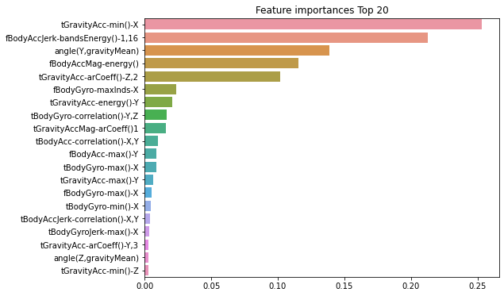

# DecisionTreeClassifier를 이용한 실습

http://archive.ics.uci.edu/ml/datasets/Human+Activity+Recognition+Using_Smartphones


```python
import pandas as pd
import matplotlib.pyplot as plt
%matplotlib inline

feature_name_df=pd.read_csv(r'C:\Users\user\Data_Handling\human_activity\features.txt', sep='\s+', header=None, names=['column_index', 'column_name'])
print(feature_name_df)
feature_name=feature_name_df.iloc[:,1].values.tolist()
feature_dup_df=feature_name_df.groupby('column_name').count()
print(feature_dup_df)
print(feature_dup_df[feature_dup_df['column_index']>1].count())
```

         column_index                           column_name
    0               1                     tBodyAcc-mean()-X
    1               2                     tBodyAcc-mean()-Y
    2               3                     tBodyAcc-mean()-Z
    3               4                      tBodyAcc-std()-X
    4               5                      tBodyAcc-std()-Y
    ..            ...                                   ...
    556           557      angle(tBodyGyroMean,gravityMean)
    557           558  angle(tBodyGyroJerkMean,gravityMean)
    558           559                  angle(X,gravityMean)
    559           560                  angle(Y,gravityMean)
    560           561                  angle(Z,gravityMean)
    
    [561 rows x 2 columns]
                                          column_index
    column_name                                       
    angle(X,gravityMean)                             1
    angle(Y,gravityMean)                             1
    angle(Z,gravityMean)                             1
    angle(tBodyAccJerkMean),gravityMean)             1
    angle(tBodyAccMean,gravity)                      1
    ...                                            ...
    tGravityAccMag-max()                             1
    tGravityAccMag-mean()                            1
    tGravityAccMag-min()                             1
    tGravityAccMag-sma()                             1
    tGravityAccMag-std()                             1
    
    [477 rows x 1 columns]
    column_index    42
    dtype: int64
    

feature_name이 겹치는게 42개가 있으므로, 원본 feature명에 \_1또는_2를 추가로 부여해 새로운 피처명을 가지는 DataFrame을 만들자!

*참고: drop할 때, axis=1이 컬럼방향축으로 drop*


```python
def get_new_feature_name_df(old_feature_name_df):
    feature_dup_df=pd.DataFrame(data=old_feature_name_df.groupby('column_name').cumcount(), columns=['dup_cnt'])
    feature_dup_df=feature_dup_df.reset_index()
    print(feature_dup_df)
    new_feature_name_df=pd.merge(old_feature_name_df.reset_index(), feature_dup_df, how='outer')
    print(new_feature_name_df)
    new_feature_name_df['column_name']=new_feature_name_df[['column_name','dup_cnt']].apply(lambda x:x[0]+'_'+str(x[1]) if x[1]>0 else x[0], axis=1)
    new_feature_name_df=new_feature_name_df.drop(['index'], axis=1)
    print(new_feature_name_df)
    return new_feature_name_df
new_feature_name_df=get_new_feature_name_df(feature_name_df)
```

         index  dup_cnt
    0        0        0
    1        1        0
    2        2        0
    3        3        0
    4        4        0
    ..     ...      ...
    556    556        0
    557    557        0
    558    558        0
    559    559        0
    560    560        0
    
    [561 rows x 2 columns]
         index  column_index                           column_name  dup_cnt
    0        0             1                     tBodyAcc-mean()-X        0
    1        1             2                     tBodyAcc-mean()-Y        0
    2        2             3                     tBodyAcc-mean()-Z        0
    3        3             4                      tBodyAcc-std()-X        0
    4        4             5                      tBodyAcc-std()-Y        0
    ..     ...           ...                                   ...      ...
    556    556           557      angle(tBodyGyroMean,gravityMean)        0
    557    557           558  angle(tBodyGyroJerkMean,gravityMean)        0
    558    558           559                  angle(X,gravityMean)        0
    559    559           560                  angle(Y,gravityMean)        0
    560    560           561                  angle(Z,gravityMean)        0
    
    [561 rows x 4 columns]
         column_index                           column_name  dup_cnt
    0               1                     tBodyAcc-mean()-X        0
    1               2                     tBodyAcc-mean()-Y        0
    2               3                     tBodyAcc-mean()-Z        0
    3               4                      tBodyAcc-std()-X        0
    4               5                      tBodyAcc-std()-Y        0
    ..            ...                                   ...      ...
    556           557      angle(tBodyGyroMean,gravityMean)        0
    557           558  angle(tBodyGyroJerkMean,gravityMean)        0
    558           559                  angle(X,gravityMean)        0
    559           560                  angle(Y,gravityMean)        0
    560           561                  angle(Z,gravityMean)        0
    
    [561 rows x 3 columns]
    

*참고: 첫번째 행이 칼럼이름이라면 header=0으로 지정해주면 되고, header=None은 칼럼이름이 없다는 뜻이다. names있으면 굳이 header=None 안써줘도 될듯!*


```python
feature_name=new_feature_name_df.iloc[:,1].values.tolist()
X_train=pd.read_csv(r'C:\Users\user\Data_Handling\human_activity\train\X_train.txt', sep='\s+', names=feature_name)
X_test=pd.read_csv(r'C:\Users\user\Data_Handling\human_activity\test\X_test.txt', sep='\s+', names=feature_name)

y_train=pd.read_csv(r'C:\Users\user\Data_Handling\human_activity\train\y_train.txt', sep='\s+', header=None, names=['action'])
y_test=pd.read_csv(r'C:\Users\user\Data_Handling\human_activity\test\y_test.txt', sep='\s+', header=None, names=['action'])

print(X_train.info())
#X_train
y_train
```

    <class 'pandas.core.frame.DataFrame'>
    RangeIndex: 7352 entries, 0 to 7351
    Columns: 561 entries, tBodyAcc-mean()-X to angle(Z,gravityMean)
    dtypes: float64(561)
    memory usage: 31.5 MB
    None
    


<div>
<style scoped>
    .dataframe tbody tr th:only-of-type {
        vertical-align: middle;
    }

    .dataframe tbody tr th {
        vertical-align: top;
    }

    .dataframe thead th {
        text-align: right;
    }
</style>
<table border="1" class="dataframe">
  <thead>
    <tr style="text-align: right;">
      <th></th>
      <th>action</th>
    </tr>
  </thead>
  <tbody>
    <tr>
      <th>0</th>
      <td>5</td>
    </tr>
    <tr>
      <th>1</th>
      <td>5</td>
    </tr>
    <tr>
      <th>2</th>
      <td>5</td>
    </tr>
    <tr>
      <th>3</th>
      <td>5</td>
    </tr>
    <tr>
      <th>4</th>
      <td>5</td>
    </tr>
    <tr>
      <th>...</th>
      <td>...</td>
    </tr>
    <tr>
      <th>7347</th>
      <td>2</td>
    </tr>
    <tr>
      <th>7348</th>
      <td>2</td>
    </tr>
    <tr>
      <th>7349</th>
      <td>2</td>
    </tr>
    <tr>
      <th>7350</th>
      <td>2</td>
    </tr>
    <tr>
      <th>7351</th>
      <td>2</td>
    </tr>
  </tbody>
</table>
<p>7352 rows × 1 columns</p>
</div>


피처가 전부 float 형의 숫자형이므로 별도의 카테고리 인코딩은 수행할 필요가 없다.<br/>
레이블 값은 특정 값으로 왜곡되지 않고 비교적 고르게 분포되어 있다.


```python
print(y_train['action'].value_counts())
```

    6    1407
    5    1374
    4    1286
    1    1226
    2    1073
    3     986
    Name: action, dtype: int64
    


```python
from sklearn.tree import DecisionTreeClassifier
from sklearn.metrics import accuracy_score
from sklearn.model_selection import GridSearchCV

dt_clf=DecisionTreeClassifier(random_state=156)
dt_clf.fit(X_train, y_train)
pred=dt_clf.predict(X_test)
accuracy=accuracy_score(y_test, pred)
print("결정 트리 예측 정확도: {0:.4f}".format(accuracy))
print("DecisionTreeClassifier 기본 하이퍼 파라미터:\n", dt_clf.get_params())
params={
    'max_depth':[6,8,10,12,16,20,24]
}
grid_cv=GridSearchCV(dt_clf, param_grid=params, scoring='accuracy', cv=5, verbose=1)
grid_cv.fit(X_train,y_train)
print("GridSearchCV 최고 평균 정확도 수치: {0:.4f}".format(grid_cv.best_score_))
print("GridSearchCV 최적 하이퍼 파라미터:", grid_cv.best_params_)
cv_results_df=pd.DataFrame(grid_cv.cv_results_)
cv_results_df
```

    결정 트리 예측 정확도: 0.8548
    DecisionTreeClassifier 기본 하이퍼 파라미터:
     {'ccp_alpha': 0.0, 'class_weight': None, 'criterion': 'gini', 'max_depth': None, 'max_features': None, 'max_leaf_nodes': None, 'min_impurity_decrease': 0.0, 'min_impurity_split': None, 'min_samples_leaf': 1, 'min_samples_split': 2, 'min_weight_fraction_leaf': 0.0, 'presort': 'deprecated', 'random_state': 156, 'splitter': 'best'}
    Fitting 5 folds for each of 7 candidates, totalling 35 fits
    

    [Parallel(n_jobs=1)]: Using backend SequentialBackend with 1 concurrent workers.
    [Parallel(n_jobs=1)]: Done  35 out of  35 | elapsed:  1.4min finished
    

    GridSearchCV 최고 평균 정확도 수치: 0.8513
    GridSearchCV 최적 하이퍼 파라미터: {'max_depth': 16}
    


<div>
<style scoped>
    .dataframe tbody tr th:only-of-type {
        vertical-align: middle;
    }

    .dataframe tbody tr th {
        vertical-align: top;
    }

    .dataframe thead th {
        text-align: right;
    }
</style>
<table border="1" class="dataframe">
  <thead>
    <tr style="text-align: right;">
      <th></th>
      <th>mean_fit_time</th>
      <th>std_fit_time</th>
      <th>mean_score_time</th>
      <th>std_score_time</th>
      <th>param_max_depth</th>
      <th>params</th>
      <th>split0_test_score</th>
      <th>split1_test_score</th>
      <th>split2_test_score</th>
      <th>split3_test_score</th>
      <th>split4_test_score</th>
      <th>mean_test_score</th>
      <th>std_test_score</th>
      <th>rank_test_score</th>
    </tr>
  </thead>
  <tbody>
    <tr>
      <th>0</th>
      <td>1.556256</td>
      <td>0.022340</td>
      <td>0.006175</td>
      <td>0.000385</td>
      <td>6</td>
      <td>{'max_depth': 6}</td>
      <td>0.813732</td>
      <td>0.872876</td>
      <td>0.819728</td>
      <td>0.865986</td>
      <td>0.881633</td>
      <td>0.850791</td>
      <td>0.028313</td>
      <td>5</td>
    </tr>
    <tr>
      <th>1</th>
      <td>1.953396</td>
      <td>0.030365</td>
      <td>0.006581</td>
      <td>0.000477</td>
      <td>8</td>
      <td>{'max_depth': 8}</td>
      <td>0.820530</td>
      <td>0.819850</td>
      <td>0.855102</td>
      <td>0.868707</td>
      <td>0.891156</td>
      <td>0.851069</td>
      <td>0.027719</td>
      <td>3</td>
    </tr>
    <tr>
      <th>2</th>
      <td>2.295474</td>
      <td>0.072298</td>
      <td>0.006179</td>
      <td>0.000383</td>
      <td>10</td>
      <td>{'max_depth': 10}</td>
      <td>0.799456</td>
      <td>0.814412</td>
      <td>0.863265</td>
      <td>0.891156</td>
      <td>0.887755</td>
      <td>0.851209</td>
      <td>0.037707</td>
      <td>2</td>
    </tr>
    <tr>
      <th>3</th>
      <td>2.575505</td>
      <td>0.127164</td>
      <td>0.006384</td>
      <td>0.000473</td>
      <td>12</td>
      <td>{'max_depth': 12}</td>
      <td>0.794697</td>
      <td>0.813052</td>
      <td>0.848980</td>
      <td>0.877551</td>
      <td>0.886395</td>
      <td>0.844135</td>
      <td>0.035598</td>
      <td>7</td>
    </tr>
    <tr>
      <th>4</th>
      <td>2.908678</td>
      <td>0.214551</td>
      <td>0.006199</td>
      <td>0.000394</td>
      <td>16</td>
      <td>{'max_depth': 16}</td>
      <td>0.799456</td>
      <td>0.818491</td>
      <td>0.853061</td>
      <td>0.887755</td>
      <td>0.897959</td>
      <td>0.851344</td>
      <td>0.038140</td>
      <td>1</td>
    </tr>
    <tr>
      <th>5</th>
      <td>2.912213</td>
      <td>0.261902</td>
      <td>0.006387</td>
      <td>0.000484</td>
      <td>20</td>
      <td>{'max_depth': 20}</td>
      <td>0.802855</td>
      <td>0.818491</td>
      <td>0.856463</td>
      <td>0.877551</td>
      <td>0.898639</td>
      <td>0.850800</td>
      <td>0.035718</td>
      <td>4</td>
    </tr>
    <tr>
      <th>6</th>
      <td>2.905015</td>
      <td>0.259527</td>
      <td>0.006396</td>
      <td>0.000478</td>
      <td>24</td>
      <td>{'max_depth': 24}</td>
      <td>0.796057</td>
      <td>0.818491</td>
      <td>0.856463</td>
      <td>0.877551</td>
      <td>0.898639</td>
      <td>0.849440</td>
      <td>0.037597</td>
      <td>6</td>
    </tr>
  </tbody>
</table>
</div>


```python
params={
    'max_depth':[6,8,10,12,16,20,24],
    'min_samples_split':[16,24]
}
grid_cv=GridSearchCV(dt_clf, param_grid=params, scoring='accuracy', cv=5, verbose=1)
grid_cv.fit(X_train, y_train)
print("GridSearchCV 최고 평균 정확도 수치: {0:.4f}".format(grid_cv.best_score_))
print("GridSearchCV 최적 하이퍼 파라미터:", grid_cv.best_params_)
best_df_clf=grid_cv.best_estimator_
pred1=best_df_clf.predict(X_test)
accuracy=accuracy_score(y_test, pred1)
print("결정 트리 예측 정확도:{0:.4f}".format(accuracy))
```

    Fitting 5 folds for each of 14 candidates, totalling 70 fits
    

    [Parallel(n_jobs=1)]: Using backend SequentialBackend with 1 concurrent workers.
    [Parallel(n_jobs=1)]: Done  70 out of  70 | elapsed:  2.9min finished
    

    GridSearchCV 최고 평균 정확도 수치: 0.8549
    GridSearchCV 최적 하이퍼 파라미터: {'max_depth': 8, 'min_samples_split': 16}
    결정 트리 예측 정확도:0.8717
    


```python
import seaborn as sns

ftr_importances_values=best_df_clf.feature_importances_
ftr_importances=pd.Series(ftr_importances_values, index=X_train.columns)
ftr_top20=ftr_importances.sort_values(ascending=False)[:20]
plt.figure(figsize=(8,6))
plt.title('Feature importances Top 20')
sns.barplot(x=ftr_top20, y=ftr_top20.index)
plt.show()
```


    

    

