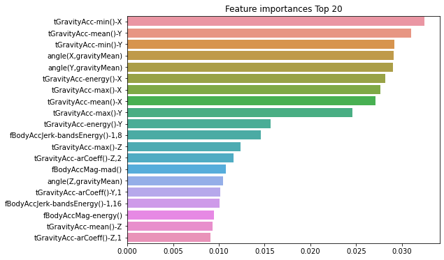

# 앙상블 - 랜덤포레스트(bagging)

## 랜덤 포레스트
여러 개의 결정 트리 분류기가 전체 데이터에서 배깅 방식으로 각자의 데이터를 샘플링해 개별적으로 학습을 수행한 뒤, 최종적으로 모든 분류기가 보팅을 통해 예측 결정

데이터가 중첩된 개별 데이터 세트에 결정 트리 분류기를 각각 적용 => 랜덤 포레스트

앙상블 알고리즘 중 비교적 빠른 수행 속도를 가지고 있으며, 랜덤 포레스트는 트리 기반 앙상블 알고리즘 중에 그래도 그나마 하이퍼 파라미터가 적은편!(트리기반 앙상블 알고리즘의 단점은 하이퍼 파라미터가 많고 그로 인해서 튜닝을 위한 시간이 많이 소모된다는 것이다)

랜덤포레스트는 CPU 병렬 처리도 효과적으로 수행되어 빠른 학습이 가능하기 때문에 그래디언트 부스팅보다 예측 성능이 약간 떨어지더라도 랜덤 포레스트로 일단 기반 모델을 먼저 구축하는 경우가 많다.


여러 개의 데이터 세트를 중첩되게 분리하는 것: **bootstrapping** 분할 방식 <br/>
**RandomForestClassifier** 사용!


```python
from sklearn.ensemble import RandomForestClassifier
from sklearn.metrics import accuracy_score
import pandas as pd
import warnings
warnings.filterwarnings('ignore')

def get_new_feature_name_df(old_feature_name_df):
    feature_dup_df=pd.DataFrame(data=old_feature_name_df.groupby('column_name').cumcount(), columns=['dup_cnt'])
    feature_dup_df=feature_dup_df.reset_index()
    new_feature_name_df=pd.merge(old_feature_name_df.reset_index(), feature_dup_df, how='outer')
    new_feature_name_df['column_name']=new_feature_name_df[['column_name','dup_cnt']].apply(lambda x:x[0]+'_'+str(x[1]) if x[1]>0 else x[0], axis=1)
    new_feature_name_df=new_feature_name_df.drop(['index'], axis=1)
    return new_feature_name_df

feature_name_df=pd.read_csv(r'C:\Users\user\Data_Handling\human_activity\features.txt', sep='\s+', header=None, names=['column_index', 'column_name'])
feature_name=feature_name_df.iloc[:,1].values.tolist()
feature_dup_df=feature_name_df.groupby('column_name').count()

new_feature_name_df=get_new_feature_name_df(feature_name_df)
feature_name=new_feature_name_df.iloc[:,1].values.tolist()
X_train=pd.read_csv(r'C:\Users\user\Data_Handling\human_activity\train\X_train.txt', sep='\s+', names=feature_name)
X_test=pd.read_csv(r'C:\Users\user\Data_Handling\human_activity\test\X_test.txt', sep='\s+', names=feature_name)

y_train=pd.read_csv(r'C:\Users\user\Data_Handling\human_activity\train\y_train.txt', sep='\s+', header=None, names=['action'])
y_test=pd.read_csv(r'C:\Users\user\Data_Handling\human_activity\test\y_test.txt', sep='\s+', header=None, names=['action'])

rf_clf=RandomForestClassifier(random_state=0)
rf_clf.fit(X_train, y_train)
pred=rf_clf.predict(X_test)
accuracy=accuracy_score(y_test,pred)
print("랜덤 포레스트 정확도:{0:.4f}".format(accuracy))
```

    랜덤 포레스트 정확도:0.9253
    

### 랜덤 포레스트 하이퍼 파라미터

* n_estimators: 랜덤 포레스트에서 결정 트리의 개수, 디폴트는 10개 
* max_features: 결정 트리에 사용된 max_features, 디폴트는 sqrt

*참고: RandomForestClassifier 생성자와 GridSearchCV 생성 시 n_jobs=-1파라미터를 추가하면 모든 CPU코어를 이용해 학습 가능*


```python
from sklearn.model_selection import GridSearchCV

params={
    'n_estimators':[100],
    'max_depth':[6,8,10,12],
    'min_samples_leaf':[8,12,18],
    'min_samples_split':[8,16,20]
}

rf_clf=RandomForestClassifier(random_state=0, n_jobs=-1)
grid_cv=GridSearchCV(rf_clf, param_grid=params, cv=2, n_jobs=-1)
grid_cv.fit(X_train, y_train)

print("최적 하이퍼 파라미터:\n", grid_cv.best_params_)
print("최고 예측 정확도: {0:.4f}".format(grid_cv.best_score_))
```

    최적 하이퍼 파라미터:
     {'max_depth': 10, 'min_samples_leaf': 8, 'min_samples_split': 8, 'n_estimators': 100}
    최고 예측 정확도: 0.9180
    


```python
rf_clf1=RandomForestClassifier(n_estimators=300, max_depth=10, min_samples_leaf=8, min_samples_split=8, random_state=0)
rf_clf1.fit(X_train,y_train)
pred=rf_clf1.predict(X_test)
print("예측 정확도:{0:.4f}".format(accuracy_score(y_test,pred)))
```

    예측 정확도:0.9165
    


```python
import matplotlib.pyplot as plt
import seaborn as sns
%matplotlib inline

ftr_importances_values=rf_clf1.feature_importances_
ftr_importances=pd.Series(ftr_importances_values, index=X_train.columns)
ftr_top20=ftr_importances.sort_values(ascending=False)[:20]

plt.figure(figsize=(8,6))
plt.title("Feature importances Top 20")
sns.barplot(x=ftr_top20, y=ftr_top20.index)
plt.show()
```


    

    

