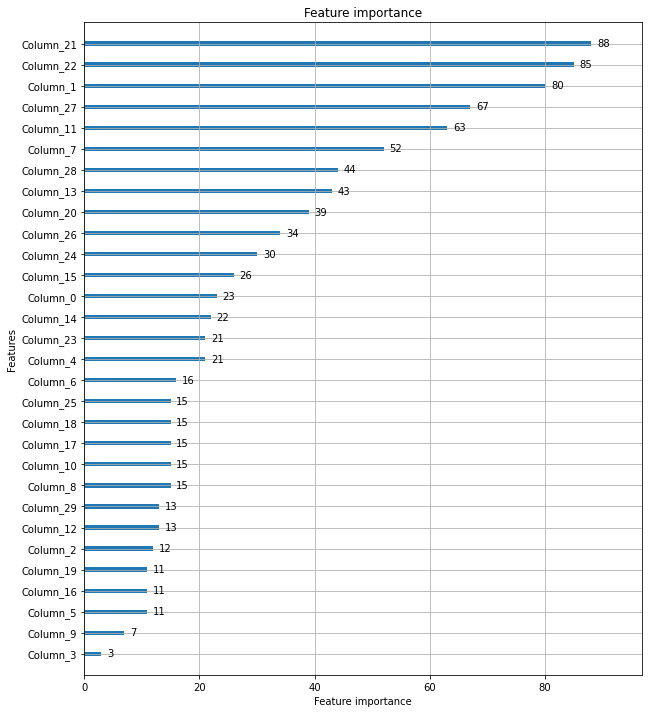

# 앙상블 - LightGBM(boosting)

<장점>
* XGBoost보다 학습에 걸리는 시간이 훨씬 적다
* XGBoost보다 메모리 사용량도 적다

<단점>
* 적은 데이터 세트에 적용할 경우 과적합이 발생하기 쉽다

일반 GBM 계열의 트리 분할은 균형 트리 분할(Level Wise) 방식 -> 즉, 최대한 균형 잡힌 트리를 유지하면서 트리의 깊이가 최소화되고 오버피팅에 보다 더 강한 구조 -> 하지만 시간이 오래 걸린다

LightGBM는 리프 중심 트리 분할(Leaf Wise) 방식 -> 최대 손실값을 가지는 리프 노드를 지속적으로 분할하면서 트리의 깊이가 깊어지고 비대칭적인 규칙 트리 생성 -> 예측 오류 손실 최소화


**num_leaves**의 개수를 중심으로 **min_child_samples(min_data_in_leaf)**, **max_depth**를 함께 조정하면서 모델의 복잡도를 줄여 튜닝


```python
from lightgbm import LGBMClassifier

import pandas as pd
import numpy as np
from sklearn.datasets import load_breast_cancer
from sklearn.model_selection import train_test_split

from sklearn.metrics import roc_auc_score
from sklearn.metrics import f1_score
from sklearn.metrics import confusion_matrix
from sklearn.metrics import accuracy_score, precision_score, recall_score

def get_clf_eval(y_test,pred, pred_proba=None):
    confusion=confusion_matrix(y_test,pred)
    accuracy=accuracy_score(y_test,pred)
    precision=precision_score(y_test,pred)
    recall=recall_score(y_test,pred)
    f1=f1_score(y_test, pred)
    roc_auc=roc_auc_score(y_test, pred_proba)
    print("오차 행렬")
    print(confusion)
    print("정확도: {0:.4f}, 정밀도: {1:.4f}, 재현율: {2:.4f}, F1:{3:.4f}, AUC:{4:.4f}".format(accuracy, precision, recall,f1, roc_auc))

dataset=load_breast_cancer()
ftr=dataset.data
target=dataset.target
X_train, X_test, y_train, y_test=train_test_split(ftr, target, test_size=0.2, random_state=156)

lgbm_wrapper=LGBMClassifier(n_estimators=400)

evals=[(X_test, y_test)]
lgbm_wrapper.fit(X_train, y_train, early_stopping_rounds=100, eval_metric='logloss', eval_set=evals, verbose=True)
preds=lgbm_wrapper.predict(X_test)
pred_proba=lgbm_wrapper.predict_proba(X_test)[:,1]
get_clf_eval(y_test, preds, pred_proba)
```

    <class 'numpy.ndarray'>
    [1]	valid_0's binary_logloss: 0.565079
    Training until validation scores don't improve for 100 rounds
    [2]	valid_0's binary_logloss: 0.507451
    [3]	valid_0's binary_logloss: 0.458489
    [4]	valid_0's binary_logloss: 0.417481
    [5]	valid_0's binary_logloss: 0.385507
    [6]	valid_0's binary_logloss: 0.355773
    [7]	valid_0's binary_logloss: 0.329587
    [8]	valid_0's binary_logloss: 0.308478
    [9]	valid_0's binary_logloss: 0.285395
    [10]	valid_0's binary_logloss: 0.267055
    [11]	valid_0's binary_logloss: 0.252013
    [12]	valid_0's binary_logloss: 0.237018
    [13]	valid_0's binary_logloss: 0.224756
    [14]	valid_0's binary_logloss: 0.213383
    [15]	valid_0's binary_logloss: 0.203058
    [16]	valid_0's binary_logloss: 0.194015
    [17]	valid_0's binary_logloss: 0.186412
    [18]	valid_0's binary_logloss: 0.179108
    [19]	valid_0's binary_logloss: 0.174004
    [20]	valid_0's binary_logloss: 0.167155
    [21]	valid_0's binary_logloss: 0.162494
    [22]	valid_0's binary_logloss: 0.156886
    [23]	valid_0's binary_logloss: 0.152855
    [24]	valid_0's binary_logloss: 0.151113
    [25]	valid_0's binary_logloss: 0.148395
    [26]	valid_0's binary_logloss: 0.145869
    [27]	valid_0's binary_logloss: 0.143036
    [28]	valid_0's binary_logloss: 0.14033
    [29]	valid_0's binary_logloss: 0.139609
    [30]	valid_0's binary_logloss: 0.136109
    [31]	valid_0's binary_logloss: 0.134867
    [32]	valid_0's binary_logloss: 0.134729
    [33]	valid_0's binary_logloss: 0.1311
    [34]	valid_0's binary_logloss: 0.131143
    [35]	valid_0's binary_logloss: 0.129435
    [36]	valid_0's binary_logloss: 0.128474
    [37]	valid_0's binary_logloss: 0.126683
    [38]	valid_0's binary_logloss: 0.126112
    [39]	valid_0's binary_logloss: 0.122831
    [40]	valid_0's binary_logloss: 0.123162
    [41]	valid_0's binary_logloss: 0.125592
    [42]	valid_0's binary_logloss: 0.128293
    [43]	valid_0's binary_logloss: 0.128123
    [44]	valid_0's binary_logloss: 0.12789
    [45]	valid_0's binary_logloss: 0.122818
    [46]	valid_0's binary_logloss: 0.12496
    [47]	valid_0's binary_logloss: 0.125578
    [48]	valid_0's binary_logloss: 0.127381
    [49]	valid_0's binary_logloss: 0.128349
    [50]	valid_0's binary_logloss: 0.127004
    [51]	valid_0's binary_logloss: 0.130288
    [52]	valid_0's binary_logloss: 0.131362
    [53]	valid_0's binary_logloss: 0.133363
    [54]	valid_0's binary_logloss: 0.1332
    [55]	valid_0's binary_logloss: 0.134543
    [56]	valid_0's binary_logloss: 0.130803
    [57]	valid_0's binary_logloss: 0.130306
    [58]	valid_0's binary_logloss: 0.132514
    [59]	valid_0's binary_logloss: 0.133278
    [60]	valid_0's binary_logloss: 0.134804
    [61]	valid_0's binary_logloss: 0.136888
    [62]	valid_0's binary_logloss: 0.138745
    [63]	valid_0's binary_logloss: 0.140497
    [64]	valid_0's binary_logloss: 0.141368
    [65]	valid_0's binary_logloss: 0.140764
    [66]	valid_0's binary_logloss: 0.14348
    [67]	valid_0's binary_logloss: 0.143418
    [68]	valid_0's binary_logloss: 0.143682
    [69]	valid_0's binary_logloss: 0.145076
    [70]	valid_0's binary_logloss: 0.14686
    [71]	valid_0's binary_logloss: 0.148051
    [72]	valid_0's binary_logloss: 0.147664
    [73]	valid_0's binary_logloss: 0.149478
    [74]	valid_0's binary_logloss: 0.14708
    [75]	valid_0's binary_logloss: 0.14545
    [76]	valid_0's binary_logloss: 0.148767
    [77]	valid_0's binary_logloss: 0.149959
    [78]	valid_0's binary_logloss: 0.146083
    [79]	valid_0's binary_logloss: 0.14638
    [80]	valid_0's binary_logloss: 0.148461
    [81]	valid_0's binary_logloss: 0.15091
    [82]	valid_0's binary_logloss: 0.153011
    [83]	valid_0's binary_logloss: 0.154807
    [84]	valid_0's binary_logloss: 0.156501
    [85]	valid_0's binary_logloss: 0.158586
    [86]	valid_0's binary_logloss: 0.159819
    [87]	valid_0's binary_logloss: 0.161745
    [88]	valid_0's binary_logloss: 0.162829
    [89]	valid_0's binary_logloss: 0.159142
    [90]	valid_0's binary_logloss: 0.156765
    [91]	valid_0's binary_logloss: 0.158625
    [92]	valid_0's binary_logloss: 0.156832
    [93]	valid_0's binary_logloss: 0.154616
    [94]	valid_0's binary_logloss: 0.154263
    [95]	valid_0's binary_logloss: 0.157156
    [96]	valid_0's binary_logloss: 0.158617
    [97]	valid_0's binary_logloss: 0.157495
    [98]	valid_0's binary_logloss: 0.159413
    [99]	valid_0's binary_logloss: 0.15847
    [100]	valid_0's binary_logloss: 0.160746
    [101]	valid_0's binary_logloss: 0.16217
    [102]	valid_0's binary_logloss: 0.165293
    [103]	valid_0's binary_logloss: 0.164749
    [104]	valid_0's binary_logloss: 0.167097
    [105]	valid_0's binary_logloss: 0.167697
    [106]	valid_0's binary_logloss: 0.169462
    [107]	valid_0's binary_logloss: 0.169947
    [108]	valid_0's binary_logloss: 0.171
    [109]	valid_0's binary_logloss: 0.16907
    [110]	valid_0's binary_logloss: 0.169521
    [111]	valid_0's binary_logloss: 0.167719
    [112]	valid_0's binary_logloss: 0.166648
    [113]	valid_0's binary_logloss: 0.169053
    [114]	valid_0's binary_logloss: 0.169613
    [115]	valid_0's binary_logloss: 0.170059
    [116]	valid_0's binary_logloss: 0.1723
    [117]	valid_0's binary_logloss: 0.174733
    [118]	valid_0's binary_logloss: 0.173526
    [119]	valid_0's binary_logloss: 0.1751
    [120]	valid_0's binary_logloss: 0.178254
    [121]	valid_0's binary_logloss: 0.182968
    [122]	valid_0's binary_logloss: 0.179017
    [123]	valid_0's binary_logloss: 0.178326
    [124]	valid_0's binary_logloss: 0.177149
    [125]	valid_0's binary_logloss: 0.179171
    [126]	valid_0's binary_logloss: 0.180948
    [127]	valid_0's binary_logloss: 0.183861
    [128]	valid_0's binary_logloss: 0.187579
    [129]	valid_0's binary_logloss: 0.188122
    [130]	valid_0's binary_logloss: 0.1857
    [131]	valid_0's binary_logloss: 0.187442
    [132]	valid_0's binary_logloss: 0.188578
    [133]	valid_0's binary_logloss: 0.189729
    [134]	valid_0's binary_logloss: 0.187313
    [135]	valid_0's binary_logloss: 0.189279
    [136]	valid_0's binary_logloss: 0.191068
    [137]	valid_0's binary_logloss: 0.192414
    [138]	valid_0's binary_logloss: 0.191255
    [139]	valid_0's binary_logloss: 0.193453
    [140]	valid_0's binary_logloss: 0.196969
    [141]	valid_0's binary_logloss: 0.196378
    [142]	valid_0's binary_logloss: 0.196367
    [143]	valid_0's binary_logloss: 0.19869
    [144]	valid_0's binary_logloss: 0.200352
    [145]	valid_0's binary_logloss: 0.19712
    Early stopping, best iteration is:
    [45]	valid_0's binary_logloss: 0.122818
    오차 행렬
    [[33  4]
     [ 1 76]]
    정확도: 0.9561, 정밀도: 0.9500, 재현율: 0.9870, F1:0.9682, AUC:0.9905
    


```python
from lightgbm import plot_importance
import matplotlib.pyplot as plt
%matplotlib inline

fig,ax=plt.subplots(figsize=(10,12))
plot_importance(lgbm_wrapper, ax=ax)
```


    <AxesSubplot:title={'center':'Feature importance'}, xlabel='Feature importance', ylabel='Features'>


    

    

