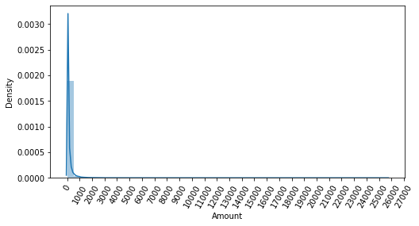
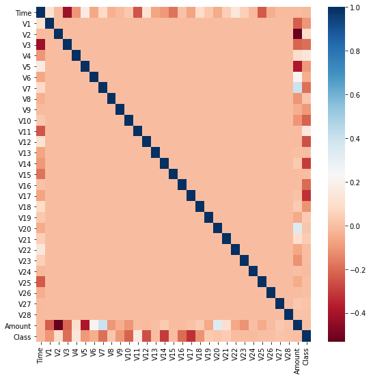
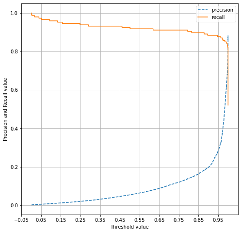

# 캐글 실습: 신용카드 사기 검출


## Feature Engineering
* 중요 Feature의 데이터 분포도 변경-정규분포, Log 변환(왜곡된 분포도를 가진 데이터 세트를 비교적 정규 분포에 가깝게 변환)
* 이상치(Outlier) 제거
* 극도로 불균형한 레이블 값 분포 해결-언더 샘플링, 오버 샘플링

### IQR(Inter Quantile Range)를 이용한 Outlier Removal


이상치: 3/4분위수에서 1.5\*IQR을 더한 지점 이상 AND 1/4분위수에서 1.5\*IQR을 뺀 지점 이하
### 언더 샘플링(Undersampling)
* 많은 데이터 세트를 적은 데이터 세트 수준으로 감소시키는 방식 
* 정상 레이블을 가진 데이터가 10000건, 이상 레이블을 가진 데이터가 100건 -> 정상 레이블 데이터를 100건으로 줄이는 방식
* 너무 많은 정상 레이블 데이터를 감소시켜 정상 레이블의 경우 오히려 제대로 된 학습 수행 불가

### 오버 샘플링(Oversampling)
* 이상 데이터와 같이 적은 데이터 세트를 증식하여 학습을 위한 충분한 데이터 확보하는 방식
* 원본 데이터의 피처 값들을 아주 약간만 변경하여 증식
* SMOTE(Synthetic Minority Over-sampling Technique): 적은 데이터 세트에 있는 개별 데이터들의 K 최근접 이웃(K Nearest Neightbor)을 찾아서 이 데이터와 K개 이웃들의 차이를 일정 값으로 만들어서 기존 데이터와 약간 차이가 나는 새로운 데이터 생성하는 방식


```python
import pandas as pd
import numpy as np
import matplotlib.pyplot as plt
import warnings
warnings.filterwarnings("ignore")
%matplotlib inline

card_df=pd.read_csv(r'C:\Users\user\Data_Handling\creditcard.csv')
card_df.head(3)    
```


<div>
<style scoped>
    .dataframe tbody tr th:only-of-type {
        vertical-align: middle;
    }

    .dataframe tbody tr th {
        vertical-align: top;
    }

    .dataframe thead th {
        text-align: right;
    }
</style>
<table border="1" class="dataframe">
  <thead>
    <tr style="text-align: right;">
      <th></th>
      <th>Time</th>
      <th>V1</th>
      <th>V2</th>
      <th>V3</th>
      <th>V4</th>
      <th>V5</th>
      <th>V6</th>
      <th>V7</th>
      <th>V8</th>
      <th>V9</th>
      <th>...</th>
      <th>V21</th>
      <th>V22</th>
      <th>V23</th>
      <th>V24</th>
      <th>V25</th>
      <th>V26</th>
      <th>V27</th>
      <th>V28</th>
      <th>Amount</th>
      <th>Class</th>
    </tr>
  </thead>
  <tbody>
    <tr>
      <th>0</th>
      <td>0.0</td>
      <td>-1.359807</td>
      <td>-0.072781</td>
      <td>2.536347</td>
      <td>1.378155</td>
      <td>-0.338321</td>
      <td>0.462388</td>
      <td>0.239599</td>
      <td>0.098698</td>
      <td>0.363787</td>
      <td>...</td>
      <td>-0.018307</td>
      <td>0.277838</td>
      <td>-0.110474</td>
      <td>0.066928</td>
      <td>0.128539</td>
      <td>-0.189115</td>
      <td>0.133558</td>
      <td>-0.021053</td>
      <td>149.62</td>
      <td>0</td>
    </tr>
    <tr>
      <th>1</th>
      <td>0.0</td>
      <td>1.191857</td>
      <td>0.266151</td>
      <td>0.166480</td>
      <td>0.448154</td>
      <td>0.060018</td>
      <td>-0.082361</td>
      <td>-0.078803</td>
      <td>0.085102</td>
      <td>-0.255425</td>
      <td>...</td>
      <td>-0.225775</td>
      <td>-0.638672</td>
      <td>0.101288</td>
      <td>-0.339846</td>
      <td>0.167170</td>
      <td>0.125895</td>
      <td>-0.008983</td>
      <td>0.014724</td>
      <td>2.69</td>
      <td>0</td>
    </tr>
    <tr>
      <th>2</th>
      <td>1.0</td>
      <td>-1.358354</td>
      <td>-1.340163</td>
      <td>1.773209</td>
      <td>0.379780</td>
      <td>-0.503198</td>
      <td>1.800499</td>
      <td>0.791461</td>
      <td>0.247676</td>
      <td>-1.514654</td>
      <td>...</td>
      <td>0.247998</td>
      <td>0.771679</td>
      <td>0.909412</td>
      <td>-0.689281</td>
      <td>-0.327642</td>
      <td>-0.139097</td>
      <td>-0.055353</td>
      <td>-0.059752</td>
      <td>378.66</td>
      <td>0</td>
    </tr>
  </tbody>
</table>
<p>3 rows × 31 columns</p>
</div>


```python
card_df.info()
```

    <class 'pandas.core.frame.DataFrame'>
    RangeIndex: 284807 entries, 0 to 284806
    Data columns (total 31 columns):
     #   Column  Non-Null Count   Dtype  
    ---  ------  --------------   -----  
     0   Time    284807 non-null  float64
     1   V1      284807 non-null  float64
     2   V2      284807 non-null  float64
     3   V3      284807 non-null  float64
     4   V4      284807 non-null  float64
     5   V5      284807 non-null  float64
     6   V6      284807 non-null  float64
     7   V7      284807 non-null  float64
     8   V8      284807 non-null  float64
     9   V9      284807 non-null  float64
     10  V10     284807 non-null  float64
     11  V11     284807 non-null  float64
     12  V12     284807 non-null  float64
     13  V13     284807 non-null  float64
     14  V14     284807 non-null  float64
     15  V15     284807 non-null  float64
     16  V16     284807 non-null  float64
     17  V17     284807 non-null  float64
     18  V18     284807 non-null  float64
     19  V19     284807 non-null  float64
     20  V20     284807 non-null  float64
     21  V21     284807 non-null  float64
     22  V22     284807 non-null  float64
     23  V23     284807 non-null  float64
     24  V24     284807 non-null  float64
     25  V25     284807 non-null  float64
     26  V26     284807 non-null  float64
     27  V27     284807 non-null  float64
     28  V28     284807 non-null  float64
     29  Amount  284807 non-null  float64
     30  Class   284807 non-null  int64  
    dtypes: float64(30), int64(1)
    memory usage: 67.4 MB
    

## 데이터 전처리
### 불필요한 feature인 Time 드롭!


```python
from sklearn.model_selection import train_test_split

def get_preprocessed_df(df=None):
    df_copy=df.copy()
    df_copy.drop('Time', axis=1, inplace=True)
    return df_copy

def get_train_test_dataset(df=None):
    df_copy=get_preprocessed_df(df)
    X_features=df_copy.iloc[:,:-1]
    y_target=df_copy.iloc[:,-1]
    X_train, X_test, y_train, y_test=train_test_split(X_features, y_target, test_size=0.3, random_state=0, stratify=y_target)
    return X_train, X_test, y_train, y_test

X_train, X_test, y_train, y_test=get_train_test_dataset(card_df)
print("학습 데이터 레이블 값 비율")
print(y_train.value_counts()/y_train.shape[0]*100)
print("테스트 데이터 레이블 값 비율")
print(y_test.value_counts()/y_test.shape[0]*100)
```

    학습 데이터 레이블 값 비율
    0    99.827451
    1     0.172549
    Name: Class, dtype: float64
    테스트 데이터 레이블 값 비율
    0    99.826785
    1     0.173215
    Name: Class, dtype: float64
    


```python
from sklearn.metrics import roc_auc_score
from sklearn.metrics import f1_score
from sklearn.metrics import confusion_matrix
from sklearn.metrics import accuracy_score, precision_score, recall_score

def get_clf_eval(y_test,pred, pred_proba=None):
    confusion=confusion_matrix(y_test,pred)
    accuracy=accuracy_score(y_test,pred)
    precision=precision_score(y_test,pred)
    recall=recall_score(y_test,pred)
    f1=f1_score(y_test, pred)
    roc_auc=roc_auc_score(y_test, pred_proba)
    print("오차 행렬")
    print(confusion)
    print("정확도: {0:.4f}, 정밀도: {1:.4f}, 재현율: {2:.4f}, F1:{3:.4f}, AUC:{4:.4f}".format(accuracy, precision, recall,f1, roc_auc))

def get_model_train_eval(model, ftr_train=None, ftr_test=None, tgt_train=None, tgt_test=None):
    model.fit(ftr_train, tgt_train)
    pred=model.predict(ftr_test)
    pred_proba=model.predict_proba(ftr_test)[:,1]
    get_clf_eval(tgt_test, pred, pred_proba)
```

### LogisticRegression 기반 예측 모델


```python
from sklearn.linear_model import LogisticRegression

lr_clf=LogisticRegression()
get_model_train_eval(lr_clf, ftr_train=X_train, ftr_test=X_test, tgt_train=y_train, tgt_test=y_test)
```

    오차 행렬
    [[85282    13]
     [   56    92]]
    정확도: 0.9992, 정밀도: 0.8762, 재현율: 0.6216, F1:0.7273, AUC:0.9582
    

### LightGBM 기반 예측 모델


```python
from lightgbm import LGBMClassifier

lgbm_clf=LGBMClassifier()
get_model_train_eval(lgbm_clf, ftr_train=X_train, ftr_test=X_test, tgt_train=y_train, tgt_test=y_test)
```

    오차 행렬
    [[85147   148]
     [   65    83]]
    정확도: 0.9975, 정밀도: 0.3593, 재현율: 0.5608, F1:0.4380, AUC:0.7557
    

*boost_from_average가 True이면 재현률 및 ROC-AUC 성능을 매우 크게 저하시킨다*<br/>
불균형한 데이터 세트에서 예측 성능이 매우 저조할 경우, boost_from_average는 False로 설정!


```python
lgbm_clf=LGBMClassifier(n_estimators=1000, num_leaves=64, n_jobs=-1, boost_from_average=False)
get_model_train_eval(lgbm_clf, ftr_train=X_train, ftr_test=X_test, tgt_train=y_train, tgt_test=y_test)
```

    오차 행렬
    [[85290     5]
     [   36   112]]
    정확도: 0.9995, 정밀도: 0.9573, 재현율: 0.7568, F1:0.8453, AUC:0.9790
    


```python
import seaborn as sns
plt.figure(figsize=(8,4))
plt.xticks(range(0,30000,1000), rotation=60)
sns.distplot(card_df['Amount'])
```


    <AxesSubplot:xlabel='Amount', ylabel='Density'>


    

    


Amount(카드 사용금액)이 1000불 이하인 데이터가 대부분이고, 꼬리가 긴 형태의 분포 곡선을 지님<br/> 
-> 데이터 분포도 변환 필요!

### 데이터 분포도 변환(StandardScaler)


```python
from sklearn.preprocessing import StandardScaler

def get_preprocessed_df(df=None):
    df_copy=df.copy()
    scaler=StandardScaler()
    amount_n=scaler.fit_transform(df_copy['Amount'].values.reshape(-1,1))
    df_copy.insert(0,'Amount_scaled', amount_n)
    df_copy.drop(['Time','Amount'], axis=1, inplace=True)
    return df_copy

X_train, X_test, y_train, y_test=get_train_test_dataset(card_df)

print("### 로지스틱 회귀 예측 성능 ###")
lr_clf=LogisticRegression()
get_model_train_eval(lr_clf, ftr_train=X_train, ftr_test=X_test, tgt_train=y_train, tgt_test=y_test)

print("### LightGBM 예측 성능 ###")
lgbm_clf=LGBMClassifier(n_estimators=1000, num_leaves=64, n_jobs=-1, boost_from_average=False)
get_model_train_eval(lgbm_clf, ftr_train=X_train, ftr_test=X_test, tgt_train=y_train, tgt_test=y_test)
```

    ### 로지스틱 회귀 예측 성능 ###
    오차 행렬
    [[85281    14]
     [   58    90]]
    정확도: 0.9992, 정밀도: 0.8654, 재현율: 0.6081, F1:0.7143, AUC:0.9702
    ### LightGBM 예측 성능 ###
    오차 행렬
    [[85290     5]
     [   37   111]]
    정확도: 0.9995, 정밀도: 0.9569, 재현율: 0.7500, F1:0.8409, AUC:0.9779
    

### 데이터 분포도 변환(로그 변환)


```python
def get_preprocessed_df(df=None):
    df_copy=df.copy()
    amount_n=np.log1p(df_copy['Amount'])
    df_copy.insert(0,'Amount_scaled', amount_n)
    df_copy.drop(['Time','Amount'], axis=1, inplace=True)
    return df_copy


X_train, X_test, y_train, y_test=get_train_test_dataset(card_df)

print("### 로지스틱 회귀 예측 성능 ###")
lr_clf=LogisticRegression()
get_model_train_eval(lr_clf, ftr_train=X_train, ftr_test=X_test, tgt_train=y_train, tgt_test=y_test)

print("### LightGBM 예측 성능 ###")
lgbm_clf=LGBMClassifier(n_estimators=1000, num_leaves=64, n_jobs=-1, boost_from_average=False)
get_model_train_eval(lgbm_clf, ftr_train=X_train, ftr_test=X_test, tgt_train=y_train, tgt_test=y_test)
```

    ### 로지스틱 회귀 예측 성능 ###
    오차 행렬
    [[85283    12]
     [   59    89]]
    정확도: 0.9992, 정밀도: 0.8812, 재현율: 0.6014, F1:0.7149, AUC:0.9727
    ### LightGBM 예측 성능 ###
    오차 행렬
    [[85290     5]
     [   35   113]]
    정확도: 0.9995, 정밀도: 0.9576, 재현율: 0.7635, F1:0.8496, AUC:0.9796
    

* log1p는 1을 더한 값이다!
* log1p의 원본값을 구하려면 np.expm1

## 이상치 데이터 제거

cmap을 RdBu로 설정해 양의 상관관계가 높을수록 색깔이 진한 파란색에 가까우며, 음의 상관관계가 높을수록 색깔이 진한 빨간색에 가깝게 표현된다.


```python
import seaborn as sns

plt.figure(figsize=(9,9))
corr=card_df.corr()
sns.heatmap(corr, cmap='RdBu')
```


    <AxesSubplot:>


    

    


Class 피처와 음의 상관관계가 가장 높은 피처는 V14와 V17이다.


```python
import numpy as np

def get_outlier(df=None, column=None, weight=1.5):
    fraud=df[df['Class']==1][column]
    quantile_25=np.percentile(fraud.values, 25)
    quantile_75=np.percentile(fraud.values, 75)
    iqr=quantile_75-quantile_25
    iqr_weight=iqr*weight
    lowest_val=quantile_25-iqr_weight
    highest_val=quantile_75+iqr_weight
    outlier_index=fraud[(fraud<lowest_val)|(fraud>highest_val)].index
    return outlier_index

outlier_index=get_outlier(df=card_df, column='V14', weight=1.5)
print("이상치 데이터 인덱스:", outlier_index)
```

    이상치 데이터 인덱스: Int64Index([8296, 8615, 9035, 9252], dtype='int64')
    


```python
def get_preprocessed_df(df=None):
    df_copy=df.copy()
    amount_n=np.log1p(df_copy['Amount'])
    df_copy.insert(0,'Amount_scaled', amount_n)
    df_copy.drop(['Time','Amount'], axis=1, inplace=True)
    #이상치 데이터 삭제하는 로직 추가
    outlier_index=get_outlier(df=card_df, column='V14', weight=1.5)
    df_copy.drop(outlier_index, axis=0, inplace=True)
    return df_copy


X_train, X_test, y_train, y_test=get_train_test_dataset(card_df)

print("### 로지스틱 회귀 예측 성능 ###")
lr_clf=LogisticRegression()
get_model_train_eval(lr_clf, ftr_train=X_train, ftr_test=X_test, tgt_train=y_train, tgt_test=y_test)

print("### LightGBM 예측 성능 ###")
lgbm_clf=LGBMClassifier(n_estimators=1000, num_leaves=64, n_jobs=-1, boost_from_average=False)
get_model_train_eval(lgbm_clf, ftr_train=X_train, ftr_test=X_test, tgt_train=y_train, tgt_test=y_test)
```

    ### 로지스틱 회귀 예측 성능 ###
    오차 행렬
    [[85281    14]
     [   48    98]]
    정확도: 0.9993, 정밀도: 0.8750, 재현율: 0.6712, F1:0.7597, AUC:0.9743
    ### LightGBM 예측 성능 ###
    오차 행렬
    [[85290     5]
     [   25   121]]
    정확도: 0.9996, 정밀도: 0.9603, 재현율: 0.8288, F1:0.8897, AUC:0.9780
    

## SMOTE 오버 샘플링


```python
from imblearn.over_sampling import SMOTE
smote=SMOTE(random_state=0)

X_train_over, y_train_over=smote.fit_sample(X_train, y_train)
print('SMOTE 적용 전 학습용 피처/레이블 데이터 세트:', X_train.shape, y_train.shape)
print('SMOTE 적용 후 학습용 피처/레이블 데이터 세트:', X_train_over.shape, y_train_over.shape)
print(y_train_over)
print('SMOTE 적용 전 레이블 값 분포\n', pd.Series(y_train).value_counts())
print('SMOTE 적용 후 레이블 값 분포\n', pd.Series(y_train_over).value_counts())
```

    SMOTE 적용 전 학습용 피처/레이블 데이터 세트: (199362, 29) (199362,)
    SMOTE 적용 후 학습용 피처/레이블 데이터 세트: (398040, 29) (398040,)
    0         0
    1         0
    2         0
    3         0
    4         0
             ..
    398035    1
    398036    1
    398037    1
    398038    1
    398039    1
    Name: Class, Length: 398040, dtype: int64
    SMOTE 적용 전 레이블 값 분포
     0    199020
    1       342
    Name: Class, dtype: int64
    SMOTE 적용 후 레이블 값 분포
     1    199020
    0    199020
    Name: Class, dtype: int64
    


```python
print("### 로지스틱 회귀 예측 성능 ###")
lr_clf=LogisticRegression()
get_model_train_eval(lr_clf, ftr_train=X_train_over, ftr_test=X_test, tgt_train=y_train_over, tgt_test=y_test)
```

    ### 로지스틱 회귀 예측 성능 ###
    오차 행렬
    [[82937  2358]
     [   11   135]]
    정확도: 0.9723, 정밀도: 0.0542, 재현율: 0.9247, F1:0.1023, AUC:0.9737
    


```python
import matplotlib.pyplot as plt
import matplotlib.ticker as ticker
from sklearn.metrics import precision_recall_curve

%matplotlib inline

def precision_recall_curve_plot(y_test, pred_proba_c1):
    precisions, recalls, thresholds = precision_recall_curve(y_test, pred_proba_c1)
    
    plt.figure(figsize=(8,8))
    threshold_boundary=thresholds.shape[0]
    plt.plot(thresholds, precisions[0:threshold_boundary], linestyle='--', label='precision')
    plt.plot(thresholds, recalls[0:threshold_boundary], label='recall')
    
    start, end=plt.xlim()
    
    plt.xticks(np.round(np.arange(start, end, 0.1),2))
    
    plt.xlabel("Threshold value")
    plt.ylabel("Precision and Recall value")
    plt.legend()
    
    plt.grid()
    plt.show()
    
precision_recall_curve_plot(y_test, lr_clf.predict_proba(X_test)[:,1])
```


    

    


로지스틱 회귀 모델의 경우, 재현율은 크게 증가하지만, 정밀도는 급격하게 저하<br/>
SMOTE를 적용하면 재현율은 높아지나, 정밀도는 낮아지는 것이 일반적, 좋은 SMOTE 패키지일수록 재현율 증가율은 높이고 정밀도 감소율은 낮추기!


```python
print("### LightGBM 예측 성능 ###")
lgbm_clf=LGBMClassifier(n_estimators=1000, num_leaves=64, n_jobs=-1, boost_from_average=False)
get_model_train_eval(lgbm_clf, ftr_train=X_train_over, ftr_test=X_test, tgt_train=y_train_over, tgt_test=y_test)
```

    ### LightGBM 예측 성능 ###
    오차 행렬
    [[85283    12]
     [   22   124]]
    정확도: 0.9996, 정밀도: 0.9118, 재현율: 0.8493, F1:0.8794, AUC:0.9814
    


