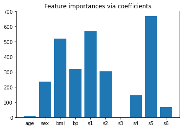

# Feature Selection
* 피처값의 분포
* Null
* 피처간 높은 상관도
* 결정값과의 독립성
* 모델의 피터 중요도(Feature importance) 기반

### 사이킷런 Feature Selection 지원
* RFE(Recursive Feature Elimination): 모델 최초 학습 후, feature 중요도 선정/feature 중요도가 낮은 속성들을 차례로 제거해 가면서 반복적으로 학습/평가를 수행하여 최적 feature 추출(수행시간이 오래 걸림)
* SelectFromModel: 모델 최초 학습 후 선정된 feature 중요도에 따라 평균/중앙값의 특정 비율 이상인 feature들을 선택

### RFE: Recursive Feature Elimination


```python
import matplotlib.pyplot as plt
from sklearn.svm import SVC
from sklearn.model_selection import StratifiedKFold
from sklearn.feature_selection import RFECV, RFE
from sklearn.datasets import make_classification

# 분류를 위한 Feature 개수가 25개인 데이터 1000개 생성
X, y = make_classification(n_samples=1000, n_features=25, n_informative=3,
                           n_redundant=2, n_repeated=0, n_classes=8,
                           n_clusters_per_class=1, random_state=0)

# SVC classifier 선택
svc = SVC(kernel="linear")

# REFCV로 Feature들을 반복적으로 제거해가면서 학습/평가 수행.  
rfecv=RFECV(estimator=svc, step=1, cv=StratifiedKFold(2),scoring='accuracy', verbose=2)
rfecv.fit(X,y)

print("Optimal number of features : %d" % rfecv.n_features_)

# Plot number of features VS. cross-validation scores
plt.figure()
plt.xlabel("Number of features selected")
plt.ylabel("Cross validation score (nb of correct classifications)")
plt.plot(range(1, len(rfecv.grid_scores_) + 1), rfecv.grid_scores_)
plt.show()
```

    Fitting estimator with 25 features.
    Fitting estimator with 24 features.
    Fitting estimator with 23 features.
    Fitting estimator with 22 features.
    Fitting estimator with 21 features.
    Fitting estimator with 20 features.
    Fitting estimator with 19 features.
    Fitting estimator with 18 features.
    Fitting estimator with 17 features.
    Fitting estimator with 16 features.
    Fitting estimator with 15 features.
    Fitting estimator with 14 features.
    Fitting estimator with 13 features.
    Fitting estimator with 12 features.
    Fitting estimator with 11 features.
    Fitting estimator with 10 features.
    Fitting estimator with 9 features.
    Fitting estimator with 8 features.
    Fitting estimator with 7 features.
    Fitting estimator with 6 features.
    Fitting estimator with 5 features.
    Fitting estimator with 4 features.
    Fitting estimator with 3 features.
    Fitting estimator with 2 features.
    Fitting estimator with 25 features.
    Fitting estimator with 24 features.
    Fitting estimator with 23 features.
    Fitting estimator with 22 features.
    Fitting estimator with 21 features.
    Fitting estimator with 20 features.
    Fitting estimator with 19 features.
    Fitting estimator with 18 features.
    Fitting estimator with 17 features.
    Fitting estimator with 16 features.
    Fitting estimator with 15 features.
    Fitting estimator with 14 features.
    Fitting estimator with 13 features.
    Fitting estimator with 12 features.
    Fitting estimator with 11 features.
    Fitting estimator with 10 features.
    Fitting estimator with 9 features.
    Fitting estimator with 8 features.
    Fitting estimator with 7 features.
    Fitting estimator with 6 features.
    Fitting estimator with 5 features.
    Fitting estimator with 4 features.
    Fitting estimator with 3 features.
    Fitting estimator with 2 features.
    Fitting estimator with 25 features.
    Fitting estimator with 24 features.
    Fitting estimator with 23 features.
    Fitting estimator with 22 features.
    Fitting estimator with 21 features.
    Fitting estimator with 20 features.
    Fitting estimator with 19 features.
    Fitting estimator with 18 features.
    Fitting estimator with 17 features.
    Fitting estimator with 16 features.
    Fitting estimator with 15 features.
    Fitting estimator with 14 features.
    Fitting estimator with 13 features.
    Fitting estimator with 12 features.
    Fitting estimator with 11 features.
    Fitting estimator with 10 features.
    Fitting estimator with 9 features.
    Fitting estimator with 8 features.
    Fitting estimator with 7 features.
    Fitting estimator with 6 features.
    Fitting estimator with 5 features.
    Fitting estimator with 4 features.
    Optimal number of features : 3
    


    

    


### SelectFromModel


```python
from sklearn.datasets import load_diabetes

diabetes=load_diabetes()
X, y=diabetes.data, diabetes.target
print(diabetes.DESCR)
```

    .. _diabetes_dataset:
    
    Diabetes dataset
    ----------------
    
    Ten baseline variables, age, sex, body mass index, average blood
    pressure, and six blood serum measurements were obtained for each of n =
    442 diabetes patients, as well as the response of interest, a
    quantitative measure of disease progression one year after baseline.
    
    **Data Set Characteristics:**
    
      :Number of Instances: 442
    
      :Number of Attributes: First 10 columns are numeric predictive values
    
      :Target: Column 11 is a quantitative measure of disease progression one year after baseline
    
      :Attribute Information:
          - age     age in years
          - sex
          - bmi     body mass index
          - bp      average blood pressure
          - s1      tc, T-Cells (a type of white blood cells)
          - s2      ldl, low-density lipoproteins
          - s3      hdl, high-density lipoproteins
          - s4      tch, thyroid stimulating hormone
          - s5      ltg, lamotrigine
          - s6      glu, blood sugar level
    
    Note: Each of these 10 feature variables have been mean centered and scaled by the standard deviation times `n_samples` (i.e. the sum of squares of each column totals 1).
    
    Source URL:
    https://www4.stat.ncsu.edu/~boos/var.select/diabetes.html
    
    For more information see:
    Bradley Efron, Trevor Hastie, Iain Johnstone and Robert Tibshirani (2004) "Least Angle Regression," Annals of Statistics (with discussion), 407-499.
    (https://web.stanford.edu/~hastie/Papers/LARS/LeastAngle_2002.pdf)
    


```python
import matplotlib.pyplot as plt
import numpy as np
from sklearn.linear_model import LassoCV

lasso = LassoCV().fit(X, y)
importance = np.abs(lasso.coef_)
feature_names = np.array(diabetes.feature_names)
plt.bar(height=importance, x=feature_names)
plt.title("Feature importances via coefficients")
plt.show()
```


    

    


```python
from sklearn.feature_selection import SelectFromModel
from time import time

threshold=np.sort(importance)[-3]+0.01
print('threshold:', threshold)

sfm = SelectFromModel(lasso, threshold='1.5 * median').fit(X, y)
print("Features selected by SelectFromModel: "
      f"{feature_names[sfm.get_support()]}")

```

    threshold: 521.7485426067491
    Features selected by SelectFromModel: ['bmi' 's1' 's5']
    

# Permutation importance
* 특정 피처들의 값을 완전히 변조했을 때 모델 성능이 얼마나 저하되는지를 기준으로 해당 피처의 중요도를 산정
* 학습 데이터를 제거하거나/변조하면 다시 재학습을 수행해야 하므로 수행시간이 오래걸림
* 일반적으로 테스트 데이터(검증 데이터)에 특정 피처들을 반복적으로 변조한 뒤 해당 피처의 중요도를 평균적으로 산정

https://scikit-learn.org/stable/modules/permutation_importance.html


```python
from sklearn.datasets import load_diabetes
from sklearn.model_selection import train_test_split
from sklearn.linear_model import Ridge
from sklearn.metrics import r2_score

diabetes = load_diabetes()
X_train, X_val, y_train, y_val = train_test_split(diabetes.data, diabetes.target, random_state=0)

#학습, 예측, R2 Score 평가 
model = Ridge(alpha=1e-2).fit(X_train, y_train)
y_pred = model.predict(X_val)
print('r2 score:', r2_score(y_val, y_pred))
```

    r2 score: 0.35666062386954533
    


```python
from sklearn.inspection import permutation_importance

r = permutation_importance(model, X_val, y_val, n_repeats=30, random_state=0)

# 가장 평균 permutation importance가 높은 순으로 내림차순 정렬 후 평균 permutation importance값과 표준 편차 출력
for i in r.importances_mean.argsort()[::-1]:
    if r.importances_mean[i] - 2 * r.importances_std[i] > 0:
         print(diabetes.feature_names[i],"   ", np.round(r.importances_mean[i], 4), " +/- ", np.round(r.importances_std[i], 5))
```

    s5     0.2042  +/-  0.04965
    bmi     0.1758  +/-  0.0484
    bp     0.0884  +/-  0.03284
    sex     0.0559  +/-  0.02319
    

## Permutation Importance vs Random Forest Feature Importance
https://scikit-learn.org/stable/auto_examples/inspection/plot_permutation_importance.html#sphx-glr-auto-examples-inspection-plot-permutation-importance-py


```python
import matplotlib.pyplot as plt
import numpy as np

from sklearn.datasets import fetch_openml
from sklearn.ensemble import RandomForestClassifier
from sklearn.impute import SimpleImputer
from sklearn.inspection import permutation_importance
from sklearn.compose import ColumnTransformer
from sklearn.model_selection import train_test_split
from sklearn.pipeline import Pipeline
from sklearn.preprocessing import OneHotEncoder

# titanic 데이터 세트 로딩. 
X, y = fetch_openml("titanic", version=1, as_frame=True, return_X_y=True)
rng = np.random.RandomState(seed=42)

# 노이즈 칼럼값...
X['random_cat'] = rng.randint(3, size=X.shape[0])
X['random_num'] = rng.randn(X.shape[0])

categorical_columns = ['pclass', 'sex', 'embarked', 'random_cat']
numerical_columns = ['age', 'sibsp', 'parch', 'fare', 'random_num']
X = X[categorical_columns + numerical_columns]
X_train, X_test, y_train, y_test = train_test_split(X, y, stratify=y, random_state=42)


# Null 값 처리, category 값 encoding 
categorical_pipe = Pipeline([
    ('imputer', SimpleImputer(strategy='constant', fill_value='missing')),
    ('onehot', OneHotEncoder(handle_unknown='ignore'))
])
numerical_pipe = Pipeline([
    ('imputer', SimpleImputer(strategy='mean'))
])

preprocessing = ColumnTransformer(
    [('cat', categorical_pipe, categorical_columns),
     ('num', numerical_pipe, numerical_columns)])

# 데이터 전처리 후 RandomForest로 학습 
rf = Pipeline([
    ('preprocess', preprocessing),
    ('classifier', RandomForestClassifier(random_state=42))
])

rf.fit(X_train, y_train)
```


    Pipeline(steps=[('preprocess',
                     ColumnTransformer(transformers=[('cat',
                                                      Pipeline(steps=[('imputer',
                                                                       SimpleImputer(fill_value='missing',
                                                                                     strategy='constant')),
                                                                      ('onehot',
                                                                       OneHotEncoder(handle_unknown='ignore'))]),
                                                      ['pclass', 'sex', 'embarked',
                                                       'random_cat']),
                                                     ('num',
                                                      Pipeline(steps=[('imputer',
                                                                       SimpleImputer())]),
                                                      ['age', 'sibsp', 'parch',
                                                       'fare', 'random_num'])])),
                    ('classifier', RandomForestClassifier(random_state=42))])


```python
print("RF train accuracy: %0.3f" % rf.score(X_train, y_train))
print("RF test accuracy: %0.3f" % rf.score(X_test, y_test))
```

    RF train accuracy: 1.000
    RF test accuracy: 0.817
    


```python
ohe = (rf.named_steps['preprocess']
         .named_transformers_['cat']
         .named_steps['onehot'])
feature_names = ohe.get_feature_names(input_features=categorical_columns)
feature_names = np.r_[feature_names, numerical_columns]
print(feature_names)

tree_feature_importances = (rf.named_steps['classifier'].feature_importances_)
sorted_idx = tree_feature_importances.argsort()

y_ticks = np.arange(0, len(feature_names))
fig, ax = plt.subplots()
ax.barh(y_ticks, tree_feature_importances[sorted_idx])
ax.set_yticklabels(feature_names[sorted_idx])
ax.set_yticks(y_ticks)
ax.set_title("Random Forest Feature Importances (MDI)")
fig.tight_layout()
plt.show()
```

    ['pclass_1.0' 'pclass_2.0' 'pclass_3.0' 'sex_female' 'sex_male'
     'embarked_C' 'embarked_Q' 'embarked_S' 'random_cat_0' 'random_cat_1'
     'random_cat_2' 'age' 'sibsp' 'parch' 'fare' 'random_num']
    

    <ipython-input-50-d08baa3e05f7>:14: UserWarning: FixedFormatter should only be used together with FixedLocator
      ax.set_yticklabels(feature_names[sorted_idx])
    


    

    


### RandomForest의 Feature Importance는 노이즈값인 random_num이 나와버렸다!!

## 검증 데이터 세트로 permutation importance 수행


```python
result = permutation_importance(rf, X_test, y_test, n_repeats=10,
                                random_state=42, n_jobs=2)
sorted_idx = result.importances_mean.argsort()

fig, ax = plt.subplots()
ax.boxplot(result.importances[sorted_idx].T,
           vert=False, labels=X_test.columns[sorted_idx])
ax.set_title("Permutation Importances (test set)")
fig.tight_layout()
plt.show()
```


    

    

