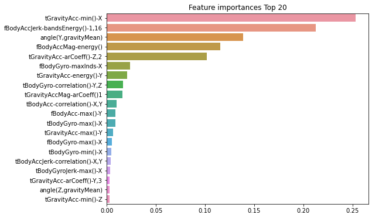

# DecisionTreeClassifier를 이용한 실습

http://archive.ics.uci.edu/ml/datasets/Human+Activity+Recognition+Using_Smartphones


```python
import pandas as pd
import matplotlib.pyplot as plt
%matplotlib inline

feature_name_df=pd.read_csv(r'C:\Users\user\Data_Handling\human_activity\features.txt', sep='\s+', header=None, names=['column_index', 'column_name'])
print(feature_name_df)
feature_name=feature_name_df.iloc[:,1].values.tolist()
feature_dup_df=feature_name_df.groupby('column_name').count()
print(feature_dup_df[feature_dup_df['column_index']>1].count())
```

         column_index                           column_name
    0               1                     tBodyAcc-mean()-X
    1               2                     tBodyAcc-mean()-Y
    2               3                     tBodyAcc-mean()-Z
    3               4                      tBodyAcc-std()-X
    4               5                      tBodyAcc-std()-Y
    ..            ...                                   ...
    556           557      angle(tBodyGyroMean,gravityMean)
    557           558  angle(tBodyGyroJerkMean,gravityMean)
    558           559                  angle(X,gravityMean)
    559           560                  angle(Y,gravityMean)
    560           561                  angle(Z,gravityMean)
    
    [561 rows x 2 columns]
    column_index    42
    dtype: int64
    

feature_name이 겹치는게 42개가 있으므로, 원본 feature명에 \_1또는_2를 추가로 부여해 새로운 피처명을 가지는 DataFrame을 만들자!

*참고: drop할 때, axis=1이 컬럼방향축으로 drop*


```python
def get_new_feature_name_df(old_feature_name_df):
    feature_dup_df=pd.DataFrame(data=old_feature_name_df.groupby('column_name').cumcount(), columns=['dup_cnt'])
    feature_dup_df=feature_dup_df.reset_index()
    print(feature_dup_df)
    new_feature_name_df=pd.merge(old_feature_name_df.reset_index(), feature_dup_df, how='outer')
    print(new_feature_name_df)
    new_feature_name_df['column_name']=new_feature_name_df[['column_name','dup_cnt']].apply(lambda x:x[0]+'_'+str(x[1]) if x[1]>0 else x[0], axis=1)
    new_feature_name_df=new_feature_name_df.drop(['index'], axis=1)
    print(new_feature_name_df)
    return new_feature_name_df
new_feature_name_df=get_new_feature_name_df(feature_name_df)
```

         index  dup_cnt
    0        0        0
    1        1        0
    2        2        0
    3        3        0
    4        4        0
    ..     ...      ...
    556    556        0
    557    557        0
    558    558        0
    559    559        0
    560    560        0
    
    [561 rows x 2 columns]
         index  column_index                           column_name  dup_cnt
    0        0             1                     tBodyAcc-mean()-X        0
    1        1             2                     tBodyAcc-mean()-Y        0
    2        2             3                     tBodyAcc-mean()-Z        0
    3        3             4                      tBodyAcc-std()-X        0
    4        4             5                      tBodyAcc-std()-Y        0
    ..     ...           ...                                   ...      ...
    556    556           557      angle(tBodyGyroMean,gravityMean)        0
    557    557           558  angle(tBodyGyroJerkMean,gravityMean)        0
    558    558           559                  angle(X,gravityMean)        0
    559    559           560                  angle(Y,gravityMean)        0
    560    560           561                  angle(Z,gravityMean)        0
    
    [561 rows x 4 columns]
         column_index                           column_name  dup_cnt
    0               1                     tBodyAcc-mean()-X        0
    1               2                     tBodyAcc-mean()-Y        0
    2               3                     tBodyAcc-mean()-Z        0
    3               4                      tBodyAcc-std()-X        0
    4               5                      tBodyAcc-std()-Y        0
    ..            ...                                   ...      ...
    556           557      angle(tBodyGyroMean,gravityMean)        0
    557           558  angle(tBodyGyroJerkMean,gravityMean)        0
    558           559                  angle(X,gravityMean)        0
    559           560                  angle(Y,gravityMean)        0
    560           561                  angle(Z,gravityMean)        0
    
    [561 rows x 3 columns]
    

*참고: 첫번째 행이 칼럼이름이라면 header=0으로 지정해주면 되고, header=None은 칼럼이름이 없다는 뜻이다. names있으면 굳이 header=None 안써줘도 될듯!*


```python
feature_name=new_feature_name_df.iloc[:,1].values.tolist()
X_train=pd.read_csv(r'C:\Users\user\Data_Handling\human_activity\train\X_train.txt', sep='\s+', names=feature_name)
X_test=pd.read_csv(r'C:\Users\user\Data_Handling\human_activity\test\X_test.txt', sep='\s+', names=feature_name)

y_train=pd.read_csv(r'C:\Users\user\Data_Handling\human_activity\train\y_train.txt', sep='\s+', header=None, names=['action'])
y_test=pd.read_csv(r'C:\Users\user\Data_Handling\human_activity\test\y_test.txt', sep='\s+', header=None, names=['action'])

print(X_train.info())
X_train

```

    <class 'pandas.core.frame.DataFrame'>
    RangeIndex: 7352 entries, 0 to 7351
    Columns: 561 entries, tBodyAcc-mean()-X to angle(Z,gravityMean)
    dtypes: float64(561)
    memory usage: 31.5 MB
    None
    


<div>
<style scoped>
    .dataframe tbody tr th:only-of-type {
        vertical-align: middle;
    }

    .dataframe tbody tr th {
        vertical-align: top;
    }

    .dataframe thead th {
        text-align: right;
    }
</style>
<table border="1" class="dataframe">
  <thead>
    <tr style="text-align: right;">
      <th></th>
      <th>tBodyAcc-mean()-X</th>
      <th>tBodyAcc-mean()-Y</th>
      <th>tBodyAcc-mean()-Z</th>
      <th>tBodyAcc-std()-X</th>
      <th>tBodyAcc-std()-Y</th>
      <th>tBodyAcc-std()-Z</th>
      <th>tBodyAcc-mad()-X</th>
      <th>tBodyAcc-mad()-Y</th>
      <th>tBodyAcc-mad()-Z</th>
      <th>tBodyAcc-max()-X</th>
      <th>...</th>
      <th>fBodyBodyGyroJerkMag-meanFreq()</th>
      <th>fBodyBodyGyroJerkMag-skewness()</th>
      <th>fBodyBodyGyroJerkMag-kurtosis()</th>
      <th>angle(tBodyAccMean,gravity)</th>
      <th>angle(tBodyAccJerkMean),gravityMean)</th>
      <th>angle(tBodyGyroMean,gravityMean)</th>
      <th>angle(tBodyGyroJerkMean,gravityMean)</th>
      <th>angle(X,gravityMean)</th>
      <th>angle(Y,gravityMean)</th>
      <th>angle(Z,gravityMean)</th>
    </tr>
  </thead>
  <tbody>
    <tr>
      <th>0</th>
      <td>0.288585</td>
      <td>-0.020294</td>
      <td>-0.132905</td>
      <td>-0.995279</td>
      <td>-0.983111</td>
      <td>-0.913526</td>
      <td>-0.995112</td>
      <td>-0.983185</td>
      <td>-0.923527</td>
      <td>-0.934724</td>
      <td>...</td>
      <td>-0.074323</td>
      <td>-0.298676</td>
      <td>-0.710304</td>
      <td>-0.112754</td>
      <td>0.030400</td>
      <td>-0.464761</td>
      <td>-0.018446</td>
      <td>-0.841247</td>
      <td>0.179941</td>
      <td>-0.058627</td>
    </tr>
    <tr>
      <th>1</th>
      <td>0.278419</td>
      <td>-0.016411</td>
      <td>-0.123520</td>
      <td>-0.998245</td>
      <td>-0.975300</td>
      <td>-0.960322</td>
      <td>-0.998807</td>
      <td>-0.974914</td>
      <td>-0.957686</td>
      <td>-0.943068</td>
      <td>...</td>
      <td>0.158075</td>
      <td>-0.595051</td>
      <td>-0.861499</td>
      <td>0.053477</td>
      <td>-0.007435</td>
      <td>-0.732626</td>
      <td>0.703511</td>
      <td>-0.844788</td>
      <td>0.180289</td>
      <td>-0.054317</td>
    </tr>
    <tr>
      <th>2</th>
      <td>0.279653</td>
      <td>-0.019467</td>
      <td>-0.113462</td>
      <td>-0.995380</td>
      <td>-0.967187</td>
      <td>-0.978944</td>
      <td>-0.996520</td>
      <td>-0.963668</td>
      <td>-0.977469</td>
      <td>-0.938692</td>
      <td>...</td>
      <td>0.414503</td>
      <td>-0.390748</td>
      <td>-0.760104</td>
      <td>-0.118559</td>
      <td>0.177899</td>
      <td>0.100699</td>
      <td>0.808529</td>
      <td>-0.848933</td>
      <td>0.180637</td>
      <td>-0.049118</td>
    </tr>
    <tr>
      <th>3</th>
      <td>0.279174</td>
      <td>-0.026201</td>
      <td>-0.123283</td>
      <td>-0.996091</td>
      <td>-0.983403</td>
      <td>-0.990675</td>
      <td>-0.997099</td>
      <td>-0.982750</td>
      <td>-0.989302</td>
      <td>-0.938692</td>
      <td>...</td>
      <td>0.404573</td>
      <td>-0.117290</td>
      <td>-0.482845</td>
      <td>-0.036788</td>
      <td>-0.012892</td>
      <td>0.640011</td>
      <td>-0.485366</td>
      <td>-0.848649</td>
      <td>0.181935</td>
      <td>-0.047663</td>
    </tr>
    <tr>
      <th>4</th>
      <td>0.276629</td>
      <td>-0.016570</td>
      <td>-0.115362</td>
      <td>-0.998139</td>
      <td>-0.980817</td>
      <td>-0.990482</td>
      <td>-0.998321</td>
      <td>-0.979672</td>
      <td>-0.990441</td>
      <td>-0.942469</td>
      <td>...</td>
      <td>0.087753</td>
      <td>-0.351471</td>
      <td>-0.699205</td>
      <td>0.123320</td>
      <td>0.122542</td>
      <td>0.693578</td>
      <td>-0.615971</td>
      <td>-0.847865</td>
      <td>0.185151</td>
      <td>-0.043892</td>
    </tr>
    <tr>
      <th>...</th>
      <td>...</td>
      <td>...</td>
      <td>...</td>
      <td>...</td>
      <td>...</td>
      <td>...</td>
      <td>...</td>
      <td>...</td>
      <td>...</td>
      <td>...</td>
      <td>...</td>
      <td>...</td>
      <td>...</td>
      <td>...</td>
      <td>...</td>
      <td>...</td>
      <td>...</td>
      <td>...</td>
      <td>...</td>
      <td>...</td>
      <td>...</td>
    </tr>
    <tr>
      <th>7347</th>
      <td>0.299665</td>
      <td>-0.057193</td>
      <td>-0.181233</td>
      <td>-0.195387</td>
      <td>0.039905</td>
      <td>0.077078</td>
      <td>-0.282301</td>
      <td>0.043616</td>
      <td>0.060410</td>
      <td>0.210795</td>
      <td>...</td>
      <td>-0.070157</td>
      <td>-0.588433</td>
      <td>-0.880324</td>
      <td>-0.190437</td>
      <td>0.829718</td>
      <td>0.206972</td>
      <td>-0.425619</td>
      <td>-0.791883</td>
      <td>0.238604</td>
      <td>0.049819</td>
    </tr>
    <tr>
      <th>7348</th>
      <td>0.273853</td>
      <td>-0.007749</td>
      <td>-0.147468</td>
      <td>-0.235309</td>
      <td>0.004816</td>
      <td>0.059280</td>
      <td>-0.322552</td>
      <td>-0.029456</td>
      <td>0.080585</td>
      <td>0.117440</td>
      <td>...</td>
      <td>0.165259</td>
      <td>-0.390738</td>
      <td>-0.680744</td>
      <td>0.064907</td>
      <td>0.875679</td>
      <td>-0.879033</td>
      <td>0.400219</td>
      <td>-0.771840</td>
      <td>0.252676</td>
      <td>0.050053</td>
    </tr>
    <tr>
      <th>7349</th>
      <td>0.273387</td>
      <td>-0.017011</td>
      <td>-0.045022</td>
      <td>-0.218218</td>
      <td>-0.103822</td>
      <td>0.274533</td>
      <td>-0.304515</td>
      <td>-0.098913</td>
      <td>0.332584</td>
      <td>0.043999</td>
      <td>...</td>
      <td>0.195034</td>
      <td>0.025145</td>
      <td>-0.304029</td>
      <td>0.052806</td>
      <td>-0.266724</td>
      <td>0.864404</td>
      <td>0.701169</td>
      <td>-0.779133</td>
      <td>0.249145</td>
      <td>0.040811</td>
    </tr>
    <tr>
      <th>7350</th>
      <td>0.289654</td>
      <td>-0.018843</td>
      <td>-0.158281</td>
      <td>-0.219139</td>
      <td>-0.111412</td>
      <td>0.268893</td>
      <td>-0.310487</td>
      <td>-0.068200</td>
      <td>0.319473</td>
      <td>0.101702</td>
      <td>...</td>
      <td>0.013865</td>
      <td>0.063907</td>
      <td>-0.344314</td>
      <td>-0.101360</td>
      <td>0.700740</td>
      <td>0.936674</td>
      <td>-0.589479</td>
      <td>-0.785181</td>
      <td>0.246432</td>
      <td>0.025339</td>
    </tr>
    <tr>
      <th>7351</th>
      <td>0.351503</td>
      <td>-0.012423</td>
      <td>-0.203867</td>
      <td>-0.269270</td>
      <td>-0.087212</td>
      <td>0.177404</td>
      <td>-0.377404</td>
      <td>-0.038678</td>
      <td>0.229430</td>
      <td>0.269013</td>
      <td>...</td>
      <td>-0.058402</td>
      <td>-0.387052</td>
      <td>-0.740738</td>
      <td>-0.280088</td>
      <td>-0.007739</td>
      <td>-0.056088</td>
      <td>-0.616956</td>
      <td>-0.783267</td>
      <td>0.246809</td>
      <td>0.036695</td>
    </tr>
  </tbody>
</table>
<p>7352 rows × 561 columns</p>
</div>


피처가 전부 float 형의 숫자형이므로 별도의 카테고리 인코딩은 수행할 필요가 없다.<br/>
레이블 값은 특정 값으로 왜곡되지 않고 비교적 고르게 분포되어 있다.


```python
print(y_train['action'].value_counts())
```

    6    1407
    5    1374
    4    1286
    1    1226
    2    1073
    3     986
    Name: action, dtype: int64
    


```python
from sklearn.tree import DecisionTreeClassifier
from sklearn.metrics import accuracy_score
from sklearn.model_selection import GridSearchCV

dt_clf=DecisionTreeClassifier(random_state=156)
dt_clf.fit(X_train, y_train)
pred=dt_clf.predict(X_test)
accuracy=accuracy_score(y_test, pred)
print("결정 트리 예측 정확도: {0:.4f}".format(accuracy))
print("DecisionTreeClassifier 기본 하이퍼 파라미터:\n", dt_clf.get_params())
params={
    'max_depth':[6,8,10,12,16,20,24]
}
grid_cv=GridSearchCV(dt_clf, param_grid=params, scoring='accuracy', cv=5, verbose=1)
grid_cv.fit(X_train,y_train)
print("GridSearchCV 최고 평균 정확도 수치: {0:.4f}".format(grid_cv.best_score_))
print("GridSearchCV 최적 하이퍼 파라미터:", grid_cv.best_params_)
cv_results_df=pd.DataFrame(grid_cv.cv_results_)
cv_results_df
```

    결정 트리 예측 정확도: 0.8548
    DecisionTreeClassifier 기본 하이퍼 파라미터:
     {'ccp_alpha': 0.0, 'class_weight': None, 'criterion': 'gini', 'max_depth': None, 'max_features': None, 'max_leaf_nodes': None, 'min_impurity_decrease': 0.0, 'min_impurity_split': None, 'min_samples_leaf': 1, 'min_samples_split': 2, 'min_weight_fraction_leaf': 0.0, 'presort': 'deprecated', 'random_state': 156, 'splitter': 'best'}
    Fitting 5 folds for each of 7 candidates, totalling 35 fits
    

    [Parallel(n_jobs=1)]: Using backend SequentialBackend with 1 concurrent workers.
    [Parallel(n_jobs=1)]: Done  35 out of  35 | elapsed:  1.5min finished
    

    GridSearchCV 최고 평균 정확도 수치: 0.8513
    GridSearchCV 최적 하이퍼 파라미터: {'max_depth': 16}
    


<div>
<style scoped>
    .dataframe tbody tr th:only-of-type {
        vertical-align: middle;
    }

    .dataframe tbody tr th {
        vertical-align: top;
    }

    .dataframe thead th {
        text-align: right;
    }
</style>
<table border="1" class="dataframe">
  <thead>
    <tr style="text-align: right;">
      <th></th>
      <th>mean_fit_time</th>
      <th>std_fit_time</th>
      <th>mean_score_time</th>
      <th>std_score_time</th>
      <th>param_max_depth</th>
      <th>params</th>
      <th>split0_test_score</th>
      <th>split1_test_score</th>
      <th>split2_test_score</th>
      <th>split3_test_score</th>
      <th>split4_test_score</th>
      <th>mean_test_score</th>
      <th>std_test_score</th>
      <th>rank_test_score</th>
    </tr>
  </thead>
  <tbody>
    <tr>
      <th>0</th>
      <td>1.640813</td>
      <td>0.168011</td>
      <td>0.007381</td>
      <td>0.001493</td>
      <td>6</td>
      <td>{'max_depth': 6}</td>
      <td>0.813732</td>
      <td>0.872876</td>
      <td>0.819728</td>
      <td>0.865986</td>
      <td>0.881633</td>
      <td>0.850791</td>
      <td>0.028313</td>
      <td>5</td>
    </tr>
    <tr>
      <th>1</th>
      <td>2.025088</td>
      <td>0.087790</td>
      <td>0.006982</td>
      <td>0.000892</td>
      <td>8</td>
      <td>{'max_depth': 8}</td>
      <td>0.820530</td>
      <td>0.819850</td>
      <td>0.855102</td>
      <td>0.868707</td>
      <td>0.891156</td>
      <td>0.851069</td>
      <td>0.027719</td>
      <td>3</td>
    </tr>
    <tr>
      <th>2</th>
      <td>2.351969</td>
      <td>0.087595</td>
      <td>0.006781</td>
      <td>0.000745</td>
      <td>10</td>
      <td>{'max_depth': 10}</td>
      <td>0.799456</td>
      <td>0.814412</td>
      <td>0.863265</td>
      <td>0.891156</td>
      <td>0.887755</td>
      <td>0.851209</td>
      <td>0.037707</td>
      <td>2</td>
    </tr>
    <tr>
      <th>3</th>
      <td>2.596052</td>
      <td>0.134093</td>
      <td>0.007382</td>
      <td>0.001024</td>
      <td>12</td>
      <td>{'max_depth': 12}</td>
      <td>0.794697</td>
      <td>0.813052</td>
      <td>0.848980</td>
      <td>0.877551</td>
      <td>0.886395</td>
      <td>0.844135</td>
      <td>0.035598</td>
      <td>7</td>
    </tr>
    <tr>
      <th>4</th>
      <td>2.890335</td>
      <td>0.211083</td>
      <td>0.006574</td>
      <td>0.000483</td>
      <td>16</td>
      <td>{'max_depth': 16}</td>
      <td>0.799456</td>
      <td>0.818491</td>
      <td>0.853061</td>
      <td>0.887755</td>
      <td>0.897959</td>
      <td>0.851344</td>
      <td>0.038140</td>
      <td>1</td>
    </tr>
    <tr>
      <th>5</th>
      <td>2.970255</td>
      <td>0.247266</td>
      <td>0.006587</td>
      <td>0.000803</td>
      <td>20</td>
      <td>{'max_depth': 20}</td>
      <td>0.802855</td>
      <td>0.818491</td>
      <td>0.856463</td>
      <td>0.877551</td>
      <td>0.898639</td>
      <td>0.850800</td>
      <td>0.035718</td>
      <td>4</td>
    </tr>
    <tr>
      <th>6</th>
      <td>2.937618</td>
      <td>0.237322</td>
      <td>0.006380</td>
      <td>0.000487</td>
      <td>24</td>
      <td>{'max_depth': 24}</td>
      <td>0.796057</td>
      <td>0.818491</td>
      <td>0.856463</td>
      <td>0.877551</td>
      <td>0.898639</td>
      <td>0.849440</td>
      <td>0.037597</td>
      <td>6</td>
    </tr>
  </tbody>
</table>
</div>


```python
params={
    'max_depth':[6,8,10,12,16,20,24],
    'min_samples_split':[16,24]
}
grid_cv=GridSearchCV(dt_clf, param_grid=params, scoring='accuracy', cv=5, verbose=1)
grid_cv.fit(X_train, y_train)
print("GridSearchCV 최고 평균 정확도 수치: {0:.4f}".format(grid_cv.best_score_))
print("GridSearchCV 최적 하이퍼 파라미터:", grid_cv.best_params_)
best_df_clf=grid_cv.best_estimator_
pred1=best_df_clf.predict(X_test)
accuracy=accuracy_score(y_test, pred1)
print("결정 트리 예측 정확도:{0:.4f}".format(accuracy))
```

    Fitting 5 folds for each of 14 candidates, totalling 70 fits
    

    [Parallel(n_jobs=1)]: Using backend SequentialBackend with 1 concurrent workers.
    [Parallel(n_jobs=1)]: Done  70 out of  70 | elapsed:  2.9min finished
    

    GridSearchCV 최고 평균 정확도 수치: 0.8549
    GridSearchCV 최적 하이퍼 파라미터: {'max_depth': 8, 'min_samples_split': 16}
    결정 트리 예측 정확도:0.8717
    


```python
import seaborn as sns

ftr_importances_values=best_df_clf.feature_importances_
ftr_importances=pd.Series(ftr_importances_values, index=X_train.columns)
ftr_top20=ftr_importances.sort_values(ascending=False)[:20]
plt.figure(figsize=(8,6))
plt.title('Feature importances Top 20')
sns.barplot(x=ftr_top20, y=ftr_top20.index)
plt.show()
```


    

    

