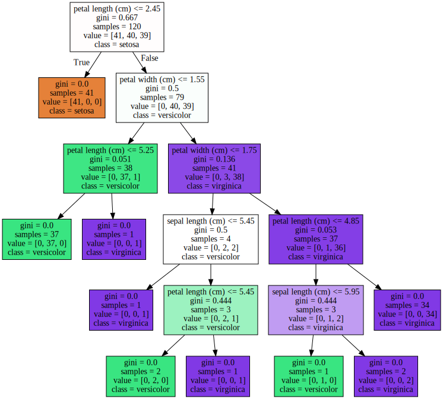
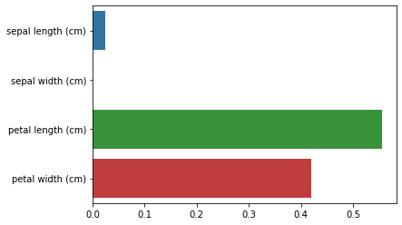
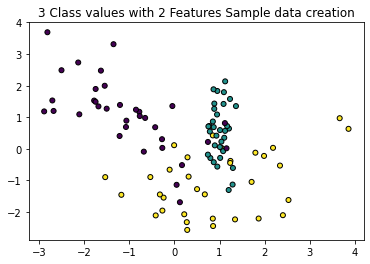
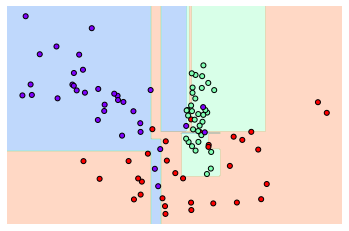
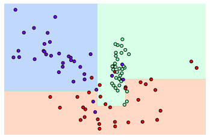

# 분류

### 대표적인 분류 알고리즘
* 베이즈 통계와 생성 모델에 기반한 나이브 베이즈(Naive Bayes)
* 독립변수와 종속변수의 선형 관계성에 기반한 로지스틱 회귀(Logistic Regression)
* 데이터 균일도에 따른 규칙 기반의 결정 트리(Decision Tree)
* 개별 클래스 간의 최대 분류 마진을 효과적으로 찾아주는 서포트 벡터 머신(Support Vector Machine)
* 근접 거리를 기준으로 하는 최소 근접(Nearest Neighbor) 알고리즘
* 심층 연결 기반의 신경망(Neural Network)
* 서로 다른/같은 머신러닝 알고리즘을 결합한 앙상블(Ensemble)


이미지, 영상, 음성, NLP 영역에서 신경망에 기반한 딥러닝이 머신러닝계를 선도<br/>
앙상블은 **Bagging**과 **Boosting**으로 나뉜다.
* Bagging -> RandomFroest
* Boosting -> Gradient Boosting, XgBoosting, LightGBM
* 앙상블의 앙상블 -> Stacking


## 결정트리

결정트리 알고리즘은 데이터에 있는 규칙을 학습을 통해 자동으로 찾아내 트리 기반의 분류 규칙을 만든다. 많은 규칙이 있다는 것은 과적합으로 이어질 수 있으므로, 가능한 한 적은 결정노드로 높은 예측 정확도를 가져야 한다.

* 결정노드는 정보 균일도가 높은 데이터 세트를 먼저 선택할 수 있도록 규칙 조건을 만든다

**정보이득(Information Gain)**: 1-엔트로피 지수, 서로 다른 값이 섞여있으면 엔트로피가 높고, 같은 값이 섞여 있으면 엔트로피가 낮다. 즉, 정보이득이 높은 속성을 기준으로 분할!

**지니계수** : 데이터가 평등(0), 불평등한 값(1)이 된다. 지니계수가 낮을수록 데이터 균일도가 높으므로, 지니계수가 낮은 속성을 기준으로 분할!

사이킷런에서 제공하는 결정트리 알고리즘 -> **DecisionTreeClassifier**는 기본으로 지니 계수를 이용해 데이터 세트를 분할<br/>

결정트리 모델은 정보의 균일도만 신경쓰면 되므로 특별한 경우를 제외하고는 <u>각 피처의 스케일링과 정규화같은 전처리 작업이 필요없다</u>. 다만, 과적합으로 알고리즘 성능이 떨어질 수 있으므로 이를 극복하기 위해 <u>트리의 크기를 사전에 제한하는 튜닝 필요</u>!

### 결정 트리 파라미터
-> 트리의 크기를 제어

* max_depth
* max_features
* min_samples_split : 노드를 분할하기 위한 최소한의 샘플 데이터 수
* min_samples_leaf : 말단 노드가 되기 위한 최소한의 샘플 데이터 수
* max_leaf_nodes


```python
from sklearn.tree import DecisionTreeClassifier
from sklearn.datasets import load_iris
from sklearn.model_selection import train_test_split
import warnings
warnings.filterwarnings('ignore')

dt_clf=DecisionTreeClassifier(random_state=156)
iris_data=load_iris()
X_train,X_test,y_train,y_test=train_test_split(iris_data.data, iris_data.target, test_size=0.2, random_state=11)
dt_clf.fit(X_train,y_train)
```


    DecisionTreeClassifier(random_state=156)


```python
from sklearn.tree import export_graphviz
export_graphviz(dt_clf, out_file="tree.dot", class_names=iris_data.target_names, feature_names=iris_data.feature_names, impurity=True, filled=True)
```


```python
import graphviz
with open("tree.dot") as f:
    dot_graph=f.read()
graphviz.Source(dot_graph)
```


    

    


**feature_importances_** 로 중요 feature를 알 수 있다


```python
import seaborn as sns
import numpy as np
%matplotlib inline

print("Feature importances:\n{0}".format(np.round(dt_clf.feature_importances_, 3)))

for name, value in zip(iris_data.feature_names, dt_clf.feature_importances_):
    print("{0} : {1:.3f}".format(name,value))

sns.barplot(x=dt_clf.feature_importances_,y=iris_data.feature_names)
```

    Feature importances:
    [0.025 0.    0.555 0.42 ]
    sepal length (cm) : 0.025
    sepal width (cm) : 0.000
    petal length (cm) : 0.555
    petal width (cm) : 0.420
    


    <AxesSubplot:>


    

    


```python
from sklearn.datasets import make_classification
import matplotlib.pyplot as plt
%matplotlib inline

plt.title("3 Class values with 2 Features Sample data creation")

X_features, y_labels=make_classification(n_features=2, n_redundant=0, n_informative=2, n_classes=3, n_clusters_per_class=1, random_state=0)
plt.scatter(X_features[:,0], X_features[:,1], marker='o', c=y_labels,s=25,edgecolor='k')
```


    <matplotlib.collections.PathCollection at 0x276c1ae2970>


    

    


```python
from sklearn.tree import DecisionTreeClassifier

def visualize_boundary(model, X, y):
    fig,ax = plt.subplots()
    
    # 학습 데이타 scatter plot으로 나타내기
    ax.scatter(X[:, 0], X[:, 1], c=y, s=25, cmap='rainbow', edgecolor='k',
               clim=(y.min(), y.max()), zorder=3)
    ax.axis('tight')
    ax.axis('off')
    xlim_start , xlim_end = ax.get_xlim()
    ylim_start , ylim_end = ax.get_ylim()
    # 호출 파라미터로 들어온 training 데이타로 model 학습 . 
    
    model.fit(X, y)
    # meshgrid 형태인 모든 좌표값으로 예측 수행. 
    xx, yy = np.meshgrid(np.linspace(xlim_start,xlim_end, num=200),np.linspace(ylim_start,ylim_end, num=200))
    
    Z = model.predict(np.c_[xx.ravel(), yy.ravel()]).reshape(xx.shape)
    
    # contourf() 를 이용하여 class boundary 를 visualization 수행. 
    n_classes = len(np.unique(y))

    contours = ax.contourf(xx, yy, Z, alpha=0.3,
                           levels=np.arange(n_classes +1) - 0.5,
                           cmap='rainbow', clim=(y.min(), y.max()),
                           zorder=1)

# 특정한 트리 생성 제약없는 결정 트리의 Decsion Boundary 시각화.
dt_clf = DecisionTreeClassifier().fit(X_features, y_labels)
visualize_boundary(dt_clf, X_features, y_labels)
```


    

    


**min_samples_leaf**를 6으로 설정!


```python
dt_clf=DecisionTreeClassifier(min_samples_leaf=6).fit(X_features,y_labels)
visualize_boundary(dt_clf, X_features, y_labels)
```


    

    

