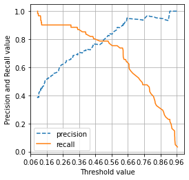
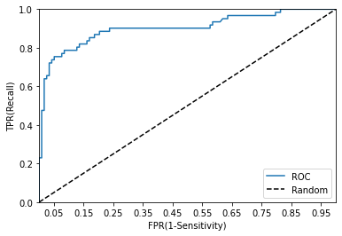

# 평가

* 정확도(Accuracy)
* 오차행렬(Confusion Matrix)
* 정밀도(Precision)
* 재현율(Recall)
* F1 스코어
* ROC AUC

## 정확도(Accuracy)

단순히 성별에 따라 분류를 해도 다음과 같이 높은 정확도를 보인다.


```python
from sklearn.base import BaseEstimator
from sklearn.model_selection import train_test_split
from sklearn.metrics import accuracy_score
from sklearn import preprocessing
import numpy as np
import pandas as pd


#NULL 처리함수
def fillna(df):   
    df['Age'].fillna(df['Age'].mean(), inplace=True)
    df['Cabin'].fillna('N',inplace=True)
    df['Embarked'].fillna('N', inplace=True)
    return df

#머신러닝 알고리즘에 불필요한 속성 제거
def drop_features(df): 
    df.drop(['PassengerId','Name','Ticket'],axis=1,inplace=True)
    return df
   
#레이블 인코딩 수행
def format_features(df):
     
    df['Cabin']=df['Cabin'].str[:1]
    features=['Cabin','Sex','Embarked']
    for feature in features:
        le=preprocessing.LabelEncoder()
        le=le.fit(df[feature])
        df[feature]=le.transform(df[feature])
    return df

#앞에서 설정한 데이터 전처리 함수 호출
def transform_features(df):
    df=fillna(df)
    df=drop_features(df)
    df=format_features(df)
    return df

class MyDummyClassifier(BaseEstimator):
    def fit(self, X, y=None):
        pass
    def predict(self, X):
        pred=np.zeros((X.shape[0],1))
        for i in range(X.shape[0]):
            if X['Sex'].iloc[i]==1:
                pred[i]=0
            else:
                pred[i]=1
        return pred

titanic_df=pd.read_csv(r'C:\Users\user\Data_Handling\titanic_train.csv')
y_titanic_df=titanic_df['Survived']
X_titanic_df=titanic_df.drop('Survived', axis=1)
X_titanic_df=transform_features(X_titanic_df)
X_train, X_test, y_train, y_test=train_test_split(X_titanic_df,y_titanic_df, test_size=0.2, random_state=0)
myclf=MyDummyClassifier()
myclf.fit(X_train,y_train)
mypredictions=myclf.predict(X_test)
print("Dummy Classifier의 정확도는: {0:.4f}".format(accuracy_score(y_test, mypredictions)))
```

    Dummy Classifier의 정확도는: 0.7877
    

mnist손글씨를 7인가 아닌가(true/false)로 분류하는 문제에서 모두 false로 예측해도 정확도가 90%이다. 따라서 불균형한 레입르 데이터 세트에서 accuracy는 성능수치로 사용해서는 안된다.


```python
from sklearn.datasets import load_digits

class MyFakeClassifier(BaseEstimator):
    def fit(self, X, y=None):
        pass
    def predict(self, X):
        return np.zeros((len(X),1), dtype=bool)

digits=load_digits()
y=(digits.target==7)#.astype(int)
X_train,X_test, y_train, y_test=train_test_split(digits.data, y, random_state=11)

print("레이블 테스트 세트 크기:", y_test.shape)
print("테스트 세트 레이블 0과 1의 분포도:\n", pd.Series(y_test).value_counts())

fakeclf=MyFakeClassifier()
fakeclf.fit(X_train,y_train)
fakepred=fakeclf.predict(X_test)
print("모든 예측을 0으로 하여도 정확도는:{:.3f}".format(accuracy_score(y_test,fakepred)))
```

    레이블 테스트 세트 크기: (450,)
    테스트 세트 레이블 0과 1의 분포도:
     False    405
    True      45
    dtype: int64
    모든 예측을 0으로 하여도 정확도는:0.900
    

## 오차행렬(Confusion Matrix)
* 실제  |  예측
* True  Negative : 예측은 Negative, 실제도 Negative
* False Positive : 예측은 Positive, 실제는 Negative
* False Negative : 예측은 Negative, 실제는 Positive
* True  Positive : 예측은 Positive, 실제도 Positive


```python
from sklearn.metrics import confusion_matrix

confusion_matrix(y_test, fakepred)
```


    array([[405,   0],
           [ 45,   0]], dtype=int64)


**정확도=(TN+TP)/(TN+FP+FN+TP)** <br/>
**precison_score() 정밀도=TP/(FP+TP)** -> 예측을 positive로 한 대상 중에<br/>
**recall_score()   재현율=TP/(FN+TP)** -> 실제값이 positive인 대상 중에 -> 민감도 또는 TPR이라고 부른다<br/>


```python
from sklearn.metrics import accuracy_score, precision_score, recall_score
import pandas as pd
from sklearn.linear_model import LogisticRegression

def get_clf_eval(y_test,pred):
    confusion=confusion_matrix(y_test,pred)
    accuracy=accuracy_score(y_test,pred)
    precision=precision_score(y_test,pred)
    recall=recall_score(y_test,pred)
    print("오차 행렬")
    print(confusion)
    print("정확도: {0:.4f}, 정밀도: {1:.4f}, 재현율: {2:.4f}".format(accuracy, precision, recall))

titanic_df=pd.read_csv(r'C:\Users\user\Data_Handling\titanic_train.csv')
y_titanic_df=titanic_df['Survived']
X_titanic_df=titanic_df.drop('Survived', axis=1)
X_titanic_df=transform_features(X_titanic_df)
X_train, X_test, y_train, y_test=train_test_split(X_titanic_df,y_titanic_df, test_size=0.2, random_state=11)

lr_clf=LogisticRegression(max_iter=500)
lr_clf.fit(X_train, y_train)
pred=lr_clf.predict(X_test)
get_clf_eval(y_test,pred)
```

    오차 행렬
    [[104  14]
     [ 13  48]]
    정확도: 0.8492, 정밀도: 0.7742, 재현율: 0.7869
    

## 정밀도/재현율 트레이드오프

분류 결정 임곗값이 낮아질수록 Positive로 예측할 확률이 높아진다->재현율 증가 <br/>
**predict_proba()**: 개별 데이터별로 예측 확률을 반환하는 메서드<br/>
predict는 분류 결정 임계값에 기반하여 predict_proba() 반영해서 결정!


```python
titanic_df=pd.read_csv(r'C:\Users\user\Data_Handling\titanic_train.csv')
y_titanic_df=titanic_df['Survived']
X_titanic_df=titanic_df.drop('Survived', axis=1)
X_titanic_df=transform_features(X_titanic_df)
X_train, X_test, y_train, y_test=train_test_split(X_titanic_df,y_titanic_df, test_size=0.2, random_state=11)

pred_proba=lr_clf.predict_proba(X_test)
pred_proba_result=np.concatenate([pred_proba,pred.reshape(-1,1)],axis=1)
print(pred_proba_result[:3])
```

    [[0.46216576 0.53783424 1.        ]
     [0.8787286  0.1212714  0.        ]
     [0.87716197 0.12283803 0.        ]]
    

### Binarizer
* 생성자로 threshold
* **fit_transform()**


```python
from sklearn.preprocessing import Binarizer
X=[[1,-1,2],
   [2,0,0],
   [0,1.1,1.2]]

binarizer=Binarizer(threshold=1.1)
binarizer.fit_transform((X))
```


    array([[0., 0., 1.],
           [1., 0., 0.],
           [0., 0., 1.]])


```python
pred_proba_1=pred_proba[:,1].reshape(-1,1)
binarizer=Binarizer(threshold=0.5)
custom_predict=binarizer.fit_transform(pred_proba_1)
get_clf_eval(y_test,custom_predict)
```

    오차 행렬
    [[104  14]
     [ 13  48]]
    정확도: 0.8492, 정밀도: 0.7742, 재현율: 0.7869
    

분류결정 임곗값을 낮추면(positive가 많아지기 때문에) 정밀도는 떨어지고 재현율을 높아진다!


```python
pred_proba_1=pred_proba[:,1].reshape(-1,1)
binarizer=Binarizer(threshold=0.4)
custom_predict=binarizer.fit_transform(pred_proba_1)
get_clf_eval(y_test,custom_predict)
```

    오차 행렬
    [[98 20]
     [10 51]]
    정확도: 0.8324, 정밀도: 0.7183, 재현율: 0.8361
    


```python
thresholds=[0.4,0.45,0.50,0.55,0.60]

def get_eval_by_threshold(y_test, pred_proba_1, thresholds):
    for custom_threshold in thresholds:
        binarizer=Binarizer(threshold=custom_threshold)
        custom_predict=binarizer.fit_transform(pred_proba_1)
        print('\n임곗값:', custom_threshold)
        get_clf_eval(y_test, custom_predict)

get_eval_by_threshold(y_test, pred_proba[:,1].reshape(-1,1),thresholds)
```

    
    임곗값: 0.4
    오차 행렬
    [[98 20]
     [10 51]]
    정확도: 0.8324, 정밀도: 0.7183, 재현율: 0.8361
    
    임곗값: 0.45
    오차 행렬
    [[103  15]
     [ 12  49]]
    정확도: 0.8492, 정밀도: 0.7656, 재현율: 0.8033
    
    임곗값: 0.5
    오차 행렬
    [[104  14]
     [ 13  48]]
    정확도: 0.8492, 정밀도: 0.7742, 재현율: 0.7869
    
    임곗값: 0.55
    오차 행렬
    [[109   9]
     [ 15  46]]
    정확도: 0.8659, 정밀도: 0.8364, 재현율: 0.7541
    
    임곗값: 0.6
    오차 행렬
    [[112   6]
     [ 16  45]]
    정확도: 0.8771, 정밀도: 0.8824, 재현율: 0.7377
    

 **precision_recall_curve()** -> 반환값: thresholds, precision, recall


```python
from sklearn.metrics import precision_recall_curve

pred_proba_class1=lr_clf.predict_proba(X_test)[:,1]
precisions, recalls, thresholds=precision_recall_curve(y_test, pred_proba_class1)

thr_index=np.arange(0,thresholds.shape[0],15)
print("샘플 추출을 위한 임계값 배열의 index 10개:",thr_index)
print("샘플용 10개의 임계값:", np.round(thresholds[thr_index], 2))
print("샘플 임계값별 정밀도:", np.round(precisions[thr_index],2))
print("샘플 임계값별 재현율:", np.round(recalls[thr_index],3))
```

    샘플 추출을 위한 임계값 배열의 index 10개: [  0  15  30  45  60  75  90 105 120 135]
    샘플용 10개의 임계값: [0.1  0.12 0.14 0.19 0.28 0.4  0.56 0.67 0.82 0.95]
    샘플 임계값별 정밀도: [0.39 0.44 0.47 0.54 0.65 0.73 0.84 0.95 0.96 1.  ]
    샘플 임계값별 재현율: [1.    0.967 0.902 0.902 0.902 0.836 0.754 0.607 0.377 0.148]
    


```python
import matplotlib.pyplot as plt
import matplotlib.ticker as ticker
%matplotlib inline

def precision_recall_curve_plot(y_test, pred_proba_c1):
    precisions, recalls, thresholds = precision_recall_curve(y_test, pred_proba_c1)
    
    plt.figure(figsize=(4,4))
    threshold_boundary=thresholds.shape[0]
    plt.plot(thresholds, precisions[0:threshold_boundary], linestyle='--', label='precision')
    plt.plot(thresholds, recalls[0:threshold_boundary], label='recall')
    
    start, end=plt.xlim()
    
    plt.xticks(np.round(np.arange(start, end, 0.1),2))
    
    plt.xlabel("Threshold value")
    plt.ylabel("Precision and Recall value")
    plt.legend()
    
    plt.grid()
    plt.show()

precision_recall_curve_plot(y_test, lr_clf.predict_proba(X_test)[:,1])
```


    

    


## F1스코어 : 정밀도와 재현율을 결합한 지표
F1=2/(1/recall+1/precision)=2\*precision\*recall/(precision+recall) <br/>
**f1_score()** 사용!


```python
from sklearn.metrics import f1_score
f1=f1_score(y_test, pred)
print("F1 스코어: {0:.4f}".format(f1))
```

    F1 스코어: 0.7805
    

## ROC 곡선과 AUC(Area Under Curve)

사이킷런은 ROC곡선을 구하기 위해 **roc_curve()** -> 반환값: fpr, tpr, thresholds
* ROC 곡선: FPR이 변할 때 TPR이 어떻게 변하는지를 나타내는 곡선
* TPR=TP/(FN+TP)=재현율(민감도) -> 실제값 positive가 정확히 예측해야 하는 수준
* TNR=TN/(FP+TN)=특이성->실제값 negative가 정확히 예측해야 하는 수준
* FPR=FP/(TN+FP)=1-TNR=1-특이성

### AUC는 ROC 곡선 밑의 면적을 구한 것으로서 1에 가까울수록 좋은 수치이다
가운데 직선에서 멀어지고 왼쪽 상단 모서리쪽으로 가파르게 곡선이 이동할수록 AUC가 높아진다.<br/>
가운데 대각선 직선은 랜덤수준의(동전 던지기 수준) 이빈 분류 AUC값으로 0.5이다.


```python
from sklearn.metrics import roc_curve

pred_proba_class1=lr_clf.predict_proba(X_test)[:,1]

fprs, tprs, thresholds=roc_curve(y_test, pred_proba_class1)
#thresholds[0]은 max+1로 임의 설정된다!! & thresholds 큰값->작은값 순서로 되어있음
#thresholds 첫번째값은 쓰면 안되므로 arange에서 1부터 시작!
thr_index=np.arange(1,thresholds.shape[0],5)
print("샘플 추출을 위한 임곗값 배열의 index:",thr_index)
print("샘플 index로 추출한 임곗값:", np.round(thresholds[thr_index],2))

print("샘플 임곗값별 FPR:", np.round(fprs[thr_index],3))
print("샘플 임곗값별 TPR:", np.round(tprs[thr_index],3))
```

    샘플 추출을 위한 임곗값 배열의 index: [ 1  6 11 16 21 26 31 36 41 46 51]
    샘플 index로 추출한 임곗값: [0.97 0.65 0.63 0.56 0.45 0.4  0.35 0.15 0.13 0.11 0.11]
    샘플 임곗값별 FPR: [0.    0.017 0.034 0.076 0.127 0.169 0.203 0.466 0.585 0.686 0.797]
    샘플 임곗값별 TPR: [0.033 0.639 0.721 0.754 0.803 0.836 0.885 0.902 0.934 0.967 0.984]
    


```python
def roc_curve_plot(y_test, pred_proba_c1):
    fprs, tps, thresholds=roc_curve(y_test, pred_proba_c1)
    plt.plot(fprs, tprs, label='ROC')
    plt.plot([0,1],[0,1], 'k--', label='Random')
    
    start, end=plt.xlim()
    plt.xticks(np.round(np.arange(start, end, 0.1),2))
    plt.xlim(0,1)
    plt.ylim(0,1)
    plt.xlabel('FPR(1-Sensitivity)')
    plt.ylabel('TPR(Recall)')
    plt.legend()
    
roc_curve_plot(y_test, pred_proba[:,1])
```


    

    


**roc_auc_score()**로 AUC값을 구한다 -> 인자값, y_test, pred_proba(predict_proba()로 호출된 예측 확률 ndarray 중 positive열에 해당하는 ndarray)


```python
from sklearn.metrics import roc_auc_score

pred_proba=lr_clf.predict_proba(X_test)[:,1]
roc_score=roc_auc_score(y_test, pred_proba)
print("ROC AUC 값:{0:.4f}".format(roc_score))
```

    ROC AUC 값:0.9024
    


```python
def get_clf_eval(y_test,pred, pred_proba=None):
    confusion=confusion_matrix(y_test,pred)
    accuracy=accuracy_score(y_test,pred)
    precision=precision_score(y_test,pred)
    recall=recall_score(y_test,pred)
    f1=f1_score(y_test, pred)
    roc_auc=roc_auc_score(y_test, pred_proba)
    print("오차 행렬")
    print(confusion)
    print("정확도: {0:.4f}, 정밀도: {1:.4f}, 재현율: {2:.4f}, F1:{3:.4f}, AUC:{4:.4f}".format(accuracy, precision, recall,f1, roc_auc))

get_clf_eval(y_test, pred, pred_proba)
```

    오차 행렬
    [[104  14]
     [ 13  48]]
    정확도: 0.8492, 정밀도: 0.7742, 재현율: 0.7869, F1:0.7805, AUC:0.9024
    
