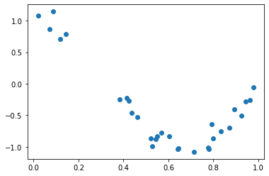
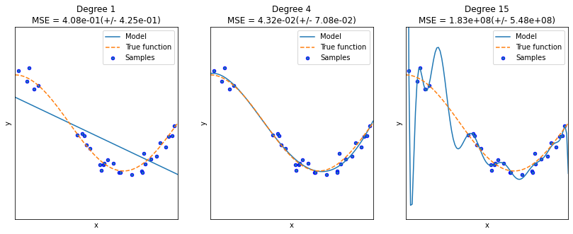

# 다항 회귀
사이킷런은 PolynomialFeatures로 피처를 변환한 후에 LinearRegression 클래스로 다항 회귀를 구현


```python
from sklearn.preprocessing import PolynomialFeatures
import numpy as np

X=np.arange(4).reshape(2,2)
print('일차 단항식 계수 feature:\n',X )

poly=PolynomialFeatures(degree=2)
poly.fit(X)
poly_ftr=poly.transform(X)
print('변환된 2차 다항식 계수 feature:\n', poly_ftr)
```

    일차 단항식 계수 feature:
     [[0 1]
     [2 3]]
    변환된 2차 다항식 계수 feature:
     [[1. 0. 1. 0. 0. 1.]
     [1. 2. 3. 4. 6. 9.]]
    

3차 다항식 결정값을 구하는 함수 polynomial_func(X) 생성. 즉 회귀식은 결정값 y = 1+ 2x_1 + 3x_1^2 + 4x_2^3 


```python
from sklearn.linear_model import LinearRegression

def polynomial_func(X):
    y=1+2*X[:,0]+3*X[:,0]**2+4*X[:,1]**3
    return y

X=np.arange(4).reshape(2,2)
print('일차 단항식 계수 feature: \n' ,X)
y=polynomial_func(X)
print('삼차 다항식 결정값: \n', y)

#3차 다항식 변환
poly_ftr=PolynomialFeatures(degree=3, include_bias=False).fit_transform(X)
print('3차 다항식 계수 feature: \n',poly_ftr)

#Linear Regression에 3차 다항식 계수 feature와 3차 다항식 결정값으로 학습 후 회귀 계수 확인
model=LinearRegression()
model.fit(poly_ftr,y)
print('Polynomial 회귀 Shape :', model.coef_.shape)
print('Polynomial 회귀 계수\n' , np.round(model.coef_, 2))

```

    일차 단항식 계수 feature: 
     [[0 1]
     [2 3]]
    삼차 다항식 결정값: 
     [  5 125]
    3차 다항식 계수 feature: 
     [[ 0.  1.  0.  0.  1.  0.  0.  0.  1.]
     [ 2.  3.  4.  6.  9.  8. 12. 18. 27.]]
    Polynomial 회귀 Shape : (9,)
    Polynomial 회귀 계수
     [0.18 0.18 0.36 0.54 0.72 0.72 1.08 1.62 2.34]
    

사이킷런에서는 일반적으로 **Pipeline 클래스**를 이용하여 PolynomialFeatures 변환과 LinearRegression 학습/예측을 결합하여 다항 회귀를 구현
### Pipeline 객체 사용


```python
from sklearn.pipeline import Pipeline

model=Pipeline([('poly',PolynomialFeatures(degree=3)),('linear',LinearRegression())])
X=np.arange(4).reshape(2,2)
y=polynomial_func(X)

model=model.fit(X,y)
print('Polynomial 회귀 계수\n', np.round(model.named_steps['linear'].coef_, 2))

```

    Polynomial 회귀 계수
     [0.   0.18 0.18 0.36 0.54 0.72 0.72 1.08 1.62 2.34]
    

## 다항 회귀를 이용한 보스턴 주택가격 예측 


```python
from sklearn.model_selection import train_test_split
from sklearn.linear_model import LinearRegression
from sklearn.metrics import mean_squared_error , r2_score
from sklearn.preprocessing import PolynomialFeatures
from sklearn.linear_model import LinearRegression
from sklearn.pipeline import Pipeline
from sklearn.datasets import load_boston
import numpy as np
import pandas as pd

boston=load_boston()
bostonDF=pd.DataFrame(boston.data, columns=boston.feature_names)

bostonDF['PRICE']=boston.target
y_target = bostonDF['PRICE']
X_data = bostonDF.drop(['PRICE'],axis=1,inplace=False)

X_train , X_test , y_train , y_test = train_test_split(X_data , y_target ,test_size=0.3, random_state=156)

## Pipeline을 이용하여 PolynomialFeatures 변환과 LinearRegression 적용을 순차적으로 결합. 
p_model = Pipeline([('poly', PolynomialFeatures(degree=3, include_bias=False)),
                  ('linear', LinearRegression())])

p_model.fit(X_train, y_train)
y_preds = p_model.predict(X_test)
mse = mean_squared_error(y_test, y_preds)
rmse = np.sqrt(mse)
r2score=r2_score(y_test,y_preds)

print('MSE : {0:.3f} , RMSE : {1:.3F}'.format(mse , rmse))
print('Variance score : {0:.3f}'.format(r2score))
```

    MSE : 79625.594 , RMSE : 282.180
    Variance score : -1116.598
    


```python
import numpy as np
import matplotlib.pyplot as plt
from sklearn.pipeline import Pipeline
from sklearn.preprocessing import PolynomialFeatures
from sklearn.linear_model import LinearRegression
from sklearn.model_selection import cross_val_score
%matplotlib inline

def true_fun(X):
    return np.cos(1.5*np.pi*X)

np.random.seed(0)
n_samples=30
X=np.sort(np.random.rand(n_samples))
y=true_fun(X)+np.random.randn(n_samples)*0.1
plt.scatter(X, y)

plt.figure(figsize=(14,5))
degrees=[1,4,15]

for i in range(len(degrees)):
    ax=plt.subplot(1,len(degrees),i+1)
    plt.setp(ax,xticks=(),yticks=())
    
    polynomial_features=PolynomialFeatures(degree=degrees[i], include_bias=False)
    linear_regression=LinearRegression()
    pipeline=Pipeline([("polynomial_features", polynomial_features),("linear_regression",linear_regression)])
    pipeline.fit(X.reshape(-1,1),y)
    
    scores=cross_val_score(pipeline, X.reshape(-1,1),y,scoring="neg_mean_squared_error", cv=10)
    coefficients=pipeline.named_steps['linear_regression'].coef_
    print('\nDegree {0} 회귀 계수: {1}'.format(degrees[i], np.round(coefficients),2))
    print('Degree {0} MSE: {1:.2f}'.format(degrees[i] , -1*np.mean(scores)))
    
    X_test=np.linspace(0,1,100)
    # 예측값 곡선
  
    plt.plot(X_test, pipeline.predict(X_test[:,np.newaxis]),label="Model")
    # 실제값 곡선
    plt.plot(X_test, true_fun(X_test), '--',label="True function")
    plt.scatter(X,y,edgecolor='b', s=20, label='Samples')
    
    plt.xlabel("x") 
    plt.ylabel("y") 
    plt.xlim((0, 1)) 
    plt.ylim((-2, 2))
    plt.legend(loc="best")
    plt.title("Degree {}\nMSE = {:.2e}(+/- {:.2e})".format(degrees[i], -scores.mean(), scores.std()))
    
plt.show()

    
```

    
    Degree 1 회귀 계수: [-2.]
    Degree 1 MSE: 0.41
    
    Degree 4 회귀 계수: [  0. -18.  24.  -7.]
    Degree 4 MSE: 0.04
    
    Degree 15 회귀 계수: [-2.98300000e+03  1.03900000e+05 -1.87417100e+06  2.03717220e+07
     -1.44873987e+08  7.09318780e+08 -2.47066977e+09  6.24564048e+09
     -1.15677067e+10  1.56895696e+10 -1.54006776e+10  1.06457788e+10
     -4.91379977e+09  1.35920330e+09 -1.70381654e+08]
    Degree 15 MSE: 182815433.48
    


    

    


    

    


## 편향-분산 트레이드오프(Bias-Variance Trade off)

Degree 1 -> 고편향(Hign Bias):지나치게 한 방향성으로 치우친 경향 <br/>
Degree 15 -> 고분산(High Variance):지나치게 높은 변동성

높은 편향/낮은 분산->과소적합
낮은 편향/높은 분산->과적합


