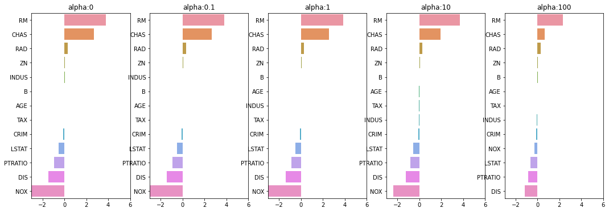

# 규제(Regularization)

### 최적 모델을 위한 Cost 함수 구성 요소 = RSS 최소화+회귀계수 크기 제어


규제(Regularization): 비용함수에 alpha값으로 페널티를 부여해 회귀 계수 값의 크기를 감소시켜 과적합 개선하는 방식
* L2방식-릿지 회귀
* L1방식-라쏘 회귀
* L2+L1방식-ElasticNet: 주로 피처가 많은 데이터 세트


```python
from sklearn.linear_model import Ridge
from sklearn.linear_model import Lasso
from sklearn.linear_model import ElasticNet
from sklearn.model_selection import cross_val_score
from sklearn.datasets import load_boston
import numpy as np
import pandas as pd
from sklearn.linear_model import LinearRegression
import matplotlib.pyplot as plt
import seaborn as sns
%matplotlib inline

def get_linear_reg_eval(model_name, params=None, X_data_n=None, y_target_n=None, verbose=True, return_coeff=True):
    coeff_df=pd.DataFrame()
    if verbose:
        print("###### ",model_name,"######")
    for param in params:
        if model_name=='Ridge': model=Ridge(alpha=param)
        elif model_name=="Lasso": model=Lasso(alpha=param)
        elif model_name=="ElasticNet": model=ElasticNet(alpha=param, l1_ratio=0.7)
        neg_mse_scores=cross_val_score(model, X_data_n, y_target_n, scoring="neg_mean_squared_error",cv=5)
        rmse_scores=np.sqrt(-1*neg_mse_scores)
        avg_rmse=np.mean(rmse_scores)
        print('alpha {0} 일 때 5 folds 의 평균 RMSE : {1:.3f} '.format(param,avg_rmse))
        model.fit(X_data_n, y_target_n)
        coeff=pd.Series(data=model.coef_,index=X_data_n.columns)
        colname="alpha:"+str(param)
        coeff_df[colname]=coeff
    return coeff_df
```

# 릿지 회귀(Ridge Regression)

L2규제->규제가 없는 LinearRegression의 RMSE보다 더 뛰어난 예측 성능을 보여준다


```python
from sklearn.linear_model import Ridge
from sklearn.model_selection import cross_val_score
from sklearn.datasets import load_boston
import numpy as np
import pandas as pd
from sklearn.linear_model import LinearRegression
import matplotlib.pyplot as plt
import seaborn as sns
%matplotlib inline

boston=load_boston()
bostonDF=pd.DataFrame(boston.data, columns=boston.feature_names)

bostonDF['PRICE']=boston.target
y_target = bostonDF['PRICE']
X_data = bostonDF.drop(['PRICE'],axis=1,inplace=False)

lr=LinearRegression()
neg_mse_scores=cross_val_score(lr, X_data, y_target, scoring="neg_mean_squared_error",cv=5)
rmse_scores=np.sqrt(-1*neg_mse_scores)
avg_rmse=np.mean(rmse_scores)
print("###Linear Regression###")
print(' 5 folds 의 개별 Negative MSE scores: ', np.round(neg_mse_scores, 3))
print(' 5 folds 의 개별 RMSE scores : ', np.round(rmse_scores,3))
print(' 5 folds 의 평균 RMSE : {0:.3f} '.format(avg_rmse))

ridge=Ridge(alpha=10)
neg_mse_scores=cross_val_score(ridge, X_data, y_target, scoring="neg_mean_squared_error",cv=5)
rmse_scores=np.sqrt(-1*neg_mse_scores)
avg_rmse=np.mean(rmse_scores)
print("###Ridge###")
print(' 5 folds 의 개별 Negative MSE scores: ', np.round(neg_mse_scores, 3))
print(' 5 folds 의 개별 RMSE scores : ', np.round(rmse_scores,3))
print(' 5 folds 의 평균 RMSE : {0:.3f} '.format(avg_rmse))
```

    ###Linear Regression###
     5 folds 의 개별 Negative MSE scores:  [-12.46  -26.049 -33.074 -80.762 -33.314]
     5 folds 의 개별 RMSE scores :  [3.53  5.104 5.751 8.987 5.772]
     5 folds 의 평균 RMSE : 5.829 
    ###Ridge###
     5 folds 의 개별 Negative MSE scores:  [-11.422 -24.294 -28.144 -74.599 -28.517]
     5 folds 의 개별 RMSE scores :  [3.38  4.929 5.305 8.637 5.34 ]
     5 folds 의 평균 RMSE : 5.518 
    


```python
alphas=[0,0.1,1,10,100]
fig, axs=plt.subplots(figsize=(18,6), nrows=1, ncols=5)

for pos, alpha in enumerate(alphas):
    ridge=Ridge(alpha=alpha)
    ridge.fit(X_data, y_target)
    coeff=pd.Series(data=ridge.coef_,index=X_data.columns)
    coeff=coeff.sort_values(ascending=False)
    colname='alpha:'+str(alpha)
    axs[pos].set_title(colname)
    axs[pos].set_xlim(-3,6)
    sns.barplot(x=coeff.values, y=coeff.index, ax=axs[pos])
plt.show()

coeff_df=get_linear_reg_eval("Ridge",params=alphas,X_data_n=X_data,y_target_n=y_target)
sort_columns='alpha:'+str(alphas[0])
coeff_df.sort_values(by=sort_columns, ascending=False)
```


    

    


    ######  Ridge ######
    alpha 0 일 때 5 folds 의 평균 RMSE : 5.829 
    alpha 0.1 일 때 5 folds 의 평균 RMSE : 5.788 
    alpha 1 일 때 5 folds 의 평균 RMSE : 5.653 
    alpha 10 일 때 5 folds 의 평균 RMSE : 5.518 
    alpha 100 일 때 5 folds 의 평균 RMSE : 5.330 
    


<div>
<style scoped>
    .dataframe tbody tr th:only-of-type {
        vertical-align: middle;
    }

    .dataframe tbody tr th {
        vertical-align: top;
    }

    .dataframe thead th {
        text-align: right;
    }
</style>
<table border="1" class="dataframe">
  <thead>
    <tr style="text-align: right;">
      <th></th>
      <th>alpha:0</th>
      <th>alpha:0.1</th>
      <th>alpha:1</th>
      <th>alpha:10</th>
      <th>alpha:100</th>
    </tr>
  </thead>
  <tbody>
    <tr>
      <th>RM</th>
      <td>3.809865</td>
      <td>3.818233</td>
      <td>3.854000</td>
      <td>3.702272</td>
      <td>2.334536</td>
    </tr>
    <tr>
      <th>CHAS</th>
      <td>2.686734</td>
      <td>2.670019</td>
      <td>2.552393</td>
      <td>1.952021</td>
      <td>0.638335</td>
    </tr>
    <tr>
      <th>RAD</th>
      <td>0.306049</td>
      <td>0.303515</td>
      <td>0.290142</td>
      <td>0.279596</td>
      <td>0.315358</td>
    </tr>
    <tr>
      <th>ZN</th>
      <td>0.046420</td>
      <td>0.046572</td>
      <td>0.047443</td>
      <td>0.049579</td>
      <td>0.054496</td>
    </tr>
    <tr>
      <th>INDUS</th>
      <td>0.020559</td>
      <td>0.015999</td>
      <td>-0.008805</td>
      <td>-0.042962</td>
      <td>-0.052826</td>
    </tr>
    <tr>
      <th>B</th>
      <td>0.009312</td>
      <td>0.009368</td>
      <td>0.009673</td>
      <td>0.010037</td>
      <td>0.009393</td>
    </tr>
    <tr>
      <th>AGE</th>
      <td>0.000692</td>
      <td>-0.000269</td>
      <td>-0.005415</td>
      <td>-0.010707</td>
      <td>0.001212</td>
    </tr>
    <tr>
      <th>TAX</th>
      <td>-0.012335</td>
      <td>-0.012421</td>
      <td>-0.012912</td>
      <td>-0.013993</td>
      <td>-0.015856</td>
    </tr>
    <tr>
      <th>CRIM</th>
      <td>-0.108011</td>
      <td>-0.107474</td>
      <td>-0.104595</td>
      <td>-0.101435</td>
      <td>-0.102202</td>
    </tr>
    <tr>
      <th>LSTAT</th>
      <td>-0.524758</td>
      <td>-0.525966</td>
      <td>-0.533343</td>
      <td>-0.559366</td>
      <td>-0.660764</td>
    </tr>
    <tr>
      <th>PTRATIO</th>
      <td>-0.952747</td>
      <td>-0.940759</td>
      <td>-0.876074</td>
      <td>-0.797945</td>
      <td>-0.829218</td>
    </tr>
    <tr>
      <th>DIS</th>
      <td>-1.475567</td>
      <td>-1.459626</td>
      <td>-1.372654</td>
      <td>-1.248808</td>
      <td>-1.153390</td>
    </tr>
    <tr>
      <th>NOX</th>
      <td>-17.766611</td>
      <td>-16.684645</td>
      <td>-10.777015</td>
      <td>-2.371619</td>
      <td>-0.262847</td>
    </tr>
  </tbody>
</table>
</div>


alpha값이 증가하면서 회귀 계수가 지속적으로 작아지고 있으나, 회귀계수를 0으로 만들지는 않는다!

# 라쏘 회귀(Lasso Regression)


L1규제->불필요한 회귀 계수를 급격하게 감소시켜 0으로 만들고 제거/적절한 피처만 회귀에 포함시키는 피처 선택의 특성


```python
lasso_alphas=[0.07,0.1,0.5,1,3]
coeff_lasso_df=get_linear_reg_eval("Lasso", params=lasso_alphas, X_data_n=X_data, y_target_n=y_target)
```

    ######  Lasso ######
    alpha 0.07 일 때 5 folds 의 평균 RMSE : 5.612 
    alpha 0.1 일 때 5 folds 의 평균 RMSE : 5.615 
    alpha 0.5 일 때 5 folds 의 평균 RMSE : 5.669 
    alpha 1 일 때 5 folds 의 평균 RMSE : 5.776 
    alpha 3 일 때 5 folds 의 평균 RMSE : 6.189 
    


```python
sort_columns='alpha:'+str(lasso_alphas[0])
coeff_lasso_df.sort_values(by=sort_columns, ascending=False)
```


<div>
<style scoped>
    .dataframe tbody tr th:only-of-type {
        vertical-align: middle;
    }

    .dataframe tbody tr th {
        vertical-align: top;
    }

    .dataframe thead th {
        text-align: right;
    }
</style>
<table border="1" class="dataframe">
  <thead>
    <tr style="text-align: right;">
      <th></th>
      <th>alpha:0.07</th>
      <th>alpha:0.1</th>
      <th>alpha:0.5</th>
      <th>alpha:1</th>
      <th>alpha:3</th>
    </tr>
  </thead>
  <tbody>
    <tr>
      <th>RM</th>
      <td>3.789725</td>
      <td>3.703202</td>
      <td>2.498212</td>
      <td>0.949811</td>
      <td>0.000000</td>
    </tr>
    <tr>
      <th>CHAS</th>
      <td>1.434343</td>
      <td>0.955190</td>
      <td>0.000000</td>
      <td>0.000000</td>
      <td>0.000000</td>
    </tr>
    <tr>
      <th>RAD</th>
      <td>0.270936</td>
      <td>0.274707</td>
      <td>0.277451</td>
      <td>0.264206</td>
      <td>0.061864</td>
    </tr>
    <tr>
      <th>ZN</th>
      <td>0.049059</td>
      <td>0.049211</td>
      <td>0.049544</td>
      <td>0.049165</td>
      <td>0.037231</td>
    </tr>
    <tr>
      <th>B</th>
      <td>0.010248</td>
      <td>0.010249</td>
      <td>0.009469</td>
      <td>0.008247</td>
      <td>0.006510</td>
    </tr>
    <tr>
      <th>NOX</th>
      <td>-0.000000</td>
      <td>-0.000000</td>
      <td>-0.000000</td>
      <td>-0.000000</td>
      <td>0.000000</td>
    </tr>
    <tr>
      <th>AGE</th>
      <td>-0.011706</td>
      <td>-0.010037</td>
      <td>0.003604</td>
      <td>0.020910</td>
      <td>0.042495</td>
    </tr>
    <tr>
      <th>TAX</th>
      <td>-0.014290</td>
      <td>-0.014570</td>
      <td>-0.015442</td>
      <td>-0.015212</td>
      <td>-0.008602</td>
    </tr>
    <tr>
      <th>INDUS</th>
      <td>-0.042120</td>
      <td>-0.036619</td>
      <td>-0.005253</td>
      <td>-0.000000</td>
      <td>-0.000000</td>
    </tr>
    <tr>
      <th>CRIM</th>
      <td>-0.098193</td>
      <td>-0.097894</td>
      <td>-0.083289</td>
      <td>-0.063437</td>
      <td>-0.000000</td>
    </tr>
    <tr>
      <th>LSTAT</th>
      <td>-0.560431</td>
      <td>-0.568769</td>
      <td>-0.656290</td>
      <td>-0.761115</td>
      <td>-0.807679</td>
    </tr>
    <tr>
      <th>PTRATIO</th>
      <td>-0.765107</td>
      <td>-0.770654</td>
      <td>-0.758752</td>
      <td>-0.722966</td>
      <td>-0.265072</td>
    </tr>
    <tr>
      <th>DIS</th>
      <td>-1.176583</td>
      <td>-1.160538</td>
      <td>-0.936605</td>
      <td>-0.668790</td>
      <td>-0.000000</td>
    </tr>
  </tbody>
</table>
</div>


alpha의 크기가 증가함에 따라 일부 피처의 회귀 계수는 아예 0으로 바뀌고 있다. 회귀 계수가 0인 피처는 회귀 식에서 제외되면서 피처 선택의 효과를 얻을 수 있다.

# 엘라스틱넷 회귀(Elastic Net Regression)


* L1규제+L2규제
* 수행시간이 상대적으로 오래 걸린다


```python
elastic_alphas=[0.07,0.1,0.5,1,3]
coeff_elastic_df=get_linear_reg_eval('ElasticNet',params=elastic_alphas, X_data_n=X_data, y_target_n=y_target)
```

    ######  ElasticNet ######
    alpha 0.07 일 때 5 folds 의 평균 RMSE : 5.542 
    alpha 0.1 일 때 5 folds 의 평균 RMSE : 5.526 
    alpha 0.5 일 때 5 folds 의 평균 RMSE : 5.467 
    alpha 1 일 때 5 folds 의 평균 RMSE : 5.597 
    alpha 3 일 때 5 folds 의 평균 RMSE : 6.068 
    


```python
sort_columns='alpha:'+str(elastic_alphas[0])
coeff_elastic_df.sort_values(by=sort_columns, ascending=False)
```


<div>
<style scoped>
    .dataframe tbody tr th:only-of-type {
        vertical-align: middle;
    }

    .dataframe tbody tr th {
        vertical-align: top;
    }

    .dataframe thead th {
        text-align: right;
    }
</style>
<table border="1" class="dataframe">
  <thead>
    <tr style="text-align: right;">
      <th></th>
      <th>alpha:0.07</th>
      <th>alpha:0.1</th>
      <th>alpha:0.5</th>
      <th>alpha:1</th>
      <th>alpha:3</th>
    </tr>
  </thead>
  <tbody>
    <tr>
      <th>RM</th>
      <td>3.574162</td>
      <td>3.414154</td>
      <td>1.918419</td>
      <td>0.938789</td>
      <td>0.000000</td>
    </tr>
    <tr>
      <th>CHAS</th>
      <td>1.330724</td>
      <td>0.979706</td>
      <td>0.000000</td>
      <td>0.000000</td>
      <td>0.000000</td>
    </tr>
    <tr>
      <th>RAD</th>
      <td>0.278880</td>
      <td>0.283443</td>
      <td>0.300761</td>
      <td>0.289299</td>
      <td>0.146846</td>
    </tr>
    <tr>
      <th>ZN</th>
      <td>0.050107</td>
      <td>0.050617</td>
      <td>0.052878</td>
      <td>0.052136</td>
      <td>0.038268</td>
    </tr>
    <tr>
      <th>B</th>
      <td>0.010122</td>
      <td>0.010067</td>
      <td>0.009114</td>
      <td>0.008320</td>
      <td>0.007020</td>
    </tr>
    <tr>
      <th>AGE</th>
      <td>-0.010116</td>
      <td>-0.008276</td>
      <td>0.007760</td>
      <td>0.020348</td>
      <td>0.043446</td>
    </tr>
    <tr>
      <th>TAX</th>
      <td>-0.014522</td>
      <td>-0.014814</td>
      <td>-0.016046</td>
      <td>-0.016218</td>
      <td>-0.011417</td>
    </tr>
    <tr>
      <th>INDUS</th>
      <td>-0.044855</td>
      <td>-0.042719</td>
      <td>-0.023252</td>
      <td>-0.000000</td>
      <td>-0.000000</td>
    </tr>
    <tr>
      <th>CRIM</th>
      <td>-0.099468</td>
      <td>-0.099213</td>
      <td>-0.089070</td>
      <td>-0.073577</td>
      <td>-0.019058</td>
    </tr>
    <tr>
      <th>NOX</th>
      <td>-0.175072</td>
      <td>-0.000000</td>
      <td>-0.000000</td>
      <td>-0.000000</td>
      <td>-0.000000</td>
    </tr>
    <tr>
      <th>LSTAT</th>
      <td>-0.574822</td>
      <td>-0.587702</td>
      <td>-0.693861</td>
      <td>-0.760457</td>
      <td>-0.800368</td>
    </tr>
    <tr>
      <th>PTRATIO</th>
      <td>-0.779498</td>
      <td>-0.784725</td>
      <td>-0.790969</td>
      <td>-0.738672</td>
      <td>-0.423065</td>
    </tr>
    <tr>
      <th>DIS</th>
      <td>-1.189438</td>
      <td>-1.173647</td>
      <td>-0.975902</td>
      <td>-0.725174</td>
      <td>-0.031208</td>
    </tr>
  </tbody>
</table>
</div>


RMSE가 가장 적은, 좋은 예측 성능을 보이고 있다. <br/>
피처들의 회귀계수들 값이 라쏘보다는 상대적으로 0이 되는 값이 적다!


## 선형 회귀 모델을 위한 데이터 변환

선형회귀모델은 피처값과 타깃값의 분포가 정규 분포형태를 매우 선호한다.


<타깃값 변환>: 반드시 정규분포를 가져야함. 이를 위해 주로 로그 변환을 적용

<피처값 변환> : 주로 로그 변환 사용
* StandardScaler(평균 0, 분산 1인 표준정규분포)/MinMaxScaler(최솟값 0, 최댓값 1인 정규화)
* 다항 특성을 적용하여 변환
* Log Transformation

표준 정규 분포와 최솟값/최댓값 정규화는 성능상의 개선이 크게 없다. 다항식 변환이 그나마 성능이 개선되는데, 다항식 변환은 피처의 개수가 많을 경우 적용하기 힘들며, 데이터 건수가 많아지면 계산에 많은 시간이 소모되어 적용에 한계가 있다. 로그변환이 가장 좋은 결과를 가져온다


```python
from sklearn.preprocessing import StandardScaler, MinMaxScaler, PolynomialFeatures

def get_scaled_data(method='None', p_degree=None, input_data=None):
    if method=='Standard':
        scaled_data=StandardScaler().fit_transform(input_data)
    elif method=='MinMax':
        scaled_data=MinMaxScaler().fit_transform(input_data)
    elif method=="Log":
        scaled_data=np.log1p(input_data)
    else:
        scaled_data=input_data
    
    if p_degree!=None:
        scaled_data=PolynomialFeatures(degree=p_degree, include_bias=False).fit_transform(scaled_data)
        
    scaled_data=pd.DataFrame(data=scaled_data)    
    return scaled_data

alphas=[0.1,1,10,100]
#변환 방법은 모두 6개, 원본 그대로, 표준정규분포, 표준정규분포+다항식 특성
# 최대/최소 정규화, 최대/최소 정규화+다항식 특성, 로그변환 
scale_methods=[(None, None), ('Standard', None), ('Standard', 2),
               ('MinMax', None), ('MinMax', 2), ('Log', None)]
for scale_method in scale_methods:
    X_data_scaled=get_scaled_data(method=scale_method[0], p_degree=scale_method[1], input_data=X_data)
    print('\n## 변환 유형:{0}, Polynomial Degree:{1}'.format(scale_method[0], scale_method[1]))
    get_linear_reg_eval('Ridge', params=alphas, X_data_n=X_data_scaled, y_target_n=y_target, verbose=False)
```

    
    ## 변환 유형:None, Polynomial Degree:None
    alpha 0.1 일 때 5 folds 의 평균 RMSE : 5.788 
    alpha 1 일 때 5 folds 의 평균 RMSE : 5.653 
    alpha 10 일 때 5 folds 의 평균 RMSE : 5.518 
    alpha 100 일 때 5 folds 의 평균 RMSE : 5.330 
    
    ## 변환 유형:Standard, Polynomial Degree:None
    alpha 0.1 일 때 5 folds 의 평균 RMSE : 5.826 
    alpha 1 일 때 5 folds 의 평균 RMSE : 5.803 
    alpha 10 일 때 5 folds 의 평균 RMSE : 5.637 
    alpha 100 일 때 5 folds 의 평균 RMSE : 5.421 
    
    ## 변환 유형:Standard, Polynomial Degree:2
    alpha 0.1 일 때 5 folds 의 평균 RMSE : 8.827 
    alpha 1 일 때 5 folds 의 평균 RMSE : 6.871 
    alpha 10 일 때 5 folds 의 평균 RMSE : 5.485 
    alpha 100 일 때 5 folds 의 평균 RMSE : 4.634 
    
    ## 변환 유형:MinMax, Polynomial Degree:None
    alpha 0.1 일 때 5 folds 의 평균 RMSE : 5.764 
    alpha 1 일 때 5 folds 의 평균 RMSE : 5.465 
    alpha 10 일 때 5 folds 의 평균 RMSE : 5.754 
    alpha 100 일 때 5 folds 의 평균 RMSE : 7.635 
    
    ## 변환 유형:MinMax, Polynomial Degree:2
    alpha 0.1 일 때 5 folds 의 평균 RMSE : 5.298 
    alpha 1 일 때 5 folds 의 평균 RMSE : 4.323 
    alpha 10 일 때 5 folds 의 평균 RMSE : 5.185 
    alpha 100 일 때 5 folds 의 평균 RMSE : 6.538 
    
    ## 변환 유형:Log, Polynomial Degree:None
    alpha 0.1 일 때 5 folds 의 평균 RMSE : 4.770 
    alpha 1 일 때 5 folds 의 평균 RMSE : 4.676 
    alpha 10 일 때 5 folds 의 평균 RMSE : 4.836 
    alpha 100 일 때 5 folds 의 평균 RMSE : 6.241 
    
