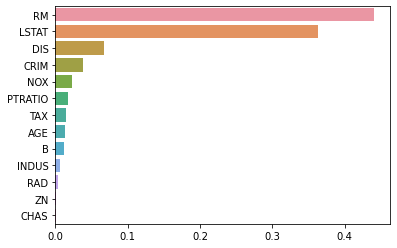
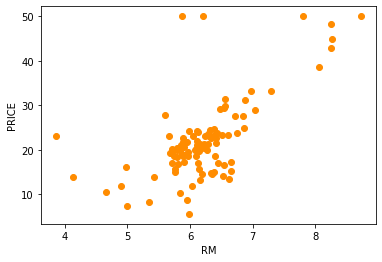
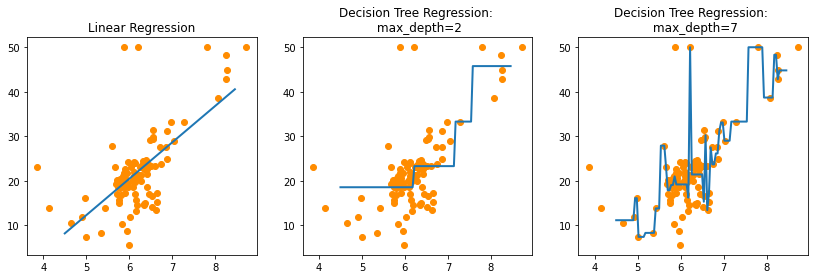

# 회귀 트리(Regression Tree)

* 트리 기반의 회귀는 회귀 트리를 이용
* 리프 노드에 속한 데이터 값의 평균값을 구해 회귀 예측값을 계산
* 트리 생성이 CART 알고리즘에 기반-Classification And Regression Trees

* DecisionTreeRegressor
* RandomForestRegressor
* GradientBoostingRegressor
* XGBRegressor
* LGBMRegressor

|알고리즘         |회귀 Estimator 클래스    |분류 Estimator 클래스     |
|:---------------:|:-----------------------:|:------------------------:|
|Decision Tree    |DecisionTreeRegressor    |DecisionTreeClassifier    |
|Gradient Boosting|GradientBoostingRegressor|GradientBoostingClassifier|
|XGBoost          |XGBRegressor             |XGBClassifier             |
|LightGBM         |LGBMRegressor            |LGBMClassifier            |


```python
from sklearn.datasets import load_boston
from sklearn.model_selection import cross_val_score
from sklearn.ensemble import RandomForestRegressor
from sklearn.model_selection import train_test_split
import matplotlib.pyplot as plt
%matplotlib inline

import pandas as pd
import numpy as np

boston=load_boston()
bostonDF=pd.DataFrame(boston.data, columns=boston.feature_names)
bostonDF['PRICE']=boston.target
y_target=bostonDF['PRICE']
X_data=bostonDF.drop(['PRICE'], axis=1, inplace=False)

rf=RandomForestRegressor(random_state=0, n_estimators=1000)
neg_mse_scores=cross_val_score(rf, X_data, y_target, scoring="neg_mean_squared_error", cv=5)
rmse_scores=np.sqrt(-1*neg_mse_scores)
avg_rmse=np.mean(rmse_scores)

print(' 5 교차 검증의 개별 Negative MSE scores: ', np.round(neg_mse_scores, 2))
print(' 5 교차 검증의 개별 RMSE scores : ', np.round(rmse_scores, 2))
print(' 5 교차 검증의 평균 RMSE : {0:.3f} '.format(avg_rmse))
```

     5 교차 검증의 개별 Negative MSE scores:  [ -7.88 -13.14 -20.57 -46.23 -18.88]
     5 교차 검증의 개별 RMSE scores :  [2.81 3.63 4.54 6.8  4.34]
     5 교차 검증의 평균 RMSE : 4.423 
    


```python
from sklearn.tree import DecisionTreeRegressor
from sklearn.ensemble import GradientBoostingRegressor
from xgboost import XGBRegressor
from lightgbm import LGBMRegressor
import time
def get_model_cv_prediction(model, X_data, y_target):
    start=time.time()
    neg_mse_scores=cross_val_score(model, X_data, y_target, scoring="neg_mean_squared_error", cv=5)
    rmse_scores=np.sqrt(-1*neg_mse_scores)
    avg_rmse=np.mean(rmse_scores)
    end=time.time()
    print("##### ", model.__class__.__name__,' #####')
    print("5 교차 검증의 평균 RMSE : {0:.3f}, 시간: {1}".format(avg_rmse, end-start))

dt_reg=DecisionTreeRegressor(random_state=0, max_depth=4)
rf_reg=RandomForestRegressor(random_state=0, n_estimators=1000)
gb_reg=GradientBoostingRegressor(random_state=0, n_estimators=1000)
xgb_reg=XGBRegressor(n_estimators=1000)
lgb_reg=LGBMRegressor(n_estimators=1000)

models=[dt_reg, rf_reg, gb_reg, xgb_reg, lgb_reg]
for model in models:
    get_model_cv_prediction(model, X_data, y_target)
```

    #####  DecisionTreeRegressor  #####
    5 교차 검증의 평균 RMSE : 5.978, 시간: 0.06283235549926758
    #####  RandomForestRegressor  #####
    5 교차 검증의 평균 RMSE : 4.423, 시간: 26.26339888572693
    #####  GradientBoostingRegressor  #####
    5 교차 검증의 평균 RMSE : 4.269, 시간: 10.554696083068848
    #####  XGBRegressor  #####
    5 교차 검증의 평균 RMSE : 4.251, 시간: 18.719956398010254
    #####  LGBMRegressor  #####
    5 교차 검증의 평균 RMSE : 4.646, 시간: 54.30186653137207
    

feature_importances_를 이용해 피처별 중요도를 알 수 있다!


```python
import seaborn as sns
%matplotlib inline

rf_reg=RandomForestRegressor(n_estimators=1000)
rf_reg.fit(X_data, y_target)
feature_series=pd.Series(data=rf_reg.feature_importances_, index=X_data.columns)
feature_series=feature_series.sort_values(ascending=False)
sns.barplot(x=feature_series, y=feature_series.index)
```


    <AxesSubplot:>


    

    


RM이 PRICE에 가장 영향을 많이 미친다!


```python
#보스턴 데이터 세트의 개수를 100개만 샘플링하고 RM과 PRICE칼럼만 추출
bostonDF_sample=bostonDF[['RM', 'PRICE']]
bostonDF_sample=bostonDF_sample.sample(n=100, random_state=0)
plt.figure()
plt.scatter(bostonDF_sample.RM, bostonDF_sample.PRICE, c="darkorange")
plt.xlabel("RM")
plt.ylabel("PRICE") 
```


    Text(0, 0.5, 'PRICE')


    

    


```python
import numpy as np
from sklearn.linear_model import LinearRegression

lr_reg=LinearRegression()
rf_reg2=DecisionTreeRegressor(max_depth=2)
rf_reg7=DecisionTreeRegressor(max_depth=7)

# 실제 예측을 적용할 테스트용 데이터 세트를 4.5~8.5까지의 100개 데이터 세트로 생성
X_test=np.arange(4.5, 8.5, 0.04).reshape(-1,1)

X_feature=bostonDF_sample['RM'].values.reshape(-1,1)
y_target=bostonDF_sample['PRICE'].values.reshape(-1,1)

lr_reg.fit(X_feature, y_target)
rf_reg2.fit(X_feature, y_target)
rf_reg7.fit(X_feature, y_target)

pred_lr=lr_reg.predict(X_test)
pred_rf2=rf_reg2.predict(X_test)
pred_rf7=rf_reg7.predict(X_test)

fig, (ax1, ax2, ax3)=plt.subplots(figsize=(14,4), ncols=3)

ax1.set_title('Linear Regression')
ax1.scatter(bostonDF_sample.RM, bostonDF_sample.PRICE, c="darkorange")
ax1.plot(X_test, pred_lr,label="linear", linewidth=2 )

ax2.set_title('Decision Tree Regression: \n max_depth=2')
ax2.scatter(bostonDF_sample.RM, bostonDF_sample.PRICE, c="darkorange")
ax2.plot(X_test, pred_rf2, label="max_depth:3", linewidth=2 )

ax3.set_title('Decision Tree Regression: \n max_depth=7')
ax3.scatter(bostonDF_sample.RM, bostonDF_sample.PRICE, c="darkorange")
ax3.plot(X_test, pred_rf7,label="max_depth:7", linewidth=2)
```


    [<matplotlib.lines.Line2D at 0x175a0aed370>]


    

    

