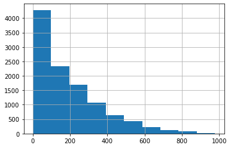
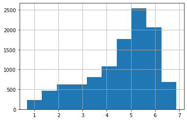
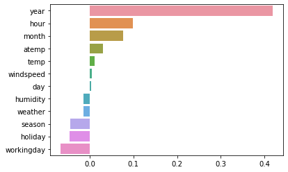
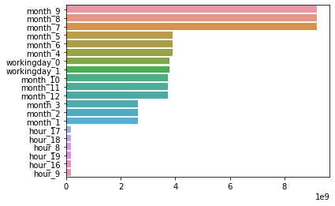

# 캐글 실습: 자전거 대여 수요 예측


```python
import numpy as np
import pandas as pd
import seaborn as sns
import matplotlib.pyplot as plt
%matplotlib inline
import warnings
warnings.filterwarnings("ignore", category=RuntimeWarning)

bike_df=pd.read_csv(r'C:\Users\user\Data_Handling\bike-sharing-demand\train.csv')
print(bike_df.shape)
bike_df
```

    (10886, 12)
    


<div>

<table border="1" class="dataframe">
  <thead>
    <tr style="text-align: right;">
      <th></th>
      <th>datetime</th>
      <th>season</th>
      <th>holiday</th>
      <th>workingday</th>
      <th>weather</th>
      <th>temp</th>
      <th>atemp</th>
      <th>humidity</th>
      <th>windspeed</th>
      <th>casual</th>
      <th>registered</th>
      <th>count</th>
    </tr>
  </thead>
  <tbody>
    <tr>
      <th>0</th>
      <td>2011-01-01 00:00:00</td>
      <td>1</td>
      <td>0</td>
      <td>0</td>
      <td>1</td>
      <td>9.84</td>
      <td>14.395</td>
      <td>81</td>
      <td>0.0000</td>
      <td>3</td>
      <td>13</td>
      <td>16</td>
    </tr>
    <tr>
      <th>1</th>
      <td>2011-01-01 01:00:00</td>
      <td>1</td>
      <td>0</td>
      <td>0</td>
      <td>1</td>
      <td>9.02</td>
      <td>13.635</td>
      <td>80</td>
      <td>0.0000</td>
      <td>8</td>
      <td>32</td>
      <td>40</td>
    </tr>
    <tr>
      <th>2</th>
      <td>2011-01-01 02:00:00</td>
      <td>1</td>
      <td>0</td>
      <td>0</td>
      <td>1</td>
      <td>9.02</td>
      <td>13.635</td>
      <td>80</td>
      <td>0.0000</td>
      <td>5</td>
      <td>27</td>
      <td>32</td>
    </tr>
    <tr>
      <th>3</th>
      <td>2011-01-01 03:00:00</td>
      <td>1</td>
      <td>0</td>
      <td>0</td>
      <td>1</td>
      <td>9.84</td>
      <td>14.395</td>
      <td>75</td>
      <td>0.0000</td>
      <td>3</td>
      <td>10</td>
      <td>13</td>
    </tr>
    <tr>
      <th>4</th>
      <td>2011-01-01 04:00:00</td>
      <td>1</td>
      <td>0</td>
      <td>0</td>
      <td>1</td>
      <td>9.84</td>
      <td>14.395</td>
      <td>75</td>
      <td>0.0000</td>
      <td>0</td>
      <td>1</td>
      <td>1</td>
    </tr>
    <tr>
      <th>...</th>
      <td>...</td>
      <td>...</td>
      <td>...</td>
      <td>...</td>
      <td>...</td>
      <td>...</td>
      <td>...</td>
      <td>...</td>
      <td>...</td>
      <td>...</td>
      <td>...</td>
      <td>...</td>
    </tr>
    <tr>
      <th>10881</th>
      <td>2012-12-19 19:00:00</td>
      <td>4</td>
      <td>0</td>
      <td>1</td>
      <td>1</td>
      <td>15.58</td>
      <td>19.695</td>
      <td>50</td>
      <td>26.0027</td>
      <td>7</td>
      <td>329</td>
      <td>336</td>
    </tr>
    <tr>
      <th>10882</th>
      <td>2012-12-19 20:00:00</td>
      <td>4</td>
      <td>0</td>
      <td>1</td>
      <td>1</td>
      <td>14.76</td>
      <td>17.425</td>
      <td>57</td>
      <td>15.0013</td>
      <td>10</td>
      <td>231</td>
      <td>241</td>
    </tr>
    <tr>
      <th>10883</th>
      <td>2012-12-19 21:00:00</td>
      <td>4</td>
      <td>0</td>
      <td>1</td>
      <td>1</td>
      <td>13.94</td>
      <td>15.910</td>
      <td>61</td>
      <td>15.0013</td>
      <td>4</td>
      <td>164</td>
      <td>168</td>
    </tr>
    <tr>
      <th>10884</th>
      <td>2012-12-19 22:00:00</td>
      <td>4</td>
      <td>0</td>
      <td>1</td>
      <td>1</td>
      <td>13.94</td>
      <td>17.425</td>
      <td>61</td>
      <td>6.0032</td>
      <td>12</td>
      <td>117</td>
      <td>129</td>
    </tr>
    <tr>
      <th>10885</th>
      <td>2012-12-19 23:00:00</td>
      <td>4</td>
      <td>0</td>
      <td>1</td>
      <td>1</td>
      <td>13.12</td>
      <td>16.665</td>
      <td>66</td>
      <td>8.9981</td>
      <td>4</td>
      <td>84</td>
      <td>88</td>
    </tr>
  </tbody>
</table>
<p>10886 rows × 12 columns</p>
</div>


```python
bike_df.info()
```

    <class 'pandas.core.frame.DataFrame'>
    RangeIndex: 10886 entries, 0 to 10885
    Data columns (total 12 columns):
     #   Column      Non-Null Count  Dtype  
    ---  ------      --------------  -----  
     0   datetime    10886 non-null  object 
     1   season      10886 non-null  int64  
     2   holiday     10886 non-null  int64  
     3   workingday  10886 non-null  int64  
     4   weather     10886 non-null  int64  
     5   temp        10886 non-null  float64
     6   atemp       10886 non-null  float64
     7   humidity    10886 non-null  int64  
     8   windspeed   10886 non-null  float64
     9   casual      10886 non-null  int64  
     10  registered  10886 non-null  int64  
     11  count       10886 non-null  int64  
    dtypes: float64(3), int64(8), object(1)
    memory usage: 1020.7+ KB
    

### 1. datetime칼럼이 object형으로 되어 있으니까 datetime 타입으로 변경!


```python
bike_df['datetime']=bike_df.datetime.apply(pd.to_datetime)
```


```python
bike_df.info()
```

    <class 'pandas.core.frame.DataFrame'>
    RangeIndex: 10886 entries, 0 to 10885
    Data columns (total 12 columns):
     #   Column      Non-Null Count  Dtype         
    ---  ------      --------------  -----         
     0   datetime    10886 non-null  datetime64[ns]
     1   season      10886 non-null  int64         
     2   holiday     10886 non-null  int64         
     3   workingday  10886 non-null  int64         
     4   weather     10886 non-null  int64         
     5   temp        10886 non-null  float64       
     6   atemp       10886 non-null  float64       
     7   humidity    10886 non-null  int64         
     8   windspeed   10886 non-null  float64       
     9   casual      10886 non-null  int64         
     10  registered  10886 non-null  int64         
     11  count       10886 non-null  int64         
    dtypes: datetime64[ns](1), float64(3), int64(8)
    memory usage: 1020.7 KB
    


```python
bike_df['year']=bike_df.datetime.apply(lambda x: x.year)
bike_df['month']=bike_df.datetime.apply(lambda x: x.month)
bike_df['day']=bike_df.datetime.apply(lambda x: x.day)
bike_df['hour']=bike_df.datetime.apply(lambda x: x.hour)
bike_df
```


<div>

<table border="1" class="dataframe">
  <thead>
    <tr style="text-align: right;">
      <th></th>
      <th>datetime</th>
      <th>season</th>
      <th>holiday</th>
      <th>workingday</th>
      <th>weather</th>
      <th>temp</th>
      <th>atemp</th>
      <th>humidity</th>
      <th>windspeed</th>
      <th>casual</th>
      <th>registered</th>
      <th>count</th>
      <th>year</th>
      <th>month</th>
      <th>day</th>
      <th>hour</th>
    </tr>
  </thead>
  <tbody>
    <tr>
      <th>0</th>
      <td>2011-01-01 00:00:00</td>
      <td>1</td>
      <td>0</td>
      <td>0</td>
      <td>1</td>
      <td>9.84</td>
      <td>14.395</td>
      <td>81</td>
      <td>0.0000</td>
      <td>3</td>
      <td>13</td>
      <td>16</td>
      <td>2011</td>
      <td>1</td>
      <td>1</td>
      <td>0</td>
    </tr>
    <tr>
      <th>1</th>
      <td>2011-01-01 01:00:00</td>
      <td>1</td>
      <td>0</td>
      <td>0</td>
      <td>1</td>
      <td>9.02</td>
      <td>13.635</td>
      <td>80</td>
      <td>0.0000</td>
      <td>8</td>
      <td>32</td>
      <td>40</td>
      <td>2011</td>
      <td>1</td>
      <td>1</td>
      <td>1</td>
    </tr>
    <tr>
      <th>2</th>
      <td>2011-01-01 02:00:00</td>
      <td>1</td>
      <td>0</td>
      <td>0</td>
      <td>1</td>
      <td>9.02</td>
      <td>13.635</td>
      <td>80</td>
      <td>0.0000</td>
      <td>5</td>
      <td>27</td>
      <td>32</td>
      <td>2011</td>
      <td>1</td>
      <td>1</td>
      <td>2</td>
    </tr>
    <tr>
      <th>3</th>
      <td>2011-01-01 03:00:00</td>
      <td>1</td>
      <td>0</td>
      <td>0</td>
      <td>1</td>
      <td>9.84</td>
      <td>14.395</td>
      <td>75</td>
      <td>0.0000</td>
      <td>3</td>
      <td>10</td>
      <td>13</td>
      <td>2011</td>
      <td>1</td>
      <td>1</td>
      <td>3</td>
    </tr>
    <tr>
      <th>4</th>
      <td>2011-01-01 04:00:00</td>
      <td>1</td>
      <td>0</td>
      <td>0</td>
      <td>1</td>
      <td>9.84</td>
      <td>14.395</td>
      <td>75</td>
      <td>0.0000</td>
      <td>0</td>
      <td>1</td>
      <td>1</td>
      <td>2011</td>
      <td>1</td>
      <td>1</td>
      <td>4</td>
    </tr>
    <tr>
      <th>...</th>
      <td>...</td>
      <td>...</td>
      <td>...</td>
      <td>...</td>
      <td>...</td>
      <td>...</td>
      <td>...</td>
      <td>...</td>
      <td>...</td>
      <td>...</td>
      <td>...</td>
      <td>...</td>
      <td>...</td>
      <td>...</td>
      <td>...</td>
      <td>...</td>
    </tr>
    <tr>
      <th>10881</th>
      <td>2012-12-19 19:00:00</td>
      <td>4</td>
      <td>0</td>
      <td>1</td>
      <td>1</td>
      <td>15.58</td>
      <td>19.695</td>
      <td>50</td>
      <td>26.0027</td>
      <td>7</td>
      <td>329</td>
      <td>336</td>
      <td>2012</td>
      <td>12</td>
      <td>19</td>
      <td>19</td>
    </tr>
    <tr>
      <th>10882</th>
      <td>2012-12-19 20:00:00</td>
      <td>4</td>
      <td>0</td>
      <td>1</td>
      <td>1</td>
      <td>14.76</td>
      <td>17.425</td>
      <td>57</td>
      <td>15.0013</td>
      <td>10</td>
      <td>231</td>
      <td>241</td>
      <td>2012</td>
      <td>12</td>
      <td>19</td>
      <td>20</td>
    </tr>
    <tr>
      <th>10883</th>
      <td>2012-12-19 21:00:00</td>
      <td>4</td>
      <td>0</td>
      <td>1</td>
      <td>1</td>
      <td>13.94</td>
      <td>15.910</td>
      <td>61</td>
      <td>15.0013</td>
      <td>4</td>
      <td>164</td>
      <td>168</td>
      <td>2012</td>
      <td>12</td>
      <td>19</td>
      <td>21</td>
    </tr>
    <tr>
      <th>10884</th>
      <td>2012-12-19 22:00:00</td>
      <td>4</td>
      <td>0</td>
      <td>1</td>
      <td>1</td>
      <td>13.94</td>
      <td>17.425</td>
      <td>61</td>
      <td>6.0032</td>
      <td>12</td>
      <td>117</td>
      <td>129</td>
      <td>2012</td>
      <td>12</td>
      <td>19</td>
      <td>22</td>
    </tr>
    <tr>
      <th>10885</th>
      <td>2012-12-19 23:00:00</td>
      <td>4</td>
      <td>0</td>
      <td>1</td>
      <td>1</td>
      <td>13.12</td>
      <td>16.665</td>
      <td>66</td>
      <td>8.9981</td>
      <td>4</td>
      <td>84</td>
      <td>88</td>
      <td>2012</td>
      <td>12</td>
      <td>19</td>
      <td>23</td>
    </tr>
  </tbody>
</table>
<p>10886 rows × 16 columns</p>
</div>


### 2. datetime, casual, registered 칼럼 삭제


```python
drop_columns=['datetime', 'casual', 'registered']
bike_df.drop(drop_columns, axis=1, inplace=True)
```

### 3. 예측 오차가 얼마나 발생하는지 확인


```python
from sklearn.metrics import mean_squared_error, mean_absolute_error

def rmsle(y,pred):
    log_y=np.log1p(y)
    log_pred=np.log1p(pred)
    squared_error=(log_y-log_pred)**2
    rmsle=np.sqrt(np.mean(squared_error))
    return rmsle

def rmse(y, pred):
    return np.sqrt(mean_squared_error(y,pred))

def evaluate_regr(y, pred):
    rmsle_val=rmsle(y, pred)
    rmse_val=rmse(y, pred)
    mae_val=mean_absolute_error(y, pred)
    print('RMSLE: {0:.3f}, RMSE: {1:.3F}, MAE: {2:.3F}'.format(rmsle_val, rmse_val, mae_val))
    
```


```python
from sklearn.model_selection import train_test_split, GridSearchCV
from sklearn.linear_model import LinearRegression, Ridge, Lasso

y_target=bike_df['count']
X_features=bike_df.drop(['count'], axis=1, inplace=False)
X_train, X_test, y_train, y_test = train_test_split(X_features, y_target, test_size=0.3, random_state=0)

lr_reg=LinearRegression()
lr_reg.fit(X_train,y_train)
pred=lr_reg.predict(X_test)
evaluate_regr(y_test, pred)
```

    RMSLE: 1.165, RMSE: 140.900, MAE: 105.924
    


```python
def get_top_error_data(y_test, pred, n_tops=5):
    result_df=pd.DataFrame(y_test.values, columns=['real_count'])
    result_df['predicted_count']=np.round(pred)
    result_df['diff']=np.abs(result_df['real_count']-result_df['predicted_count'])
    
    print(result_df.sort_values('diff',ascending=False)[:n_tops])
    
get_top_error_data(y_test,pred,n_tops=5)
```

          real_count  predicted_count   diff
    1618         890            322.0  568.0
    3151         798            241.0  557.0
    966          884            327.0  557.0
    412          745            194.0  551.0
    2817         856            310.0  546.0
    

오차가 꽤 크게 발생한다! 이럴 때 살펴볼 것은<br/>
### 3-1) Target 값의 분포가 왜곡된 형태를 이루고 있는지 확인


```python
y_target.hist()
```


    <AxesSubplot:>


    

    


count 칼럼 값이 정규 분포가 아닌 0~200 사이에 왜곡돼 있는 것을 알 수 있다. <br/>
### 3-2) 왜곡된 값을 정규 분포 형태로 바꾸는 가장 일반적인 방법: **로그 적용!**


```python
y_log_transform=np.log1p(y_target)
y_log_transform.hist()
```


    <AxesSubplot:>


    

    


y_target을 **np.log1p**변환을 한뒤 -> 회귀 예측<br/>
회귀 예측 한 후, **np.expm1**으로 원상복귀


```python
y_target_log=np.log1p(y_target)
X_train, X_test, y_train, y_test = train_test_split(X_features, y_target_log, test_size=0.3, random_state=0)
lr_reg=LinearRegression()
lr_reg.fit(X_train,y_train)
pred=lr_reg.predict(X_test)

y_test_exp=np.expm1(y_test)
pred_exp=np.expm1(pred)

evaluate_regr(y_test_exp, pred_exp)
```

    RMSLE: 1.017, RMSE: 162.594, MAE: 109.286
    

RMSLE 오류는 줄어들었지만, RMSE는 오히려 더 늘어났다.

### 3-3) 각 피처의 회귀 계수 값 시각화


```python
coef=pd.Series(lr_reg.coef_, index=X_features.columns)
coef_sort=coef.sort_values(ascending=False)
sns.barplot(x=coef_sort.values, y=coef_sort.index)
```


    <AxesSubplot:>


    

    


year의 회귀 계수 값이 독보적으로 크지만, 자전거 대여 횟수가 year에 크게 영향을 받는다는 것은 납득하기 어렵다. year피처는 연도를 뜻하므로 카테고리(Category)형 피처지만 숫자형 값으로 되어있다. 

숫자형 카테고리 값을 선형 회귀에 사용할 경우 회귀 계수를 연산할 때, 이 숫자형 값에 크게 영향을 받는 경우가 발생할 수 있다. 

### 4. 따라서 선형회귀에서는 이러한 피처 인코딩에 원-핫 인코딩을 적용해 변환해야 한다.

pandas에는 원-핫 인코딩을 더 쉽게 지원하는 API-> **get_dummies()**


```python
X_features_ohe=pd.get_dummies(X_features, columns=['year', 'month','day','hour','holiday','workingday','season','weather'])
X_features_ohe
```


<div>

<table border="1" class="dataframe">
  <thead>
    <tr style="text-align: right;">
      <th></th>
      <th>temp</th>
      <th>atemp</th>
      <th>humidity</th>
      <th>windspeed</th>
      <th>year_2011</th>
      <th>year_2012</th>
      <th>month_1</th>
      <th>month_2</th>
      <th>month_3</th>
      <th>month_4</th>
      <th>...</th>
      <th>workingday_0</th>
      <th>workingday_1</th>
      <th>season_1</th>
      <th>season_2</th>
      <th>season_3</th>
      <th>season_4</th>
      <th>weather_1</th>
      <th>weather_2</th>
      <th>weather_3</th>
      <th>weather_4</th>
    </tr>
  </thead>
  <tbody>
    <tr>
      <th>0</th>
      <td>9.84</td>
      <td>14.395</td>
      <td>81</td>
      <td>0.0000</td>
      <td>1</td>
      <td>0</td>
      <td>1</td>
      <td>0</td>
      <td>0</td>
      <td>0</td>
      <td>...</td>
      <td>1</td>
      <td>0</td>
      <td>1</td>
      <td>0</td>
      <td>0</td>
      <td>0</td>
      <td>1</td>
      <td>0</td>
      <td>0</td>
      <td>0</td>
    </tr>
    <tr>
      <th>1</th>
      <td>9.02</td>
      <td>13.635</td>
      <td>80</td>
      <td>0.0000</td>
      <td>1</td>
      <td>0</td>
      <td>1</td>
      <td>0</td>
      <td>0</td>
      <td>0</td>
      <td>...</td>
      <td>1</td>
      <td>0</td>
      <td>1</td>
      <td>0</td>
      <td>0</td>
      <td>0</td>
      <td>1</td>
      <td>0</td>
      <td>0</td>
      <td>0</td>
    </tr>
    <tr>
      <th>2</th>
      <td>9.02</td>
      <td>13.635</td>
      <td>80</td>
      <td>0.0000</td>
      <td>1</td>
      <td>0</td>
      <td>1</td>
      <td>0</td>
      <td>0</td>
      <td>0</td>
      <td>...</td>
      <td>1</td>
      <td>0</td>
      <td>1</td>
      <td>0</td>
      <td>0</td>
      <td>0</td>
      <td>1</td>
      <td>0</td>
      <td>0</td>
      <td>0</td>
    </tr>
    <tr>
      <th>3</th>
      <td>9.84</td>
      <td>14.395</td>
      <td>75</td>
      <td>0.0000</td>
      <td>1</td>
      <td>0</td>
      <td>1</td>
      <td>0</td>
      <td>0</td>
      <td>0</td>
      <td>...</td>
      <td>1</td>
      <td>0</td>
      <td>1</td>
      <td>0</td>
      <td>0</td>
      <td>0</td>
      <td>1</td>
      <td>0</td>
      <td>0</td>
      <td>0</td>
    </tr>
    <tr>
      <th>4</th>
      <td>9.84</td>
      <td>14.395</td>
      <td>75</td>
      <td>0.0000</td>
      <td>1</td>
      <td>0</td>
      <td>1</td>
      <td>0</td>
      <td>0</td>
      <td>0</td>
      <td>...</td>
      <td>1</td>
      <td>0</td>
      <td>1</td>
      <td>0</td>
      <td>0</td>
      <td>0</td>
      <td>1</td>
      <td>0</td>
      <td>0</td>
      <td>0</td>
    </tr>
    <tr>
      <th>...</th>
      <td>...</td>
      <td>...</td>
      <td>...</td>
      <td>...</td>
      <td>...</td>
      <td>...</td>
      <td>...</td>
      <td>...</td>
      <td>...</td>
      <td>...</td>
      <td>...</td>
      <td>...</td>
      <td>...</td>
      <td>...</td>
      <td>...</td>
      <td>...</td>
      <td>...</td>
      <td>...</td>
      <td>...</td>
      <td>...</td>
      <td>...</td>
    </tr>
    <tr>
      <th>10881</th>
      <td>15.58</td>
      <td>19.695</td>
      <td>50</td>
      <td>26.0027</td>
      <td>0</td>
      <td>1</td>
      <td>0</td>
      <td>0</td>
      <td>0</td>
      <td>0</td>
      <td>...</td>
      <td>0</td>
      <td>1</td>
      <td>0</td>
      <td>0</td>
      <td>0</td>
      <td>1</td>
      <td>1</td>
      <td>0</td>
      <td>0</td>
      <td>0</td>
    </tr>
    <tr>
      <th>10882</th>
      <td>14.76</td>
      <td>17.425</td>
      <td>57</td>
      <td>15.0013</td>
      <td>0</td>
      <td>1</td>
      <td>0</td>
      <td>0</td>
      <td>0</td>
      <td>0</td>
      <td>...</td>
      <td>0</td>
      <td>1</td>
      <td>0</td>
      <td>0</td>
      <td>0</td>
      <td>1</td>
      <td>1</td>
      <td>0</td>
      <td>0</td>
      <td>0</td>
    </tr>
    <tr>
      <th>10883</th>
      <td>13.94</td>
      <td>15.910</td>
      <td>61</td>
      <td>15.0013</td>
      <td>0</td>
      <td>1</td>
      <td>0</td>
      <td>0</td>
      <td>0</td>
      <td>0</td>
      <td>...</td>
      <td>0</td>
      <td>1</td>
      <td>0</td>
      <td>0</td>
      <td>0</td>
      <td>1</td>
      <td>1</td>
      <td>0</td>
      <td>0</td>
      <td>0</td>
    </tr>
    <tr>
      <th>10884</th>
      <td>13.94</td>
      <td>17.425</td>
      <td>61</td>
      <td>6.0032</td>
      <td>0</td>
      <td>1</td>
      <td>0</td>
      <td>0</td>
      <td>0</td>
      <td>0</td>
      <td>...</td>
      <td>0</td>
      <td>1</td>
      <td>0</td>
      <td>0</td>
      <td>0</td>
      <td>1</td>
      <td>1</td>
      <td>0</td>
      <td>0</td>
      <td>0</td>
    </tr>
    <tr>
      <th>10885</th>
      <td>13.12</td>
      <td>16.665</td>
      <td>66</td>
      <td>8.9981</td>
      <td>0</td>
      <td>1</td>
      <td>0</td>
      <td>0</td>
      <td>0</td>
      <td>0</td>
      <td>...</td>
      <td>0</td>
      <td>1</td>
      <td>0</td>
      <td>0</td>
      <td>0</td>
      <td>1</td>
      <td>1</td>
      <td>0</td>
      <td>0</td>
      <td>0</td>
    </tr>
  </tbody>
</table>
<p>10886 rows × 73 columns</p>
</div>


### 5. 예측 수행


```python
import time

X_train, X_test, y_train, y_test = train_test_split(X_features_ohe, y_target_log, test_size=0.3, random_state=0)

def get_model_predict(model, X_train,X_test,y_train,y_test, is_expm1=False):
    start=time.time()
    model.fit(X_train,y_train)
    pred=model.predict(X_test)
    if is_expm1:
        y_test=np.expm1(y_test)
        pred=np.expm1(pred)
    end=time.time()
    print("\n###",model.__class__.__name__,'### time:', str(end-start))
    evaluate_regr(y_test,pred)
    

lr_reg=LinearRegression()
ridge_reg=Ridge(alpha=10)
lasso_reg=Lasso(alpha=0.01)

for model in [lr_reg,ridge_reg, lasso_reg]:
    get_model_predict(model, X_train, X_test, y_train,y_test, is_expm1=True)
    
```

    
    ### LinearRegression ### time: 0.035904645919799805
    RMSLE: 0.590, RMSE: 97.688, MAE: 63.382
    
    ### Ridge ### time: 0.01894974708557129
    RMSLE: 0.590, RMSE: 98.529, MAE: 63.893
    
    ### Lasso ### time: 0.07231950759887695
    RMSLE: 0.635, RMSE: 113.219, MAE: 72.803
    


```python
coef=pd.Series(lr_reg.coef_, index=X_features_ohe.columns)
coef_sort=coef.sort_values(ascending=False)[:20]
sns.barplot(x=coef_sort.values, y=coef_sort.index)
```


    <AxesSubplot:>


    

    


원-핫 인코딩을 적용하고 나서 회귀의 예측 성능이 많이 향상됨<br/>
월, 주말/주중, 그리고 시간대등의 회귀 계수가 높아졌다.

### 기타. 회귀 트리를 이용해 회귀 예측 수행


```python
from sklearn.ensemble import RandomForestRegressor, GradientBoostingRegressor
from xgboost import XGBRegressor
from lightgbm import LGBMRegressor

rf_reg=RandomForestRegressor(n_estimators=500)
gbm_reg=GradientBoostingRegressor(n_estimators=500)
xgb_reg=XGBRegressor(n_estimators=500)
lgbm_reg=LGBMRegressor(n_estimators=500)

for model in [rf_reg, gbm_reg, xgb_reg, lgbm_reg]:
    get_model_predict(model, X_train, X_test, y_train, y_test, is_expm1=True)
```

    
    ### RandomForestRegressor ### time: 83.07943344116211
    RMSLE: 0.353, RMSE: 50.082, MAE: 31.053
    
    ### GradientBoostingRegressor ### time: 21.00291609764099
    RMSLE: 0.330, RMSE: 53.332, MAE: 32.744
    
    ### XGBRegressor ### time: 13.526992321014404
    RMSLE: 0.342, RMSE: 51.732, MAE: 31.251
    
    ### LGBMRegressor ### time: 3.3538451194763184
    RMSLE: 0.319, RMSE: 47.215, MAE: 29.029
    

선형 회귀 모델보다 회귀 트리의 예측 성능이 더 좋지만, 이것이 회귀 트리가 선형 회귀보다 더 나은 성능을 가진다는 의미는 아니다! 데이터 세트의 유형에 따라 결과는 얼마든지 달라질 수 있다.
