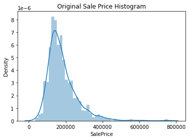
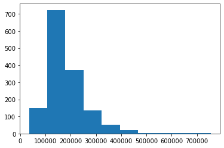
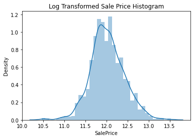
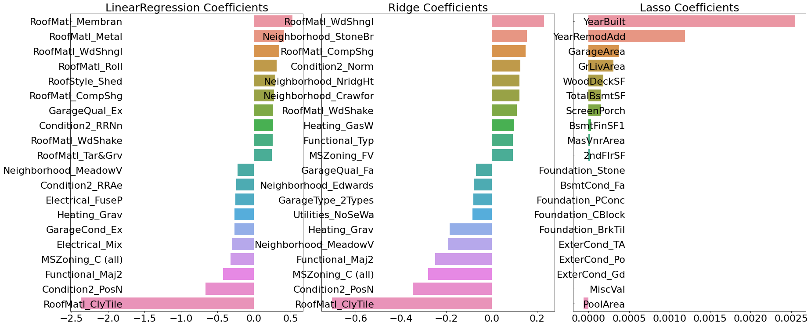
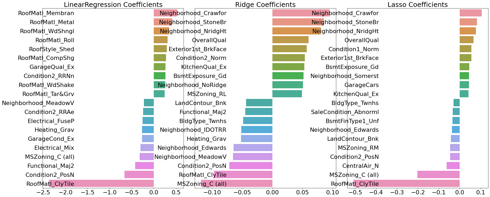
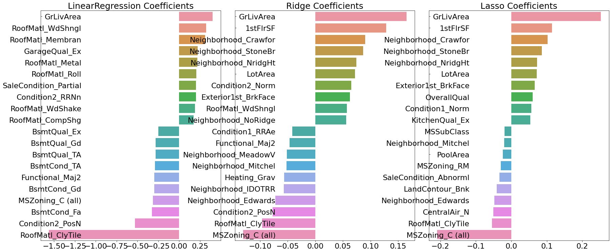
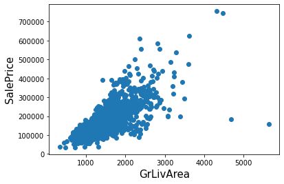
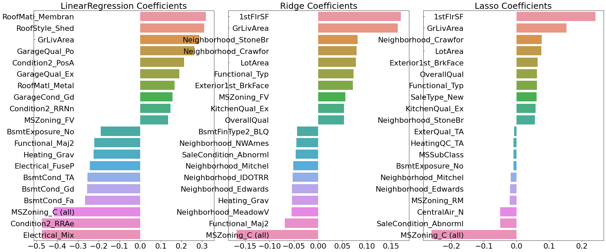
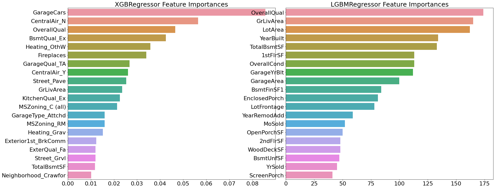

# 캐글 실습: 주택 가격-고급회귀기법 


```python
import warnings
warnings.filterwarnings('ignore')
import pandas as pd
import numpy as np
import seaborn as sns
import matplotlib.pyplot as plt
%matplotlib inline

house_df_org=pd.read_csv(r'C:\Users\user\Data_Handling\house-prices-advanced-regression-techniques\train.csv')
house_df=house_df_org.copy()
house_df
```


<div>

<table border="1" class="dataframe">
  <thead>
    <tr style="text-align: right;">
      <th></th>
      <th>Id</th>
      <th>MSSubClass</th>
      <th>MSZoning</th>
      <th>LotFrontage</th>
      <th>LotArea</th>
      <th>Street</th>
      <th>Alley</th>
      <th>LotShape</th>
      <th>LandContour</th>
      <th>Utilities</th>
      <th>...</th>
      <th>PoolArea</th>
      <th>PoolQC</th>
      <th>Fence</th>
      <th>MiscFeature</th>
      <th>MiscVal</th>
      <th>MoSold</th>
      <th>YrSold</th>
      <th>SaleType</th>
      <th>SaleCondition</th>
      <th>SalePrice</th>
    </tr>
  </thead>
  <tbody>
    <tr>
      <th>0</th>
      <td>1</td>
      <td>60</td>
      <td>RL</td>
      <td>65.0</td>
      <td>8450</td>
      <td>Pave</td>
      <td>NaN</td>
      <td>Reg</td>
      <td>Lvl</td>
      <td>AllPub</td>
      <td>...</td>
      <td>0</td>
      <td>NaN</td>
      <td>NaN</td>
      <td>NaN</td>
      <td>0</td>
      <td>2</td>
      <td>2008</td>
      <td>WD</td>
      <td>Normal</td>
      <td>208500</td>
    </tr>
    <tr>
      <th>1</th>
      <td>2</td>
      <td>20</td>
      <td>RL</td>
      <td>80.0</td>
      <td>9600</td>
      <td>Pave</td>
      <td>NaN</td>
      <td>Reg</td>
      <td>Lvl</td>
      <td>AllPub</td>
      <td>...</td>
      <td>0</td>
      <td>NaN</td>
      <td>NaN</td>
      <td>NaN</td>
      <td>0</td>
      <td>5</td>
      <td>2007</td>
      <td>WD</td>
      <td>Normal</td>
      <td>181500</td>
    </tr>
    <tr>
      <th>2</th>
      <td>3</td>
      <td>60</td>
      <td>RL</td>
      <td>68.0</td>
      <td>11250</td>
      <td>Pave</td>
      <td>NaN</td>
      <td>IR1</td>
      <td>Lvl</td>
      <td>AllPub</td>
      <td>...</td>
      <td>0</td>
      <td>NaN</td>
      <td>NaN</td>
      <td>NaN</td>
      <td>0</td>
      <td>9</td>
      <td>2008</td>
      <td>WD</td>
      <td>Normal</td>
      <td>223500</td>
    </tr>
    <tr>
      <th>3</th>
      <td>4</td>
      <td>70</td>
      <td>RL</td>
      <td>60.0</td>
      <td>9550</td>
      <td>Pave</td>
      <td>NaN</td>
      <td>IR1</td>
      <td>Lvl</td>
      <td>AllPub</td>
      <td>...</td>
      <td>0</td>
      <td>NaN</td>
      <td>NaN</td>
      <td>NaN</td>
      <td>0</td>
      <td>2</td>
      <td>2006</td>
      <td>WD</td>
      <td>Abnorml</td>
      <td>140000</td>
    </tr>
    <tr>
      <th>4</th>
      <td>5</td>
      <td>60</td>
      <td>RL</td>
      <td>84.0</td>
      <td>14260</td>
      <td>Pave</td>
      <td>NaN</td>
      <td>IR1</td>
      <td>Lvl</td>
      <td>AllPub</td>
      <td>...</td>
      <td>0</td>
      <td>NaN</td>
      <td>NaN</td>
      <td>NaN</td>
      <td>0</td>
      <td>12</td>
      <td>2008</td>
      <td>WD</td>
      <td>Normal</td>
      <td>250000</td>
    </tr>
    <tr>
      <th>...</th>
      <td>...</td>
      <td>...</td>
      <td>...</td>
      <td>...</td>
      <td>...</td>
      <td>...</td>
      <td>...</td>
      <td>...</td>
      <td>...</td>
      <td>...</td>
      <td>...</td>
      <td>...</td>
      <td>...</td>
      <td>...</td>
      <td>...</td>
      <td>...</td>
      <td>...</td>
      <td>...</td>
      <td>...</td>
      <td>...</td>
      <td>...</td>
    </tr>
    <tr>
      <th>1455</th>
      <td>1456</td>
      <td>60</td>
      <td>RL</td>
      <td>62.0</td>
      <td>7917</td>
      <td>Pave</td>
      <td>NaN</td>
      <td>Reg</td>
      <td>Lvl</td>
      <td>AllPub</td>
      <td>...</td>
      <td>0</td>
      <td>NaN</td>
      <td>NaN</td>
      <td>NaN</td>
      <td>0</td>
      <td>8</td>
      <td>2007</td>
      <td>WD</td>
      <td>Normal</td>
      <td>175000</td>
    </tr>
    <tr>
      <th>1456</th>
      <td>1457</td>
      <td>20</td>
      <td>RL</td>
      <td>85.0</td>
      <td>13175</td>
      <td>Pave</td>
      <td>NaN</td>
      <td>Reg</td>
      <td>Lvl</td>
      <td>AllPub</td>
      <td>...</td>
      <td>0</td>
      <td>NaN</td>
      <td>MnPrv</td>
      <td>NaN</td>
      <td>0</td>
      <td>2</td>
      <td>2010</td>
      <td>WD</td>
      <td>Normal</td>
      <td>210000</td>
    </tr>
    <tr>
      <th>1457</th>
      <td>1458</td>
      <td>70</td>
      <td>RL</td>
      <td>66.0</td>
      <td>9042</td>
      <td>Pave</td>
      <td>NaN</td>
      <td>Reg</td>
      <td>Lvl</td>
      <td>AllPub</td>
      <td>...</td>
      <td>0</td>
      <td>NaN</td>
      <td>GdPrv</td>
      <td>Shed</td>
      <td>2500</td>
      <td>5</td>
      <td>2010</td>
      <td>WD</td>
      <td>Normal</td>
      <td>266500</td>
    </tr>
    <tr>
      <th>1458</th>
      <td>1459</td>
      <td>20</td>
      <td>RL</td>
      <td>68.0</td>
      <td>9717</td>
      <td>Pave</td>
      <td>NaN</td>
      <td>Reg</td>
      <td>Lvl</td>
      <td>AllPub</td>
      <td>...</td>
      <td>0</td>
      <td>NaN</td>
      <td>NaN</td>
      <td>NaN</td>
      <td>0</td>
      <td>4</td>
      <td>2010</td>
      <td>WD</td>
      <td>Normal</td>
      <td>142125</td>
    </tr>
    <tr>
      <th>1459</th>
      <td>1460</td>
      <td>20</td>
      <td>RL</td>
      <td>75.0</td>
      <td>9937</td>
      <td>Pave</td>
      <td>NaN</td>
      <td>Reg</td>
      <td>Lvl</td>
      <td>AllPub</td>
      <td>...</td>
      <td>0</td>
      <td>NaN</td>
      <td>NaN</td>
      <td>NaN</td>
      <td>0</td>
      <td>6</td>
      <td>2008</td>
      <td>WD</td>
      <td>Normal</td>
      <td>147500</td>
    </tr>
  </tbody>
</table>
<p>1460 rows × 81 columns</p>
</div>


```python
print(house_df.shape)
# 전체 피처의 type
print(house_df.info())
print(house_df.dtypes.value_counts())
isnull_series=house_df.isnull().sum()
print("Null 칼럼과 그 건수:\n", isnull_series[isnull_series>0].sort_values(ascending=False))
```

    (1460, 81)
    <class 'pandas.core.frame.DataFrame'>
    RangeIndex: 1460 entries, 0 to 1459
    Data columns (total 81 columns):
     #   Column         Non-Null Count  Dtype  
    ---  ------         --------------  -----  
     0   Id             1460 non-null   int64  
     1   MSSubClass     1460 non-null   int64  
     2   MSZoning       1460 non-null   object 
     3   LotFrontage    1201 non-null   float64
     4   LotArea        1460 non-null   int64  
     5   Street         1460 non-null   object 
     6   Alley          91 non-null     object 
     7   LotShape       1460 non-null   object 
     8   LandContour    1460 non-null   object 
     9   Utilities      1460 non-null   object 
     10  LotConfig      1460 non-null   object 
     11  LandSlope      1460 non-null   object 
     12  Neighborhood   1460 non-null   object 
     13  Condition1     1460 non-null   object 
     14  Condition2     1460 non-null   object 
     15  BldgType       1460 non-null   object 
     16  HouseStyle     1460 non-null   object 
     17  OverallQual    1460 non-null   int64  
     18  OverallCond    1460 non-null   int64  
     19  YearBuilt      1460 non-null   int64  
     20  YearRemodAdd   1460 non-null   int64  
     21  RoofStyle      1460 non-null   object 
     22  RoofMatl       1460 non-null   object 
     23  Exterior1st    1460 non-null   object 
     24  Exterior2nd    1460 non-null   object 
     25  MasVnrType     1452 non-null   object 
     26  MasVnrArea     1452 non-null   float64
     27  ExterQual      1460 non-null   object 
     28  ExterCond      1460 non-null   object 
     29  Foundation     1460 non-null   object 
     30  BsmtQual       1423 non-null   object 
     31  BsmtCond       1423 non-null   object 
     32  BsmtExposure   1422 non-null   object 
     33  BsmtFinType1   1423 non-null   object 
     34  BsmtFinSF1     1460 non-null   int64  
     35  BsmtFinType2   1422 non-null   object 
     36  BsmtFinSF2     1460 non-null   int64  
     37  BsmtUnfSF      1460 non-null   int64  
     38  TotalBsmtSF    1460 non-null   int64  
     39  Heating        1460 non-null   object 
     40  HeatingQC      1460 non-null   object 
     41  CentralAir     1460 non-null   object 
     42  Electrical     1459 non-null   object 
     43  1stFlrSF       1460 non-null   int64  
     44  2ndFlrSF       1460 non-null   int64  
     45  LowQualFinSF   1460 non-null   int64  
     46  GrLivArea      1460 non-null   int64  
     47  BsmtFullBath   1460 non-null   int64  
     48  BsmtHalfBath   1460 non-null   int64  
     49  FullBath       1460 non-null   int64  
     50  HalfBath       1460 non-null   int64  
     51  BedroomAbvGr   1460 non-null   int64  
     52  KitchenAbvGr   1460 non-null   int64  
     53  KitchenQual    1460 non-null   object 
     54  TotRmsAbvGrd   1460 non-null   int64  
     55  Functional     1460 non-null   object 
     56  Fireplaces     1460 non-null   int64  
     57  FireplaceQu    770 non-null    object 
     58  GarageType     1379 non-null   object 
     59  GarageYrBlt    1379 non-null   float64
     60  GarageFinish   1379 non-null   object 
     61  GarageCars     1460 non-null   int64  
     62  GarageArea     1460 non-null   int64  
     63  GarageQual     1379 non-null   object 
     64  GarageCond     1379 non-null   object 
     65  PavedDrive     1460 non-null   object 
     66  WoodDeckSF     1460 non-null   int64  
     67  OpenPorchSF    1460 non-null   int64  
     68  EnclosedPorch  1460 non-null   int64  
     69  3SsnPorch      1460 non-null   int64  
     70  ScreenPorch    1460 non-null   int64  
     71  PoolArea       1460 non-null   int64  
     72  PoolQC         7 non-null      object 
     73  Fence          281 non-null    object 
     74  MiscFeature    54 non-null     object 
     75  MiscVal        1460 non-null   int64  
     76  MoSold         1460 non-null   int64  
     77  YrSold         1460 non-null   int64  
     78  SaleType       1460 non-null   object 
     79  SaleCondition  1460 non-null   object 
     80  SalePrice      1460 non-null   int64  
    dtypes: float64(3), int64(35), object(43)
    memory usage: 924.0+ KB
    None
    object     43
    int64      35
    float64     3
    dtype: int64
    Null 칼럼과 그 건수:
     PoolQC          1453
    MiscFeature     1406
    Alley           1369
    Fence           1179
    FireplaceQu      690
    LotFrontage      259
    GarageYrBlt       81
    GarageType        81
    GarageFinish      81
    GarageQual        81
    GarageCond        81
    BsmtFinType2      38
    BsmtExposure      38
    BsmtFinType1      37
    BsmtCond          37
    BsmtQual          37
    MasVnrArea         8
    MasVnrType         8
    Electrical         1
    dtype: int64
    

### 1-1. 데이터 양에 비해 Null 값이 많은 피처는 드롭
### 1-2. 회귀 모델을 적용하기 전에 타깃 값의 분포도가 정규 분포인지 확인


```python
plt.title('Original Sale Price Histogram')
sns.distplot(house_df['SalePrice'])
```


    <AxesSubplot:title={'center':'Original Sale Price Histogram'}, xlabel='SalePrice', ylabel='Density'>


    

    


```python
plt.hist(house_df['SalePrice'])
```


    (array([148., 723., 373., 135.,  51.,  19.,   4.,   3.,   2.,   2.]),
     array([ 34900., 106910., 178920., 250930., 322940., 394950., 466960.,
            538970., 610980., 682990., 755000.]),
     <BarContainer object of 10 artists>)


    

    


### 1-3. 정규 분포가 아닌 결괏값을 정규 분포 형태로 변환하기 위해 로그 변환을 적용


```python
plt.title("Log Transformed Sale Price Histogram")
log_SalePrice=np.log1p(house_df['SalePrice'])
sns.distplot(log_SalePrice)
```


    <AxesSubplot:title={'center':'Log Transformed Sale Price Histogram'}, xlabel='SalePrice', ylabel='Density'>


    

    


* SalePrice 로그 변환
* Null 값이 많은 PoolQC, MiscFeature, Alley, Fence, FireplaceQu 삭제 / Id도 단순식별자이므로 삭제
* Null 피처는 평균값으로 대체(mean()메서드가 자동으로 숫자형 칼럼만 추출)


```python
original_SalePrice=house_df['SalePrice']
house_df['SalePrice']=np.log1p(house_df['SalePrice'])
house_df.drop(['Id','PoolQC','MiscFeature','Alley','Fence','FireplaceQu'],axis=1,inplace=True)
house_df.fillna(house_df.mean(), inplace=True)
```

object형만 null 피처로 남음을 다음과 같이 확인할 수 있다.


```python
null_column_count=house_df.isnull().sum()[house_df.isnull().sum()>0]
house_df.dtypes[null_column_count.index]
```


    MasVnrType      object
    BsmtQual        object
    BsmtCond        object
    BsmtExposure    object
    BsmtFinType1    object
    BsmtFinType2    object
    Electrical      object
    GarageType      object
    GarageFinish    object
    GarageQual      object
    GarageCond      object
    dtype: object


### 1-4. 문자형 피처는 원-핫 인코딩 변환(get_dummies)


```python
house_df_ohe=pd.get_dummies(house_df)
```


```python
null_column_count=house_df_ohe.isnull().sum()[house_df_ohe.isnull().sum()>0]
null_column_count
```


    Series([], dtype: int64)


### 2. 선형 회귀 모델 학습/예측/평가


```python
from sklearn.linear_model import LinearRegression, Ridge, Lasso
from sklearn.model_selection import train_test_split
from sklearn.metrics import mean_squared_error

def get_rmse(model):
    pred=model.predict(X_test)
    mse=mean_squared_error(y_test, pred)
    rmse=np.sqrt(mse)
    print(model.__class__.__name__,'로그 변환된 RMSE:',np.round(rmse,3))
    return rmse

def get_rmses(models):
    rmses=[]
    for model in models:
        rmse=get_rmse(model)
        rmses.append(rmse)
    return rmses

y_target=house_df_ohe['SalePrice']
X_features=house_df_ohe.drop('SalePrice', axis=1, inplace=False)
X_train,X_test,y_train,y_test=train_test_split(X_features, y_target, test_size=0.2, random_state=156)

lr_reg=LinearRegression()
lr_reg.fit(X_train,y_train)

ridge_reg=Ridge()
ridge_reg.fit(X_train,y_train)

lasso_reg=Lasso()
lasso_reg.fit(X_train,y_train)

models=[lr_reg, ridge_reg, lasso_reg]
print(get_rmses(models))
```

    LinearRegression 로그 변환된 RMSE: 0.132
    Ridge 로그 변환된 RMSE: 0.128
    Lasso 로그 변환된 RMSE: 0.176
    [0.13189576579154308, 0.12750846334053026, 0.17628250556471395]
    


```python
def get_top_bottom_coef(model, n=10):
    coef=pd.Series(model.coef_, index=X_features.columns)
    coef_high=coef.sort_values(ascending=False).head(n)
    coef_low=coef.sort_values(ascending=False).tail(n)
    return coef_high, coef_low

def visualize_coefficient(models):
    fig, axs=plt.subplots(figsize=(24,10), nrows=1, ncols=3)
    fig.tight_layout()
    for i_num,model in enumerate(models):
        coef_high, coef_low=get_top_bottom_coef(model)
        coef_concat=pd.concat([coef_high,coef_low])
        axs[i_num].set_title(model.__class__.__name__+' Coefficients',size=25)
        axs[i_num].tick_params(axis="y", direction="in", pad=-120)
        for label in (axs[i_num].get_xticklabels()+axs[i_num].get_yticklabels()):
            label.set_fontsize(22)
        sns.barplot(x=coef_concat.values, y=coef_concat.index, ax=axs[i_num])

models=[lr_reg,ridge_reg,lasso_reg]
visualize_coefficient(models)
```


    

    


Lasso의 경우 전체적으로 회귀 계수 값이 매우 작고, 그중에 YearBuild가 가장 크고 다른 피처의 회귀계수는 너무 작다. 혹시 학습 데이터의 데이터 분할에 문제가 있어서 그런건지 확인!


```python
from sklearn.model_selection import cross_val_score

def get_avg_rmse_cv(models):
    for model in models:
        rmse_list=np.sqrt(-cross_val_score(model, X_features, y_target, scoring="neg_mean_squared_error", cv=5))
        rmse_avg=np.mean(rmse_list)
        print('\n{0} CV RMSE 값 리스트: {1}'.format( model.__class__.__name__, np.round(rmse_list, 3)))
        print('{0} CV 평균 RMSE 값: {1}'.format( model.__class__.__name__, np.round(rmse_avg, 3)))

models=[lr_reg,ridge_reg,lasso_reg]
get_avg_rmse_cv(models)
```

    
    LinearRegression CV RMSE 값 리스트: [0.135 0.165 0.168 0.111 0.198]
    LinearRegression CV 평균 RMSE 값: 0.155
    
    Ridge CV RMSE 값 리스트: [0.117 0.154 0.142 0.117 0.189]
    Ridge CV 평균 RMSE 값: 0.144
    
    Lasso CV RMSE 값 리스트: [0.161 0.204 0.177 0.181 0.265]
    Lasso CV 평균 RMSE 값: 0.198
    

5개의 폴드 세트로 학습한 후 평가해도, 여전히 Lasso의 성능이 떨어진다.<br/>
-> alpha값을 변화시켜보자.
### GridSearchCV로 최적의 alpha값을 찾아 Lasso의 성능 향상!


```python
from sklearn.model_selection import GridSearchCV

def print_best_params(model, params):
    grid_model=GridSearchCV(model, param_grid=params, scoring="neg_mean_squared_error",cv=5)
    grid_model.fit(X_features, y_target)
    rmse=np.sqrt(-1*grid_model.best_score_)
    print('{0} 5 CV 시 최적 평균 RMSE 값: {1}, 최적 alpha:{2}'.format(model.__class__.__name__,
                                        np.round(rmse, 4), grid_model.best_params_))
    return grid_model.best_estimator_
ridge_params={
    'alpha':[0.05,0.1,1,5,8,10,12,15,20]
}
lasso_params = { 
    'alpha':[0.001, 0.005, 0.008, 0.05, 0.03, 0.1, 0.5, 1,5, 10] 
}

print_best_params(ridge_reg,ridge_params)
print_best_params(lasso_reg,lasso_params)
```

    Ridge 5 CV 시 최적 평균 RMSE 값: 0.1418, 최적 alpha:{'alpha': 12}
    Lasso 5 CV 시 최적 평균 RMSE 값: 0.142, 최적 alpha:{'alpha': 0.001}
    


    Lasso(alpha=0.001)


```python
lr_reg=LinearRegression()
lr_reg.fit(X_train,y_train)

ridge_reg=Ridge(alpha=12)
ridge_reg.fit(X_train,y_train)

lasso_reg=Lasso(alpha=0.001)
lasso_reg.fit(X_train,y_train)

models=[lr_reg,ridge_reg,lasso_reg]
get_rmses(models)
visualize_coefficient(models)
```

    LinearRegression 로그 변환된 RMSE: 0.132
    Ridge 로그 변환된 RMSE: 0.124
    Lasso 로그 변환된 RMSE: 0.12
    


    

    


이제 릿지와 라쏘 모델이 유사해졌다..

### 3. 피처의 데이터 분포도 확인

사이파이 stats 모듈의 **skew()** 함수를 이용해 칼럼의 데이터 세트의 왜곡된 정도를 쉽게 추출할 수 있다!
* 일반적으로 skew() 함수의 반환 값이 1이상인 경우를 왜곡 정도가 높다고 판단(상황에 따라 편차는 존재)
* 왜곡 정도를 완화하기 위해 로그 변환 적용
* 단, 숫자형 피처에서 원-핫 인코딩된 카테고리 숫자형 피처는 제외해야 한다!!

### 3-1. object형이 아닌 column에 대해 skew()가 1보다 크면 로그 변환


```python
from scipy.stats import skew
features_index=house_df.dtypes[house_df.dtypes!='object'].index
skew_features=house_df[features_index].apply(lambda x:skew(x))
skew_features_top=skew_features[skew_features>1]
print(skew_features_top.sort_values(ascending=False))
```

    MiscVal          24.451640
    PoolArea         14.813135
    LotArea          12.195142
    3SsnPorch        10.293752
    LowQualFinSF      9.002080
    KitchenAbvGr      4.483784
    BsmtFinSF2        4.250888
    ScreenPorch       4.117977
    BsmtHalfBath      4.099186
    EnclosedPorch     3.086696
    MasVnrArea        2.673661
    LotFrontage       2.382499
    OpenPorchSF       2.361912
    BsmtFinSF1        1.683771
    WoodDeckSF        1.539792
    TotalBsmtSF       1.522688
    MSSubClass        1.406210
    1stFlrSF          1.375342
    GrLivArea         1.365156
    dtype: float64
    


```python
house_df[skew_features_top.index]=np.log1p(house_df[skew_features_top.index])
```

### 3-2. get_dummies()로 object형에 대해 원-핫 인코딩 수행


```python
house_df_ohe=pd.get_dummies(house_df)
y_target=house_df_ohe['SalePrice']
X_features=house_df_ohe.drop('SalePrice',axis=1, inplace=False)
X_train,X_test,y_train,y_test=train_test_split(X_features, y_target, test_size=0.2, random_state=156)

ridge_params = { 'alpha':[0.05, 0.1, 1, 5, 8, 10, 12, 15, 20] }
lasso_params = { 'alpha':[0.001, 0.005, 0.008, 0.05, 0.03, 0.1, 0.5, 1,5, 10] }

print_best_params(ridge_reg, ridge_params)
print_best_params(lasso_reg, lasso_params)
```

    Ridge 5 CV 시 최적 평균 RMSE 값: 0.1275, 최적 alpha:{'alpha': 10}
    Lasso 5 CV 시 최적 평균 RMSE 값: 0.1252, 최적 alpha:{'alpha': 0.001}
    


    Lasso(alpha=0.001)


```python
lr_reg = LinearRegression()
lr_reg.fit(X_train, y_train)
ridge_reg = Ridge(alpha=10)
ridge_reg.fit(X_train, y_train)
lasso_reg = Lasso(alpha=0.001)
lasso_reg.fit(X_train, y_train)

models=[lr_reg,ridge_reg,lasso_reg]
get_rmses(models)
visualize_coefficient(models)
```

    LinearRegression 로그 변환된 RMSE: 0.128
    Ridge 로그 변환된 RMSE: 0.122
    Lasso 로그 변환된 RMSE: 0.119
    


    

    


이제, 3경우 모두 GrLivArea, 즉 주거 공간 크기가 회귀계수가 가장 높은 피처가 되었다!

### 3-3. 이상치 데이터 처리
원본 데이터 세트에서 GrLivArea와 SalePrice의 관계


```python
plt.scatter(x=house_df_org['GrLivArea'],y=house_df_org['SalePrice'])
plt.ylabel('SalePrice',fontsize=15)
plt.xlabel('GrLivArea',fontsize=15)
plt.show()
```


    

    


```python
cond1=house_df_ohe['GrLivArea']>np.log1p(4000)
cond2=house_df_ohe['SalePrice']<np.log1p(500000)
outlier_index=house_df_ohe[cond1&cond2].index
print("이상치 레코드 index :",outlier_index.values)
house_df_ohe.drop(outlier_index, axis=0, inplace=True)
```

    이상치 레코드 index : [ 523 1298]
    


```python
y_target=house_df_ohe['SalePrice']
X_features=house_df_ohe.drop('SalePrice',axis=1, inplace=False)
X_train,X_test,y_train,y_test=train_test_split(X_features, y_target, test_size=0.2, random_state=156)

ridge_params = { 'alpha':[0.05, 0.1, 1, 5, 8, 10, 12, 15, 20] }
lasso_params = { 'alpha':[0.001, 0.005, 0.008, 0.05, 0.03, 0.1, 0.5, 1,5, 10] }

print_best_params(ridge_reg, ridge_params)
print_best_params(lasso_reg, lasso_params)
```

    Ridge 5 CV 시 최적 평균 RMSE 값: 0.1125, 최적 alpha:{'alpha': 8}
    Lasso 5 CV 시 최적 평균 RMSE 값: 0.1122, 최적 alpha:{'alpha': 0.001}
    


    Lasso(alpha=0.001)


```python
lr_reg = LinearRegression()
lr_reg.fit(X_train, y_train)
ridge_reg = Ridge(alpha=8)
ridge_reg.fit(X_train, y_train)
lasso_reg = Lasso(alpha=0.001)
lasso_reg.fit(X_train, y_train)

models=[lr_reg,ridge_reg,lasso_reg]
get_rmses(models)
visualize_coefficient(models)
```

    LinearRegression 로그 변환된 RMSE: 0.129
    Ridge 로그 변환된 RMSE: 0.103
    Lasso 로그 변환된 RMSE: 0.1
    


    

    


단 두개의 이상치 데이터만 제거했는데, 예측 수치가 매우 크게 향상

## 회귀 트리 모델 학습/예측/평가


```python
from xgboost import XGBRegressor, plot_importance
from lightgbm import LGBMRegressor, plot_importance

xgb_params={'n_estimators':[1000]}
lgbm_params={'n_estimators':[1000]}

xgb_reg=XGBRegressor(n_estimators=1000, learning_rate=0.05, colsample_bytree=0.5, subsample=0.8)
lgbm_reg=LGBMRegressor(n_estimators=1000,learning_rate=0.05, num_leaves=4, subsample=0.6, colsample_bytree=0.4, reg_lambda=10, n_jobs=-1)

best_xgb=print_best_params(xgb_reg,xgb_params)
best_lgbm=print_best_params(lgbm_reg, lgbm_params)
```

    XGBRegressor 5 CV 시 최적 평균 RMSE 값: 0.1178, 최적 alpha:{'n_estimators': 1000}
    LGBMRegressor 5 CV 시 최적 평균 RMSE 값: 0.1163, 최적 alpha:{'n_estimators': 1000}
    


```python
# 모델의 중요도 상위 20개의 피처명과 그때의 중요도값을 Series로 반환.
def get_top_features(model):
    ftr_importances_values = model.feature_importances_
    ftr_importances = pd.Series(ftr_importances_values, index=X_features.columns)
    ftr_top20 = ftr_importances.sort_values(ascending=False)[:20]
    return ftr_top20

def visualize_ftr_importances(models):
    # 2개 회귀 모델의 시각화를 위해 2개의 컬럼을 가지는 subplot 생성
    fig, axs = plt.subplots(figsize=(24,10),nrows=1, ncols=2)
    fig.tight_layout() 
    # 입력인자로 받은 list객체인 models에서 차례로 model을 추출하여 피처 중요도 시각화. 
    for i_num, model in enumerate(models):
        # 중요도 상위 20개의 피처명과 그때의 중요도값 추출 
        ftr_top20 = get_top_features(model)
        axs[i_num].set_title(model.__class__.__name__+' Feature Importances', size=25)
        #font 크기 조정.
        for label in (axs[i_num].get_xticklabels() + axs[i_num].get_yticklabels()):
            label.set_fontsize(22)
        sns.barplot(x=ftr_top20.values, y=ftr_top20.index , ax=axs[i_num])

# 앞 예제에서 get_best_params( )가 반환한 GridSearchCV로 최적화된 모델의 피처 중요도 시각화    
models = [best_xgb,best_lgbm]
visualize_ftr_importances(models)
```


    

    


## 회귀 모델의 예측 결과 혼합을 통한 최종 예측


```python
def get_rmse_pred(preds):
    for key in preds.keys():
        pred_value=preds[key]
        mse=mean_squared_error(y_test,pred_value)
        rmse=np.sqrt(mse)
        print("{0} 모델의 RMSE: {1}".format(key,rmse))
        
ridge_reg=Ridge(alpha=8)
ridge_reg.fit(X_train,y_train)
lasso_reg=Lasso(alpha=0.001)
lasso_reg.fit(X_train,y_train)

ridge_pred=ridge_reg.predict(X_test)
lasso_pred=lasso_reg.predict(X_test)

pred=0.4*ridge_pred+0.6*lasso_pred
preds={'최종 혼합':pred,
      'Ridge':ridge_pred,
      'Lasso':lasso_pred}

get_rmse_pred(preds)
```

    최종 혼합 모델의 RMSE: 0.10007930884470514
    Ridge 모델의 RMSE: 0.10345177546603257
    Lasso 모델의 RMSE: 0.10024170460890039
    


```python
xgb_reg=XGBRegressor(n_estimators=1000, learning_rate=0.05, colsample_bytree=0.5, subsample=0.8)
lgbm_reg=LGBMRegressor(n_estimators=1000,learning_rate=0.05, num_leaves=4, subsample=0.6, colsample_bytree=0.4, reg_lambda=10, n_jobs=-1)

xgb_reg.fit(X_train,y_train)
lgbm_reg.fit(X_train,y_train)
xgb_pred=xgb_reg.predict(X_test)
lgbm_pred=lgbm_reg.predict(X_test)

pred=0.5*xgb_pred+0.5*lgbm_pred
preds = {'최종 혼합': pred,
         'XGBM': xgb_pred,
         'LGBM': lgbm_pred}
        
get_rmse_pred(preds)
```

    최종 혼합 모델의 RMSE: 0.10170077353447762
    XGBM 모델의 RMSE: 0.10738295638346222
    LGBM 모델의 RMSE: 0.10382510019327311
    

## 스태킹 앙상블 모델을 통한 회귀 예측


```python
from sklearn.model_selection import KFold
from sklearn.metrics import mean_absolute_error

def get_stacking_base_datasets(model, X_train_n, y_train_n, X_test_n, n_folds):
    # 지정된 n_folds 값으로 KFold 생성
    kf=KFold(n_splits=n_folds, shuffle=False, random_state=0)
    # 추후에 메타 모델이 사용할 학습 데이터 반환을 위한 넘파이 배열 초기화
    train_fold_pred=np.zeros((X_train_n.shape[0],1))
    test_pred=np.zeros((X_test_n.shape[0], n_folds))
    print(model.__class__.__name__,'model 시작')
    
    for folder_count, (train_index, valid_index) in enumerate(kf.split(X_train_n)):
        #입력된 학습 데이터에서 기반 모델이 학습예측할 폴드 데이터 세트 추출
        print("\t 폴드 세트: ", folder_count, ' 시작')
        X_tr=X_train_n[train_index]
        y_tr=y_train_n[train_index]
        X_te=X_train_n[valid_index]
        
        #폴드 세트 내부에서 다시 만들어진 학습 데이터로 기반 모델의 학습 수행
        model.fit(X_tr, y_tr)
        #폴드 세트 내부에서 다시 만들어진 검증 데이터로 기반 모델 예측 후 데이터 저장
        train_fold_pred[valid_index,:]=model.predict(X_te).reshape(-1,1)
        #입력된 원본 테스트 데이터를 폴드 세트내 학습된 기반 모델에서 예측 후 데이터 저장
        test_pred[:, folder_count]=model.predict(X_test_n)
        
    #폴드 세트 내에서 원본 테스트 데이터를 예측한 데이터를 평균하여 테스트 데이터로 생성
    test_pred_mean=np.mean(test_pred, axis=1).reshape(-1,1)
    return train_fold_pred, test_pred_mean

X_train_n=X_train.values
X_test_n=X_test.values
y_train_n=y_train.values

ridge_train,ridge_test=get_stacking_base_datasets(ridge_reg,X_train_n, y_train_n, X_test_n,5)
lasso_train, lasso_test = get_stacking_base_datasets(lasso_reg, X_train_n, y_train_n, X_test_n, 5)
xgb_train, xgb_test = get_stacking_base_datasets(xgb_reg, X_train_n, y_train_n, X_test_n, 5)  
lgbm_train, lgbm_test = get_stacking_base_datasets(lgbm_reg, X_train_n, y_train_n, X_test_n, 5)

Stack_final_X_train = np.concatenate((ridge_train, lasso_train, xgb_train, lgbm_train), axis=1)
Stack_final_X_test = np.concatenate((ridge_test, lasso_test, xgb_test, lgbm_test), axis=1)

meta_model_lasso=Lasso(alpha=0.00005)

meta_model_lasso.fit(Stack_final_X_train,y_train)
final=meta_model_lasso.predict(Stack_final_X_test)
mse=mean_squared_error(y_test,final)
rmse=np.sqrt(mse)

print('스태킹 회귀 모델의 최종 RMSE 값은:', rmse)

```

    Ridge model 시작
    	 폴드 세트:  0  시작
    	 폴드 세트:  1  시작
    	 폴드 세트:  2  시작
    	 폴드 세트:  3  시작
    	 폴드 세트:  4  시작
    Lasso model 시작
    	 폴드 세트:  0  시작
    	 폴드 세트:  1  시작
    	 폴드 세트:  2  시작
    	 폴드 세트:  3  시작
    	 폴드 세트:  4  시작
    XGBRegressor model 시작
    	 폴드 세트:  0  시작
    	 폴드 세트:  1  시작
    	 폴드 세트:  2  시작
    	 폴드 세트:  3  시작
    	 폴드 세트:  4  시작
    LGBMRegressor model 시작
    	 폴드 세트:  0  시작
    	 폴드 세트:  1  시작
    	 폴드 세트:  2  시작
    	 폴드 세트:  3  시작
    	 폴드 세트:  4  시작
    스태킹 회귀 모델의 최종 RMSE 값은: 0.09811946560031792
    

RMSE가 가장 낮으므로, 스태킹 회귀 모델이 현재까지 가장 좋은 성능을 보여준다. 스태킹 모델은 분류뿐만 아니라 회귀에서 특히 효과적으로 사용될 수 있는 모델이다!
