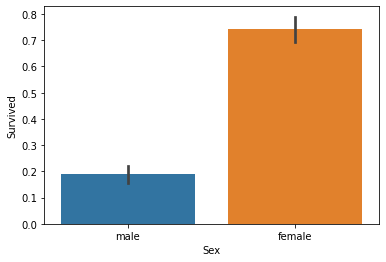
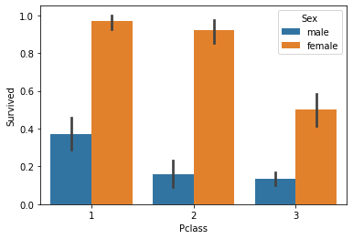
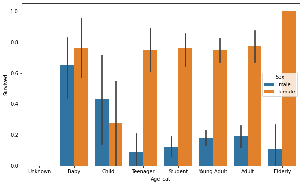

### 캐글1 타이타닉 생존자 예측


```python
import pandas as pd
import numpy as np
import matplotlib.pyplot as plt
import seaborn as sns
%matplotlib inline

titanic_df=pd.read_csv(r'C:\Users\user\Data_Handling\titanic_train.csv')
titanic_df
```


<div>
<table border="1" class="dataframe">
  <thead>
    <tr style="text-align: right;">
      <th></th>
      <th>PassengerId</th>
      <th>Survived</th>
      <th>Pclass</th>
      <th>Name</th>
      <th>Sex</th>
      <th>Age</th>
      <th>SibSp</th>
      <th>Parch</th>
      <th>Ticket</th>
      <th>Fare</th>
      <th>Cabin</th>
      <th>Embarked</th>
    </tr>
  </thead>
  <tbody>
    <tr>
      <th>0</th>
      <td>1</td>
      <td>0</td>
      <td>3</td>
      <td>Braund, Mr. Owen Harris</td>
      <td>male</td>
      <td>22.0</td>
      <td>1</td>
      <td>0</td>
      <td>A/5 21171</td>
      <td>7.2500</td>
      <td>NaN</td>
      <td>S</td>
    </tr>
    <tr>
      <th>1</th>
      <td>2</td>
      <td>1</td>
      <td>1</td>
      <td>Cumings, Mrs. John Bradley (Florence Briggs Th...</td>
      <td>female</td>
      <td>38.0</td>
      <td>1</td>
      <td>0</td>
      <td>PC 17599</td>
      <td>71.2833</td>
      <td>C85</td>
      <td>C</td>
    </tr>
    <tr>
      <th>2</th>
      <td>3</td>
      <td>1</td>
      <td>3</td>
      <td>Heikkinen, Miss. Laina</td>
      <td>female</td>
      <td>26.0</td>
      <td>0</td>
      <td>0</td>
      <td>STON/O2. 3101282</td>
      <td>7.9250</td>
      <td>NaN</td>
      <td>S</td>
    </tr>
    <tr>
      <th>3</th>
      <td>4</td>
      <td>1</td>
      <td>1</td>
      <td>Futrelle, Mrs. Jacques Heath (Lily May Peel)</td>
      <td>female</td>
      <td>35.0</td>
      <td>1</td>
      <td>0</td>
      <td>113803</td>
      <td>53.1000</td>
      <td>C123</td>
      <td>S</td>
    </tr>
    <tr>
      <th>4</th>
      <td>5</td>
      <td>0</td>
      <td>3</td>
      <td>Allen, Mr. William Henry</td>
      <td>male</td>
      <td>35.0</td>
      <td>0</td>
      <td>0</td>
      <td>373450</td>
      <td>8.0500</td>
      <td>NaN</td>
      <td>S</td>
    </tr>
    <tr>
      <th>...</th>
      <td>...</td>
      <td>...</td>
      <td>...</td>
      <td>...</td>
      <td>...</td>
      <td>...</td>
      <td>...</td>
      <td>...</td>
      <td>...</td>
      <td>...</td>
      <td>...</td>
      <td>...</td>
    </tr>
    <tr>
      <th>886</th>
      <td>887</td>
      <td>0</td>
      <td>2</td>
      <td>Montvila, Rev. Juozas</td>
      <td>male</td>
      <td>27.0</td>
      <td>0</td>
      <td>0</td>
      <td>211536</td>
      <td>13.0000</td>
      <td>NaN</td>
      <td>S</td>
    </tr>
    <tr>
      <th>887</th>
      <td>888</td>
      <td>1</td>
      <td>1</td>
      <td>Graham, Miss. Margaret Edith</td>
      <td>female</td>
      <td>19.0</td>
      <td>0</td>
      <td>0</td>
      <td>112053</td>
      <td>30.0000</td>
      <td>B42</td>
      <td>S</td>
    </tr>
    <tr>
      <th>888</th>
      <td>889</td>
      <td>0</td>
      <td>3</td>
      <td>Johnston, Miss. Catherine Helen "Carrie"</td>
      <td>female</td>
      <td>NaN</td>
      <td>1</td>
      <td>2</td>
      <td>W./C. 6607</td>
      <td>23.4500</td>
      <td>NaN</td>
      <td>S</td>
    </tr>
    <tr>
      <th>889</th>
      <td>890</td>
      <td>1</td>
      <td>1</td>
      <td>Behr, Mr. Karl Howell</td>
      <td>male</td>
      <td>26.0</td>
      <td>0</td>
      <td>0</td>
      <td>111369</td>
      <td>30.0000</td>
      <td>C148</td>
      <td>C</td>
    </tr>
    <tr>
      <th>890</th>
      <td>891</td>
      <td>0</td>
      <td>3</td>
      <td>Dooley, Mr. Patrick</td>
      <td>male</td>
      <td>32.0</td>
      <td>0</td>
      <td>0</td>
      <td>370376</td>
      <td>7.7500</td>
      <td>NaN</td>
      <td>Q</td>
    </tr>
  </tbody>
</table>
<p>891 rows × 12 columns</p>
</div>


```python
titanic_df.info()
```

    <class 'pandas.core.frame.DataFrame'>
    RangeIndex: 891 entries, 0 to 890
    Data columns (total 12 columns):
     #   Column       Non-Null Count  Dtype  
    ---  ------       --------------  -----  
     0   PassengerId  891 non-null    int64  
     1   Survived     891 non-null    int64  
     2   Pclass       891 non-null    int64  
     3   Name         891 non-null    object 
     4   Sex          891 non-null    object 
     5   Age          714 non-null    float64
     6   SibSp        891 non-null    int64  
     7   Parch        891 non-null    int64  
     8   Ticket       891 non-null    object 
     9   Fare         891 non-null    float64
     10  Cabin        204 non-null    object 
     11  Embarked     889 non-null    object 
    dtypes: float64(2), int64(5), object(5)
    memory usage: 83.7+ KB
    

사이킷런 머신러닝 알고리즘은 Null값을 허용하지 않으므로 DataFrame의 fillna()함수를 사용해 변경


```python
titanic_df['Age'].fillna(titanic_df['Age'].mean(), inplace=True)
titanic_df['Cabin'].fillna('N',inplace=True)
titanic_df['Embarked'].fillna('N', inplace=True)

titanic_df.isnull().sum()
```


    PassengerId    0
    Survived       0
    Pclass         0
    Name           0
    Sex            0
    Age            0
    SibSp          0
    Parch          0
    Ticket         0
    Fare           0
    Cabin          0
    Embarked       0
    dtype: int64


```python
titanic_df['Age'].value_counts()
```


    29.699118    177
    24.000000     30
    22.000000     27
    18.000000     26
    28.000000     25
                ... 
    55.500000      1
    53.000000      1
    20.500000      1
    23.500000      1
    0.420000       1
    Name: Age, Length: 89, dtype: int64


```python
titanic_df['Cabin'].value_counts()
```


    N              687
    C23 C25 C27      4
    G6               4
    B96 B98          4
    E101             3
                  ... 
    B73              1
    D7               1
    C106             1
    C47              1
    F G63            1
    Name: Cabin, Length: 148, dtype: int64


```python
titanic_df['Embarked'].value_counts()
```


    S    644
    C    168
    Q     77
    N      2
    Name: Embarked, dtype: int64


C23 C25 C27처럼 제대로 정리가 되지 않았다.


```python
titanic_df['Cabin']=titanic_df['Cabin'].str[:1]
titanic_df['Cabin'].value_counts()
```


    N    687
    C     59
    B     47
    D     33
    E     32
    A     15
    F     13
    G      4
    T      1
    Name: Cabin, dtype: int64


```python
titanic_df.groupby(['Sex','Survived'])['Survived'].count()
```


    Sex     Survived
    female  0            81
            1           233
    male    0           468
            1           109
    Name: Survived, dtype: int64


```python
sns.barplot(x='Sex',y='Survived',data=titanic_df)
```


    <AxesSubplot:xlabel='Sex', ylabel='Survived'>


    

    


```python
sns.barplot(x='Pclass',y='Survived', hue='Sex',data=titanic_df)
```


    <AxesSubplot:xlabel='Pclass', ylabel='Survived'>


    

    


```python
def get_category(age):
    cat=""
    if age<=-1:
        cat="Unknown"
    elif age<=5 :
        cat="Baby"
    elif age<=12:
        cat="Child"
    elif age<=18:
        cat="Teenager"
    elif age<=25:
        cat="Student"
    elif age<=35:
        cat="Young Adult"
    elif age<=60:
        cat="Adult"
    else:
        cat="Elderly"
    return cat

plt.figure(figsize=(10,6))
group_names=["Unknown", "Baby", "Child", "Teenager", "Student", "Young Adult", "Adult", "Elderly"]
titanic_df['Age_cat']=titanic_df['Age'].apply(lambda x:get_category(x))
#titanic_df['Age_cat']
sns.barplot(x='Age_cat', y='Survived',hue='Sex',data=titanic_df, order=group_names)
titanic_df.drop('Age_cat', axis=1, inplace=True)
```


    

    


### 남아있는 문자열 카테고리 피처를 숫자형 카테고리 피처로 변환


```python
from sklearn import preprocessing

def encode_features(dataDF):
    features=['Cabin','Sex','Embarked']
    for feature in features:
        le=preprocessing.LabelEncoder()
        le=le.fit(dataDF[feature])
        dataDF[feature]=le.transform(dataDF[feature])
    return dataDF

titanic_df=encode_features(titanic_df)
titanic_df
```


<div>

<table border="1" class="dataframe">
  <thead>
    <tr style="text-align: right;">
      <th></th>
      <th>PassengerId</th>
      <th>Survived</th>
      <th>Pclass</th>
      <th>Name</th>
      <th>Sex</th>
      <th>Age</th>
      <th>SibSp</th>
      <th>Parch</th>
      <th>Ticket</th>
      <th>Fare</th>
      <th>Cabin</th>
      <th>Embarked</th>
    </tr>
  </thead>
  <tbody>
    <tr>
      <th>0</th>
      <td>1</td>
      <td>0</td>
      <td>3</td>
      <td>Braund, Mr. Owen Harris</td>
      <td>1</td>
      <td>22.000000</td>
      <td>1</td>
      <td>0</td>
      <td>A/5 21171</td>
      <td>7.2500</td>
      <td>7</td>
      <td>3</td>
    </tr>
    <tr>
      <th>1</th>
      <td>2</td>
      <td>1</td>
      <td>1</td>
      <td>Cumings, Mrs. John Bradley (Florence Briggs Th...</td>
      <td>0</td>
      <td>38.000000</td>
      <td>1</td>
      <td>0</td>
      <td>PC 17599</td>
      <td>71.2833</td>
      <td>2</td>
      <td>0</td>
    </tr>
    <tr>
      <th>2</th>
      <td>3</td>
      <td>1</td>
      <td>3</td>
      <td>Heikkinen, Miss. Laina</td>
      <td>0</td>
      <td>26.000000</td>
      <td>0</td>
      <td>0</td>
      <td>STON/O2. 3101282</td>
      <td>7.9250</td>
      <td>7</td>
      <td>3</td>
    </tr>
    <tr>
      <th>3</th>
      <td>4</td>
      <td>1</td>
      <td>1</td>
      <td>Futrelle, Mrs. Jacques Heath (Lily May Peel)</td>
      <td>0</td>
      <td>35.000000</td>
      <td>1</td>
      <td>0</td>
      <td>113803</td>
      <td>53.1000</td>
      <td>2</td>
      <td>3</td>
    </tr>
    <tr>
      <th>4</th>
      <td>5</td>
      <td>0</td>
      <td>3</td>
      <td>Allen, Mr. William Henry</td>
      <td>1</td>
      <td>35.000000</td>
      <td>0</td>
      <td>0</td>
      <td>373450</td>
      <td>8.0500</td>
      <td>7</td>
      <td>3</td>
    </tr>
    <tr>
      <th>...</th>
      <td>...</td>
      <td>...</td>
      <td>...</td>
      <td>...</td>
      <td>...</td>
      <td>...</td>
      <td>...</td>
      <td>...</td>
      <td>...</td>
      <td>...</td>
      <td>...</td>
      <td>...</td>
    </tr>
    <tr>
      <th>886</th>
      <td>887</td>
      <td>0</td>
      <td>2</td>
      <td>Montvila, Rev. Juozas</td>
      <td>1</td>
      <td>27.000000</td>
      <td>0</td>
      <td>0</td>
      <td>211536</td>
      <td>13.0000</td>
      <td>7</td>
      <td>3</td>
    </tr>
    <tr>
      <th>887</th>
      <td>888</td>
      <td>1</td>
      <td>1</td>
      <td>Graham, Miss. Margaret Edith</td>
      <td>0</td>
      <td>19.000000</td>
      <td>0</td>
      <td>0</td>
      <td>112053</td>
      <td>30.0000</td>
      <td>1</td>
      <td>3</td>
    </tr>
    <tr>
      <th>888</th>
      <td>889</td>
      <td>0</td>
      <td>3</td>
      <td>Johnston, Miss. Catherine Helen "Carrie"</td>
      <td>0</td>
      <td>29.699118</td>
      <td>1</td>
      <td>2</td>
      <td>W./C. 6607</td>
      <td>23.4500</td>
      <td>7</td>
      <td>3</td>
    </tr>
    <tr>
      <th>889</th>
      <td>890</td>
      <td>1</td>
      <td>1</td>
      <td>Behr, Mr. Karl Howell</td>
      <td>1</td>
      <td>26.000000</td>
      <td>0</td>
      <td>0</td>
      <td>111369</td>
      <td>30.0000</td>
      <td>2</td>
      <td>0</td>
    </tr>
    <tr>
      <th>890</th>
      <td>891</td>
      <td>0</td>
      <td>3</td>
      <td>Dooley, Mr. Patrick</td>
      <td>1</td>
      <td>32.000000</td>
      <td>0</td>
      <td>0</td>
      <td>370376</td>
      <td>7.7500</td>
      <td>7</td>
      <td>2</td>
    </tr>
  </tbody>
</table>
<p>891 rows × 12 columns</p>
</div>


```python
#NULL 처리함수
def fillna(df):
     
   
    df['Age'].fillna(df['Age'].mean(), inplace=True)
   
    df['Cabin'].fillna('N',inplace=True)
    df['Embarked'].fillna('N', inplace=True)
    
    return df

#머신러닝 알고리즘에 불필요한 속성 제거
def drop_features(df): 
    df.drop(['PassengerId','Name','Ticket'],axis=1,inplace=True)
    return df
   
#레이블 인코딩 수행
def format_features(df):
     
    df['Cabin']=df['Cabin'].str[:1]
    features=['Cabin','Sex','Embarked']
    for feature in features:
        le=preprocessing.LabelEncoder()
        le=le.fit(df[feature])
        df[feature]=le.transform(df[feature])
    return df

#앞에서 설정한 데이터 전처리 함수 호출
def transform_features(df):
    df=fillna(df)
    df=drop_features(df)
    df=format_features(df)
    return df


titanic_df=pd.read_csv(r'C:\Users\user\Data_Handling\titanic_train.csv')
y_titanic_df=titanic_df['Survived']
X_titanic_df=titanic_df.drop('Survived',axis=1)
X_titanic_df=transform_features(X_titanic_df)
X_titanic_df
```


<div>
<style scoped>
    .dataframe tbody tr th:only-of-type {
        vertical-align: middle;
    }

    .dataframe tbody tr th {
        vertical-align: top;
    }

    .dataframe thead th {
        text-align: right;
    }
</style>
<table border="1" class="dataframe">
  <thead>
    <tr style="text-align: right;">
      <th></th>
      <th>Pclass</th>
      <th>Sex</th>
      <th>Age</th>
      <th>SibSp</th>
      <th>Parch</th>
      <th>Fare</th>
      <th>Cabin</th>
      <th>Embarked</th>
    </tr>
  </thead>
  <tbody>
    <tr>
      <th>0</th>
      <td>3</td>
      <td>1</td>
      <td>22.000000</td>
      <td>1</td>
      <td>0</td>
      <td>7.2500</td>
      <td>7</td>
      <td>3</td>
    </tr>
    <tr>
      <th>1</th>
      <td>1</td>
      <td>0</td>
      <td>38.000000</td>
      <td>1</td>
      <td>0</td>
      <td>71.2833</td>
      <td>2</td>
      <td>0</td>
    </tr>
    <tr>
      <th>2</th>
      <td>3</td>
      <td>0</td>
      <td>26.000000</td>
      <td>0</td>
      <td>0</td>
      <td>7.9250</td>
      <td>7</td>
      <td>3</td>
    </tr>
    <tr>
      <th>3</th>
      <td>1</td>
      <td>0</td>
      <td>35.000000</td>
      <td>1</td>
      <td>0</td>
      <td>53.1000</td>
      <td>2</td>
      <td>3</td>
    </tr>
    <tr>
      <th>4</th>
      <td>3</td>
      <td>1</td>
      <td>35.000000</td>
      <td>0</td>
      <td>0</td>
      <td>8.0500</td>
      <td>7</td>
      <td>3</td>
    </tr>
    <tr>
      <th>...</th>
      <td>...</td>
      <td>...</td>
      <td>...</td>
      <td>...</td>
      <td>...</td>
      <td>...</td>
      <td>...</td>
      <td>...</td>
    </tr>
    <tr>
      <th>886</th>
      <td>2</td>
      <td>1</td>
      <td>27.000000</td>
      <td>0</td>
      <td>0</td>
      <td>13.0000</td>
      <td>7</td>
      <td>3</td>
    </tr>
    <tr>
      <th>887</th>
      <td>1</td>
      <td>0</td>
      <td>19.000000</td>
      <td>0</td>
      <td>0</td>
      <td>30.0000</td>
      <td>1</td>
      <td>3</td>
    </tr>
    <tr>
      <th>888</th>
      <td>3</td>
      <td>0</td>
      <td>29.699118</td>
      <td>1</td>
      <td>2</td>
      <td>23.4500</td>
      <td>7</td>
      <td>3</td>
    </tr>
    <tr>
      <th>889</th>
      <td>1</td>
      <td>1</td>
      <td>26.000000</td>
      <td>0</td>
      <td>0</td>
      <td>30.0000</td>
      <td>2</td>
      <td>0</td>
    </tr>
    <tr>
      <th>890</th>
      <td>3</td>
      <td>1</td>
      <td>32.000000</td>
      <td>0</td>
      <td>0</td>
      <td>7.7500</td>
      <td>7</td>
      <td>2</td>
    </tr>
  </tbody>
</table>
<p>891 rows × 8 columns</p>
</div>


### * 결정트리: DecisionTreeClassifier
### * 랜덤 포레스트: RandomForestClassifier
### * 로지스틱 회귀: LogisticRegression


```python
from sklearn.model_selection import train_test_split
from sklearn.tree import DecisionTreeClassifier
from sklearn.ensemble import RandomForestClassifier
from sklearn.linear_model import LogisticRegression
from sklearn.metrics import accuracy_score

X_train, X_test, y_train, y_test=train_test_split(X_titanic_df, y_titanic_df, test_size=0.2, random_state=11)
dt_clf=DecisionTreeClassifier(random_state=11)
rf_clf=RandomForestClassifier(random_state=11)
lr_clf=LogisticRegression(max_iter=500)

#DecisionTreeClassifier로 학습/예측/평가
dt_clf.fit(X_train,y_train)
dt_pred=dt_clf.predict(X_test)
print("DecisionTreeClassifier 정확도: {0:.4f}".format(accuracy_score(y_test,dt_pred)))

#RandomForestClassifier로 학습/예측/평가
rf_clf.fit(X_train,y_train)
rf_pred=rf_clf.predict(X_test)
print("RandomForestClassifier 정확도: {0:.4f}".format(accuracy_score(y_test,rf_pred)))

#LogisticRegression으로 학습/예측/평가
lr_clf.fit(X_train,y_train)
lr_pred=lr_clf.predict(X_test)
print("LogisticRegression 정확도: {0:.4f}".format(accuracy_score(y_test,lr_pred)))
```

    DecisionTreeClassifier 정확도: 0.7877
    RandomForestClassifier 정확도: 0.8547
    LogisticRegression 정확도: 0.8492
    

### KFold로 교차 검증


```python
from sklearn.model_selection import KFold

def exec_kfold(clf, folds=5):
    kfold=KFold(n_splits=folds)
    scores=[]
    for iter_count, (train_index, test_index) in enumerate(kfold.split(X_titanic_df)):
        X_train, X_test=X_titanic_df.values[train_index], X_titanic_df.values[test_index]
        y_train, y_test=y_titanic_df.values[train_index], y_titanic_df.values[test_index]
        
        clf.fit(X_train,y_train)
        predictions=clf.predict(X_test)
        accuracy=accuracy_score(y_test,predictions)
        scores.append(accuracy)
        print("교차 검증 {0} 정확도: {1:.4f}".format(iter_count, accuracy))
        
    
    print("평균 정확도: {0:.4f}".format(np.mean(scores)))

exec_kfold(dt_clf, folds=5)
```

    교차 검증 0 정확도: 0.7542
    교차 검증 1 정확도: 0.7809
    교차 검증 2 정확도: 0.7865
    교차 검증 3 정확도: 0.7697
    교차 검증 4 정확도: 0.8202
    평균 정확도: 0.7823
    

#### cross_val_score 이용 -> Stratified K fold를 사용하기 때문에, 단순히 K-fold를 사용하는 것보단 정확도가 높아진다.


```python
from sklearn.model_selection import cross_val_score

scores=cross_val_score(dt_clf, X_titanic_df, y_titanic_df, cv=5)
for iter_count, accuracy in enumerate(scores):
    print("교차 검증 {0} 정확도: {1:.4f}".format(iter_count, accuracy))
    
print("평균 정확도: {0:.4f}".format(np.mean(scores)))
```

    교차 검증 0 정확도: 0.7430
    교차 검증 1 정확도: 0.7753
    교차 검증 2 정확도: 0.7921
    교차 검증 3 정확도: 0.7865
    교차 검증 4 정확도: 0.8427
    평균 정확도: 0.7879
    

#### GridSearchCV를 이용 -> 최적의 하이퍼 파라미터(max_depth, min_samples_split, min_samples_leaf)


```python
from sklearn.model_selection import GridSearchCV

parameters={'max_depth':[2,3,5,10],
            'min_samples_split':[2,3,5],
            'min_samples_leaf':[1,5,8]}

grid_dclf=GridSearchCV(dt_clf, param_grid=parameters, scoring='accuracy', cv=5)
grid_dclf.fit(X_train,y_train)

print("GridSearchCV 최적 하이퍼 파라미터 :", grid_dclf.best_params_)
print("GridSearchCV 최고 정확도: {0:.4f}".format(grid_dclf.best_score_))

best_dclf=grid_dclf.best_estimator_

dpredictions=best_dclf.predict(X_test)
accuracy=accuracy_score(y_test,dpredictions)
print("테스트 세트에서의 DecisionTreeClassifier 정확도: {0:.4f}".format(accuracy))
```

    GridSearchCV 최적 하이퍼 파라미터 : {'max_depth': 3, 'min_samples_leaf': 5, 'min_samples_split': 2}
    GridSearchCV 최고 정확도: 0.7992
    테스트 세트에서의 DecisionTreeClassifier 정확도: 0.8715
    
